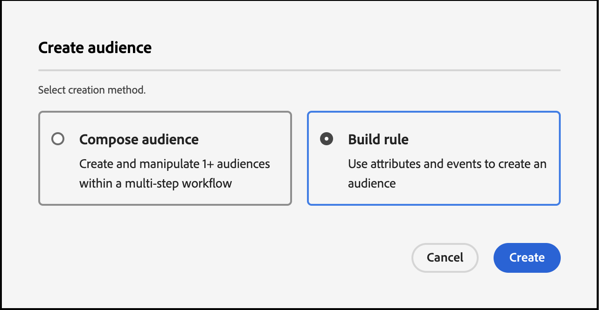

# Création d’audiences dans Real-Time CDP à l’aide de [!DNL Commerce] Données d’événement

Utilisez les données d’événement capturées dans votre [!DNL Commerce] pour créer des audiences dans Real-Time CDP. Les données capturées sont basées sur le comportement de navigation, les achats passés, les attributs de profil, les propensions à convertir ou à générer, l’état de fidélité, la valeur client élevée et faible, etc.

## Quelles données dois-je envisager d’utiliser ?

Créez des audiences dans Real-Time CDP à l’aide de données issues d’événements storefront, back-office et de profil.

| Types de données | Données Storefront (Événements comportementaux) | Données du back-office (événements côté serveur) | Données de profil et de segment du client |
|---|---|---|---|
| **Définition** | Clics ou actions des clients sur votre site. | Informations sur le cycle de vie et détails de chaque commande (passé et actuel). | Qui sont vos acheteurs et à quels segments sont-ils qualifiés ? |
| **Événements capturés par Adobe Commerce** | [productPageView](events.md#productpageview) [addToCart](events.md#addtocart) | [placeOrder](events.md#completecheckout) [orderplace](events-backoffice.md#orderplaced) [orderLineItemRefunding](events-backoffice.md#orderlineitemrefunded) [commande annulée](events-backoffice.md#ordercancelled) [historique des commandes](connect-data.md#send-historical-order-data) | [createAccount](events.md#createaccount) [editAccount](events.md#editaccount) [Enregistrement de profil](events-profilerecord.md) |

## Qu’ont réalisé d’autres clients ?

Adobe [!DNL Commerce] Les clients ont eu des répercussions importantes sur l’entreprise en activant les audiences intégrées à Real-Time CDP et en les déployant sur leurs [!DNL Commerce] instance.

Un détaillant mondial de vêtements multimarques a obtenu les résultats suivants :

- Une source de vérité avec 10 millions de profils client unifiés
- Création de plus de 40 audiences uniques de &quot;clients à haut niveau d’intention&quot; pour interagir entre les canaux

Une société mondiale de boissons a collecté :

- 98 millions de profils client provenant de plus de 100 pays

## Commençons

Dans cet article, vous apprendrez à :

- Créez une audience dans Real-Time CDP en fonction de la variable [!DNL Commerce] données collectées par les événements
- Activez cette audience pour votre [!DNL Commerce] store
- Utilisation de l’audience dans [!DNL Commerce] pour informer une règle de prix de panier

>[!IMPORTANT]
>
>Effectuez les tâches décrites dans cet article en utilisant votre [!DNL Commerce] environnement de test. Cela permet de s’assurer que les données d’événement storefront et back-office que vous envoyez à Experience Platform ne diluent pas vos données d’événement de production.

### Conditions préalables

Avant de commencer, assurez-vous que :

- Vous êtes configuré pour utiliser Real-Time CDP. Si vous n’en êtes pas sûr, contactez votre intégrateur de systèmes ou l’équipe de développement qui gère les projets et les environnements.
- You [installé](install.md) et [configuré](connect-data.md) la valeur [!DNL Data Connection] extension dans [!DNL Commerce].
- You [confirm](connect-data.md#confirm-that-event-data-is-collected) que votre [!DNL Commerce] les données d’événement arrivent à la périphérie Experience Platform.

### 1. Création d’une audience

Une audience est un ensemble de clients qui partagent un comportement ou des caractéristiques similaires. Dans cet exercice, vous créez une audience qui qualifie les personnes intéressées par un produit particulier de votre boutique.

Pour simplifier cet exercice, vous utilisez les données d’événement de la variable [productPageView](events.md#productpageview) . Cet événement capture les détails du produit consulté, tels que le nom, le SKU, le prix, etc. du produit.

Utilisez ces données d’événement pour indiquer que l’audience inclut des personnes qui ont au moins un événement &quot;Consultations produits&quot; où le SKU (identifiant du produit) est égal à un produit spécifique sur votre site et où l’événement se produit au cours du dernier jour. &#x200B;

1. Ouvrez l’Experience Platform et sélectionnez **[!UICONTROL Audiences]** dans le menu de navigation de gauche.

   

1. Cliquez sur **[!UICONTROL Create Audience]**.

   

   La variable **Créateur de segments** workspace s’affiche.

1. Dans le **Créateur de segments** espace de travail, sélectionnez **Créer une règle** méthode de création.

   

   La variable **Créateur de segments** workspace vous permet de définir les règles et conditions de votre audience. &#x200B; Ces règles et conditions sont basées sur les données d’événement et de profil de votre magasin Commerce et définissent les critères qui déterminent si un utilisateur est admissible pour l’audience. Vous pouvez par exemple créer une règle qui inclut les utilisateurs qui ont consulté un produit spécifique ou ceux qui ont effectué un achat au cours d’une période donnée. En savoir plus sur [Créateur de segments](https://experienceleague.adobe.com/en/docs/experience-platform/segmentation/ui/segment-builder) et les règles et conditions.

1. Sélectionnez la variable [Événements](https://experienceleague.adobe.com/en/docs/experience-platform/segmentation/ui/segment-builder#events) .

   

1. Recherchez le type d’événement &quot;Consultations produits&quot;. Faites ensuite glisser et déposez-le dans le **Créateur de segments** workspace.

1. Revenez au **Événements** et recherchez &quot;SKU&quot;, qui est un champ de données situé sous `productListItems` champ . Faites-le glisser et déposez-le dans la **Créateur de segments** espace de travail au-dessus de **Consultation produit** .

   La variable **Règles d’événement** s’affiche, où vous pouvez spécifier le produit spécifique dont vous souhaitez créer votre audience.

   

1. Définissez l’intervalle sur un jour en cliquant sur **N’importe quelle heure** et sélection *En dernier* avec la valeur de *1*.

   Lors de la création d’une audience, vous pouvez spécifier un intervalle de temps pour capturer l’activité récente. La définition d’un intervalle de temps vous permet de cibler les utilisateurs en fonction de leurs interactions ou comportements récents au cours d’une période spécifique.

1. Dans le **Propriétés de l’audience** sur le côté droit de l’espace de travail, définissez les propriétés de l’audience en fournissant un nom, une description et une méthode d’évaluation pour l’audience.

1. Pour enregistrer l’audience, cliquez sur **[!UICONTROL Save and Close]**.

   Les détails de votre audience s’affichent sur la page **Audience** tableau de bord.

### 2. Activez l’audience dans la variable [!DNL Commerce] destination

Vous rendez une audience disponible dans [!DNL Commerce] en l’activant pour la variable [!DNL Commerce] destination.

>[!IMPORTANT]
>
>Si vous n’avez pas déjà défini [!DNL Commerce] en tant que destination disponible pour la réception de données, voir [Adobe [!DNL Commerce] Connexion](https://experienceleague.adobe.com/en/docs/experience-platform/destinations/catalog/personalization/adobe-commerce) rubrique.

1. Dans le **Détails** de votre audience, cliquez sur **Activer la destination**.

1. Sélectionnez votre [!DNL Commerce] destination. Cliquez ensuite sur **Suivant**.

1. Terminez le processus d’activation en cliquant sur **[!UICONTROL Finish]**.

## 3. Afficher l’audience dans le tableau de bord des audiences

Dans [!DNL Commerce], vous pouvez afficher toutes les [active](https://experienceleague.adobe.com/en/docs/experience-platform/destinations/ui/activate/activate-edge-personalization-destinations) audiences qui peuvent être personnalisées pour vos [!DNL Commerce] à l’aide de la fonction **Audiences Real-Time CDP** tableau de bord.

Pour accéder au **Audiences Real-Time CDP** tableau de bord, accédez à la _Administration_ barre latérale, puis accédez à **[!UICONTROL Customers]** > **[!UICONTROL Real-time CDP Audience]**.

Dans le tableau de bord, recherchez l’audience que vous avez créée. Notez qu’il n’est pas utilisé dans une règle de prix de panier ou un bloc dynamique. Dans la section suivante, vous associez l’audience à une règle de prix de panier.

### 4. Créez une règle de prix de panier basée sur l’audience

Cette section vous explique comment créer une règle de prix de panier basée sur votre nouvelle audience.

1. Vérifiez que votre nouvelle audience s’affiche dans le **Audiences Real-Time CDP** tableau de bord.
1. [Créer une règle de prix de panier](https://experienceleague.adobe.com/en/docs/commerce-admin/marketing/promotions/cart-rules/price-rules-cart-create).
1. [Définition de la condition](https://experienceleague.adobe.com/en/docs/commerce-admin/marketing/promotions/cart-rules/price-rules-cart-create#use-real-time-cdp-audiences-to-set-a-condition) de la règle de prix du panier en utilisant votre nouvelle audience.
1. [Définition de l’action](https://experienceleague.adobe.com/en/docs/commerce-admin/marketing/promotions/cart-rules/price-rules-cart-create#step-3-define-the-actions) que vous souhaitez voir se produire lorsque le produit est ajouté au panier.
1. Continuez à configurer la règle de prix du panier.
1. Accédez à la vue du client de votre instance sandbox.
1. Ajoutez le produit que vous avez basé l’audience de dans le panier. Notez que la règle de prix du panier est activée.

## Terminer

Au cours de cet exercice, vous avez créé une audience dans Real-Time CDP et l’avez activée dans la variable [!DNL Commerce] destination. Ensuite, dans la variable [!DNL Commerce] admin, vous avez créé une règle de prix de panier basée sur cette audience et vous avez activé la règle dans votre environnement de test.
