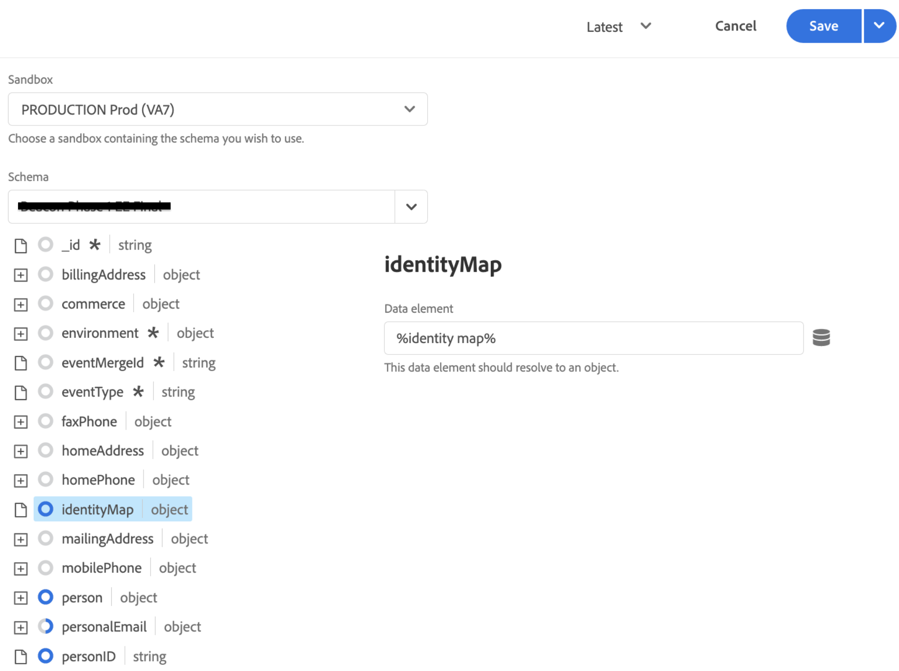

# Collecte de données Commerce à l’aide de balises Adobe Experience Platform

Bien que vous puissiez utiliser l’extension [!DNL Data Connection] pour publier et vous abonner à des événements storefront, certains commerçants utilisent peut-être déjà une solution de collecte de données, comme les [balises Adobe Experience Platform](https://experienceleague.adobe.com/docs/platform-learn/data-collection/tags/create-a-property.html). Pour ces commerçants, Adobe Commerce fournit une option de publication uniquement dans l’extension [!DNL Data Connection] qui utilise le SDK Adobe Commerce Event.

![[!DNL Data Connection] Flux de données d’extension ](assets/tags-data-flow.png)
_[!DNL Data Connection]Flux de données d’extension avec balises_

Dans cette rubrique, vous allez apprendre à mapper les valeurs d’événement storefront fournies par l’extension [!DNL Data Connection] à la solution de balises Adobe Experience Platform que vous utilisez déjà.

## Collecte de données d’événement à partir d’Adobe Commerce

Pour collecter des données d’événement Commerce :

- Installez le [SDK Adobe Commerce Events](https://github.com/adobe/commerce-events/tree/main/packages/storefront-events-sdk). Pour les storefronts PHP, consultez la rubrique [install](install.md) . Pour les vitrines de PWA Studio, consultez le [guide du PWA Studio](https://developer.adobe.com/commerce/pwa-studio/integrations/adobe-commerce/aep/).

  >[!NOTE]
  >
  > Ne **pas** [configurez](connect-data.md) l’ID d’organisation et l’ID de flux de données.

## Mappage des données du storefront Commerce à Adobe Experience Platform

Pour mapper les données de storefront Commerce à Adobe Experience Platform, configurez et installez les éléments suivants depuis les balises Adobe Experience Platform :

1. [Configurez une propriété de balise](https://experienceleague.adobe.com/docs/platform-learn/implement-in-websites/configure-tags/create-a-property.html) dans la collecte de données Adobe Experience Platform.

1. Sous **Création**, sélectionnez **Extensions** et installez et configurez les extensions suivantes :

   - [Adobe de la couche de données client](https://experienceleague.adobe.com/docs/experience-platform/tags/extensions/client/client-data-layer/overview.html)

   - [SDK Web Adobe Experience Platform](https://experienceleague.adobe.com/docs/experience-platform/edge/fundamentals/installing-the-sdk.html)

1. [Balise Publish](https://experienceleague.adobe.com/docs/experience-platform/tags/publish/overview.html) vers votre environnement de développement.

1. Suivez les étapes **Mappage d’événements** ci-dessous pour configurer des éléments de données et des règles pour des événements spécifiques.

### Mappage des événements

La collecte de données à l’aide de balises diffère de l’utilisation du SDK d’événement Adobe Commerce. Il est donc important de comprendre les termes équivalents utilisés dans les deux frameworks.

| Terme des balises Adobe Experience Platform | Terme du SDK d’événement Adobe Commerce |
|---|---|
| _éléments de données_ | contexte |
| _rules_ | event |
|  | _conditions de règle_ - écouteurs d’événements (à partir d’ACDL)<br><br>_actions de règle_ - gestionnaires d’événements (envoyer à Adobe Experience Platform) |

Lorsque vous mettez à jour les éléments de données et les règles dans les balises Adobe Experience Platform avec des données d’événement spécifiques à Adobe Commerce, certaines étapes sont courantes.

Par exemple, ajoutons l’événement Adobe Commerce `signOut` aux balises Adobe Experience Platform. Les étapes décrites ci-dessous, à l’exception des valeurs spécifiques que vous définissez, décrivent comment ajouter des [éléments de données](https://experienceleague.adobe.com/docs/experience-platform/collection/e2e.html#data-element) et des [règles](https://experienceleague.adobe.com/docs/experience-platform/collection/e2e.html#create-a-rule), qui s’appliquent à tous les événements Adobe Commerce que vous ajoutez à des balises.

1. Créer un élément de données :

   
   _Créer un élément de données_

1. Définissez **Name** sur `sign out`.

1. Définissez **Extension** sur `Adobe Experience Platform Web SDK`.

1. Définissez **Type d’élément de données** sur `XDM object`.

1. Sélectionnez les **sandbox** et le **schéma** que vous souhaitez mettre à jour.

1. Sous **userAccount** > **logout**, définissez la **valeur** dans **Visitor Logout** sur `1`.

   
   _Mettre à jour la valeur de déconnexion_

1. Sélectionnez **Enregistrer**.

1. Créer une règle :

   
   _Créer une règle_

1. Sélectionnez **Ajouter** sous **EVENTS**.

1. Définissez **Extension** sur `Adobe Client Data Layer`.

1. Définissez **Type d’événement** sur `Data Pushed`.

1. Sélectionnez **Specific Event** et définissez **Event/Key to register for** sur `sign-out`.

1. Sélectionnez **Conserver les modifications** pour enregistrer la nouvelle règle.

1. Ajoutez une action.

1. Définissez **Extension** sur `Adobe Experience Platform Web SDK`.

1. Définissez **Action Type** sur `Send Event`.

1. Définissez **Instance** sur `Alloy`.

1. Définissez **Type** sur `userAccount.logout`.

1. Définissez **Données XDM** sur `%sign out%`.

1. Cliquez sur **Enregistrer**.

   Vous avez créé un élément de données dans votre schéma pour l’événement `signOut` à partir d’Adobe Commerce. En outre, vous avez créé une règle avec une action spécifique qui doit se produire lorsque cet événement est déclenché à partir du storefront Adobe Commerce.

Répétez les étapes ci-dessus dans les balises pour chacun des événements Adobe Commerce décrits ci-dessous.

## Événements disponibles

Pour chacun des événements suivants, mappez les événements Adobe Commerce à votre XDM en suivant les étapes ci-dessus.

- [`signOut`](#signout)
- [`signIn`](#signin)
- [`createAccount`](#createaccount)
- [`editAccount`](#editaccount)
- [`pageView`](#pageview)
- [`productView`](#productview)
- [`searchRequestSent`](#searchrequestsent)
- [`searchResponseReceived`](#searchresponsereceived)
- [`addToCart`](#addtocart)
- [`openCart`](#opencart)
- [`viewCart`](#viewcart)
- [`removeFromCart`](#removefromcart)
- [`initiateCheckout`](#initiatecheckout)
- [`placeOrder`](#placeorder)

### signOut

Déclenché lorsqu’un acheteur tente de se déconnecter.

#### Éléments de données

Créez l’élément de données suivant :

1. Déconnexion :

   - **Nom** : `Sign out`
   - **Extension** : `Adobe Experience Platform Web SDK`
   - **Type d’élément de données** : `XDM object`
   - **Groupe de champs** : `userAccount` > `logout`
   - **Déconnexion du visiteur** : **Valeur** = `1`

#### Règles 

- **Nom** : `Sign out`
- **Extension** : `Adobe Client Data Layer`
- **Type d’événement** : `Data Pushed`
- **Evénement spécifique** : `sign-out`

##### Actions

- **Extension** : `Adobe Experience Platform Web SDK`
- **Type d’action** : `Send event`
- **Type** : `userAccount.logout`
- **Données XDM** : `%sign-out%`

### signIn

Déclenché lorsqu’un acheteur tente de se connecter.

#### Éléments de données

Créez les éléments de données suivants :

1. Adresse électronique du compte :

   - **Nom** : `account email`
   - **Extension** : `Adobe Client Data Layer`
   - **Type d’élément de données** : `Data Layer Computed State`
   - **[Facultatif] chemin** : `accountContext.emailAddress`

1. Type de compte :

   - **Nom** : `account type`
   - **Extension** : `Adobe Client Data Layer`
   - **Type d’élément de données** : `Data Layer Computed State`
   - **[Facultatif] chemin** : `accountContext.accountType`

1. ID de compte :

   - **Nom** : `account id`
   - **Extension** : `Adobe Client Data Layer`
   - **Type d’élément de données** : `Data Layer Computed State`
   - **[Facultatif] chemin*** : `accountContext.accountId`

1. Connexion :

   - **Nom** : `sign in`
   - **Extension** : `Adobe Experience Platform Web SDK`
   - **Type d’élément de données** : `XDM object`
   - **Groupe de champs** : `person` > `accountID`
   - **ID de compte** : **Valeur** = `%account id%`
   - **Groupe de champs** : `person` > `accountType`
   - **Type de compte** : **Valeur** = `%account type%`
   - **Groupe de champs** : `person` > `personalEmailID`
   - **Adresse de courriel personnelle** : **Valeur** = `%account email%`
   - **Groupe de champs** : `personalEmail` > `address`
   - **Adresse** : **Valeur** = `%account email%`
   - **Groupe de champs** : `userAccount` > `login`
   - **Connexion du visiteur** : **Valeur** = `1`

#### Règles 

- **Nom** : `sign in`
- **Extension** : `Adobe Client Data Layer`
- **Type d’événement** : `Data Pushed`
- **Evénement spécifique** : `sign-in`

##### Actions

- **Extension** : `Adobe Experience Platform Web SDK`
- **Type d’action** : `Send event`
- **Type** : `userAccount.login`
- **Données XDM** : `%sign in%`

### createAccount

Déclenché lorsqu’un acheteur tente de créer un compte.

#### Éléments de données

Créez les éléments de données suivants :

1. Adresse électronique du compte :

   - **Nom** : `account email`
   - **Extension** : `Adobe Client Data Layer`
   - **Type d’élément de données** : `Data Layer Computed State`
   - **[Facultatif] chemin** : `accountContext.emailAddress`

1. Type de compte :

   - **Nom** : `account type`
   - **Extension** : `Adobe Client Data Layer`
   - **Type d’élément de données** : `Data Layer Computed State`
   - **[Facultatif] chemin** : `accountContext.accountType`

1. ID de compte :

   - **Nom** : `account id`
   - **Extension** : `Adobe Client Data Layer`
   - **Type d’élément de données** : `Data Layer Computed State`
   - **[Facultatif] chemin** : `accountContext.accountId`

1. Créer un compte :

   - **Nom** : `Create account`
   - **Extension** : `Adobe Experience Platform Web SDK`
   - **Type d’élément de données** : `XDM object`
   - **Groupe de champs** : `person` > `accountID`
   - **ID de compte** : **Valeur** = `%account id%`
   - **Groupe de champs** : `person` > `accountType`
   - **Type de compte** : **Valeur** = `%account type%`
   - **Groupe de champs** : `person` > `personalEmailID`
   - **Adresse de courriel personnelle** : **Valeur** = `%account email%`
   - **Groupe de champs** : `personalEmail` > `address`
   - **Adresse** : **Valeur** = `%account email%`
   - **Groupe de champs** : `userAccount` > `createProfile`
   - **Créer un profil de compte** : **Valeur** = `1`

#### Règles 

- **Nom** : `Create account`
- **Extension** : `Adobe Client Data Layer`
- **Type d’événement** : `Data Pushed`
- **Evénement spécifique** : `create-account`

##### Actions

- **Extension** : `Adobe Experience Platform Web SDK`
- **Type d’action** : `Send event`
- **Type** : `userAccount.createProfile`
- **Données XDM** : `%create account%`

### editAccount

Déclenché lorsqu’un acheteur tente de modifier un compte.

#### Éléments de données

Créez les éléments de données suivants :

1. Adresse électronique du compte :

   - **Nom** : `account email`
   - **Extension** : `Adobe Client Data Layer`
   - **Type d’élément de données** : `Data Layer Computed State`
   - **[Facultatif] chemin** : `accountContext.emailAddress`

1. Type de compte :

   - **Nom** : `account type`
   - **Extension** : `Adobe Client Data Layer`
   - **Type d’élément de données** : `Data Layer Computed State`
   - **[Facultatif] chemin** : `accountContext.accountType`

1. ID de compte :

   - **Nom** : `account id`
   - **Extension** : `Adobe Client Data Layer`
   - **Type d’élément de données** : `Data Layer Computed State`
   - **[Facultatif] chemin** : `accountContext.accountId`

1. Modifier le compte :

   - **Nom** : `Edit account`
   - **Extension** : `Adobe Experience Platform Web SDK`
   - **Type d’élément de données** : `XDM object`
   - **Groupe de champs** : `person` > `accountID`
   - **ID de compte** : **Valeur** = `%account id%`
   - **Groupe de champs** : `person` > `accountType`
   - **Type de compte** : **Valeur** = `%account type%`
   - **Groupe de champs** : `person` > `personalEmailID`
   - **Adresse de courriel personnelle** : **Valeur** = `%account email%`
   - **Groupe de champs** : `personalEmail` > `address`
   - **Adresse** : **Valeur** = `%account email%`
   - **Groupe de champs** : `userAccount` > `updateProfile`
   - **Créer un profil de compte** : **Valeur** = `1`

#### Règles

- **Nom** : `Edit account`
- **Extension** : `Adobe Client Data Layer`
- **Type d’événement** : `Data Pushed`
- **Evénement spécifique** : `edit-account`

##### Actions

- **Extension** : `Adobe Experience Platform Web SDK`
- **Type d’action** : `Send event`
- **Type** : `userAccount.updateProfile`
- **Données XDM** : `%edit account%`

### pageView

Déclenché lors du chargement d’une page.

#### Éléments de données

Créez les éléments de données suivants :

1. Nom de la page :

   - **Nom** : `page name`
   - **Extension** : `Adobe Client Data Layer`
   - **Type d’élément de données** : `Data Layer Computed State`
   - **[Facultatif] chemin** : `pageContext.pageName`

#### Règles 

- **Nom** : `page view`
- **Extension** : `Adobe Client Data Layer`
- **Type d’événement** : `Data Pushed`
- **Evénement spécifique** : `page-view`

##### Actions

- **Extension** : `Adobe Experience Platform Web SDK`
- **Type d’action** : `Send event`
- **Type** : `web.webPageDetails.pageViews`
- **Données XDM** : `%page view%`

### productView

Déclenché lors du chargement d’une page de produits.

#### Éléments de données

Créez les éléments de données suivants :

1. Nom du produit :

   - **Nom** : `product name`
   - **Extension** : `Adobe Client Data Layer`
   - **Type d’élément de données** : `Data Layer Computed State`
   - **[Facultatif] chemin** : `productContext.name`

1. SKU du produit :

   - **Nom** : `product sku`
   - **Extension** : `Adobe Client Data Layer`
   - **Type d’élément de données** : `Data Layer Computed State`
   - **[Facultatif] chemin** : `productContext.sku`

1. URL de l’image du produit :

   - **Nom** : `product image`
   - **Extension** : `Adobe Client Data Layer`
   - **Type d’élément de données** : `Data Layer Computed State`
   - **[Facultatif] chemin** : `productContext.mainImageUrl`

1. Devise du produit :

   - **Nom** : `product currency`
   - **Extension** : `Adobe Client Data Layer`
   - **Type d’élément de données** : `Data Layer Computed State`
   - **[Facultatif] chemin** : `productContext.pricing.currencyCode`

1. Code de devise :

   - **Nom** : `currency code`
   - **Extension** : `Core`
   - **Type d’élément de données** : `Custom Code`
   - **Ouvrir l’éditeur** :

   ```bash
   return _satellite.getVar('product currency') || _satellite.getVar('storefront').storeViewCurrencyCode
   ```

1. Prix spécial :

   - **Nom** : `special price`
   - **Extension** : `Adobe Client Data Layer`
   - **Type d’élément de données** : `Data Layer Computed State`
   - **[Facultatif] chemin** : `productContext.pricing.specialPrice`

1. Prix normal :

   - **Nom** : `regular price`
   - **Extension** : `Adobe Client Data Layer`
   - **Type d’élément de données** : `Data Layer Computed State`
   - **[Facultatif] chemin** : `productContext.pricing.regularPrice`

1. Prix du produit :

   - **Nom** : `product price`
   - **Extension** : `Core`
   - **Type d’élément de données** : `Custom Code`
   - **Ouvrir l’éditeur** :

   ```bash
   return _satellite.getVar('product regular price') || _satellite.getVar('product special price')
   ```

1. Consultation produit :

   - **Nom** : `product view`
   - **Extension** : `Adobe Experience Platform Web SDK`
   - **Type d’élément de données** : `XDM object`
   - **Groupe de champs** : `productListItems`. Sélectionnez **Fournir des éléments individuels** et cliquez sur le bouton **Ajouter un élément** . Comme cette vue est destinée à un PDP, vous pouvez renseigner un seul élément.
   - **Groupe de champs** : `productListItems` > `name`
   - **Nom** : **Valeur** = `%product name%`
   - **Groupe de champs** : `productListItems` > `SKU`
   - **SKU** : **Valeur** = `%product sku%`
   - **Groupe de champs** : `productListItems` > `priceTotal`
   - **Total du prix** : **Valeur** = `%product price%`
   - **Groupe de champs** : `productListItems` > `currencyCode`
   - **Code de devise** : **Valeur** = `%currency code%`
   - **Groupe de champs** : `productListItems` > `ProductImageUrl`
   - **ProductImageUrl** : **Valeur** = `%product image%`
   - **Groupe de champs** : `commerce` > `productViews` > `value`
   - **value** : **Value** = `1`

#### Règles 

- **Nom** : `product view`
- **Extension** : `Adobe Client Data Layer`
- **Type d’événement** : `Data Pushed`
- **Evénement spécifique** : `product-page-view`

##### Actions

- **Extension** : `Adobe Experience Platform Web SDK`
- **Type d’action** : `Send event`
- **Type** : `commerce.productViews`
- **Données XDM** : `%product view%`

### searchRequestSent

Déclenché par des événements dans la fenêtre contextuelle &quot;Rechercher lorsque vous tapez&quot; et par des événements sur les pages de résultats de la recherche.

#### Éléments de données

Créez les éléments de données suivants :

1. Entrée de recherche

   - **Nom** : `search input`
   - **Extension** : `Adobe Client Data Layer`
   - **Type d’élément de données** : `Data Layer Computed State`
   - **[Facultatif] chemin** : `searchInputContext.units[0]`

1. Expression de saisie de recherche

   - **Nom** : `search input phrase`
   - **Extension** : `Core`
   - **Type d’élément de données** : `Custom Code`
   - **Ouvrir l’éditeur** :

   ```bash
   return _satellite.getVar('search input').phrase;
   ```

1. Rechercher le tri des entrées

   - **Nom** : `search input sort`
   - **Extension** : `Core`
   - **Type d’élément de données** : `Custom Code`
   - **Ouvrir l’éditeur** :

   ```bash
   const searchInput = _satellite.getVar('search input');
   const sortFromInput = searchInput ? searchInput.sort : [];
   const sort = sortFromInput.map((searchSort) => {
       return {
           attribute: searchSort.attribute,
           order: searchSort.direction,
       };
   });
   return sort;
   ```

1. Filtres de saisie de recherche

   - **Nom** : `search input filters`
   - **Extension** : `Core`
   - **Type d’élément de données** : `Custom Code`
   - **Ouvrir l’éditeur** :

   ```bash
   const searchInput = _satellite.getVar('search input');
   const filtersFromInput = searchInput ? searchInput.filter : [];
   const filters = filtersFromInput.map(
       (searchFilter) => {
           let value = [];
           let isRange = false;
           if (searchFilter.eq) {
               value.push(searchFilter.eq);
           } else if (searchFilter.in) {
               value = searchFilter.in;
           } else if (searchFilter.range) {
               isRange = true;
               value.push(String(searchFilter.range.from));
               value.push(String(searchFilter.range.to));
           }
           return {
               attribute: searchFilter.attribute,
               value,
               isRange,
           };
       }
   );
   
   return filters;
   ```

1. Requête de recherche :

   - **Nom** : `search request`
   - **Extension** : `Adobe Experience Platform Web SDK`
   - **Type d’élément de données** : `XDM object`
   - **Groupe de champs** : `siteSearch` > `phrase`
   - **value** : pas encore disponible
   - **Groupe de champs** : `siteSearch` > `sort`. Sélectionnez **Fournir l’objet entier**.
   - **Groupe de champs** : `siteSearch` > `filter`. Sélectionnez **Fournir l’objet entier**.
   - **Groupe de champs** : `searchRequest` > `id`
   - **Identifiant unique** : **Valeur** = `%search request ID%`
   - **Groupe de champs** : `searchRequest` > `value`
   - **value** : **Value** = `1`

#### Règles 

- **Nom** : `search request sent`
- **Extension** : `Adobe Client Data Layer`
- **Type d’événement** : `Data Pushed`
- **Evénement spécifique** : `search-request-sent`

##### Actions

- **Extension** : `Adobe Experience Platform Web SDK`
- **Type d’action** : `Send event`
- **Type** : `searchRequest`
- **Données XDM** : `%search request%`

### searchResponseReceived

Déclenché lorsque la recherche en direct renvoie les résultats de la fenêtre contextuelle &quot;Rechercher lorsque vous tapez&quot; ou de la page des résultats de la recherche.

#### Éléments de données

Créez les éléments de données suivants :

1. Résultats de la recherche :

   - **Nom** : `search results`
   - **Extension** : `Adobe Client Data Layer`
   - **Type d’élément de données** : `Data Layer Computed State`
   - **[Facultatif] chemin** : `searchResultsContext.units[0]`

1. Nombre de résultats de recherche de produits :

   - **Nom** : `search result number of products`
   - **Extension** : `Core`
   - **Type d’élément de données** : `Custom Code`
   - **Ouvrir l’éditeur** :

   ```bash
   return _satellite.getVar('search result').products.length;
   ```

1. Résultats de la recherche :

   - **Nom** : `search result products`
   - **Extension** : `Core`
   - **Type d’élément de données** : `Custom Code`
   - **Ouvrir l’éditeur** :

   ```bash
   const searchResult = _satellite.getVar('search result');
   const productsFromResult = searchResult.products ? searchResult.products : [];
   const products = productsFromResult.map(
       (product) => {
           return { SKU: product.sku, name: product.name };
       }
   );
   return products;
   ```

1. Suggestions de résultats de recherche :

   - **Nom** : `search result products`
   - **Extension** : `Core`
   - **Type d’élément de données** : `Custom Code`
   - **Ouvrir l’éditeur** :

   ```bash
   const searchResult = _satellite.getVar('search result');
   const suggestionsFromResult = searchResult.suggestions ? searchResult.suggestions : [];
   const suggestions = suggestionsFromResult.map((suggestion) => suggestion.suggestion);
   return suggestions;
   ```

1. URL de l’image du produit :

   - **Nom** : `product image`
   - **Extension** : `Adobe Client Data Layer`
   - **Type d’élément de données** : `Data Layer Computed State`
   - **[Facultatif] chemin** : `productContext.mainImageUrl`

1. Réponse de recherche :

   - **Nom** : `search response`
   - **Extension** : `Adobe Experience Platform Web SDK`
   - **Type d’élément de données** : `XDM object`
   - **Groupe de champs** : `siteSearch` > `suggestions`. Sélectionnez **Fournir l’objet entier**.
   - **Élément de données** : `%search result suggestions%`
   - **Groupe de champs** : `siteSearch` > `numberOfResults`
   - **value** : `%search result number of products%`
   - **Groupe de champs** : `productListItems`. Sélectionnez **Fournir l’objet entier**.
   - **Groupe de champs** : `productListItems` > `ProductImageUrl`
   - **ProductImageUrl** : **Valeur** = `%product image%`
   - **Élément de données** : `%search result products%`
   - **Groupe de champs** : `searchResponse` > `id`
   - **Identifiant unique** : **Valeur** = `%search response ID%`
   - **Groupe de champs** : `searchResponse` > `value`
   - **value** : **Value** = `1`

#### Règles 

- **Nom** : `search response received`
- **Extension** : `Adobe Client Data Layer`
- **Type d’événement** : `Data Pushed`
- **Evénement spécifique** : `search-response-received`

##### Actions

- **Extension** : `Adobe Experience Platform Web SDK`
- **Type d’action** : `Send event`
- **Type** : `searchResponse`
- **Données XDM** : `%search response%`

### addToCart

Déclenché lorsqu’un produit est ajouté à un panier ou chaque fois que la quantité d’un produit dans le panier est incrémentée.

#### Éléments de données

Créez les éléments de données suivants :

1. Nom du produit :

   - **Nom** : `product name`
   - **Extension** : `Adobe Client Data Layer`
   - **Type d’élément de données** : `Data Layer Computed State`
   - **[Facultatif] chemin** : `productContext.name`

1. SKU du produit :

   - **Nom** : `product sku`
   - **Extension** : `Adobe Client Data Layer`
   - **Type d’élément de données** : `Data Layer Computed State`
   - **[Facultatif] chemin** : `productContext.sku`

1. Code de devise :

   - **Nom** : `currency code`
   - **Extension** : `Adobe Client Data Layer`
   - **Type d’élément de données** : `Data Layer Computed State`
   - **[Facultatif] chemin** : `productContext.pricing.currencyCode`

1. Prix spécial du produit :

   - **Nom** : `product special price`
   - **Extension** : `Adobe Client Data Layer`
   - **Type d’élément de données** : `Data Layer Computed State`
   - **[Facultatif] chemin** : `productContext.pricing.specialPrice`

1. URL de l’image du produit :

   - **Nom** : `product image`
   - **Extension** : `Adobe Client Data Layer`
   - **Type d’élément de données** : `Data Layer Computed State`
   - **[Facultatif] chemin** : `productContext.mainImageUrl`

1. Prix normal du produit :

   - **Nom** : `product regular price`
   - **Extension** : `Adobe Client Data Layer`
   - **Type d’élément de données** : `Data Layer Computed State`
   - **[Facultatif] chemin** : `productContext.pricing.regularPrice`

1. Produit  price :

   - **Nom** : `product price`
   - **Extension** : `Core`
   - **Type d’élément de données** : `Custom Code`
   - **Ouvrir l’éditeur** :

   ```bash
   return _satellite.getVar('product regular price') || _satellite.getVar('product special price') 
   ```

1. Panier :

   - **Nom** : `cart`
   - **Extension** : `Adobe Client Data Layer`
   - **Type d’élément de données** : `Data Layer Computed State`
   - **[Facultatif] chemin** : `shoppingCartContext`

1. ID de panier :

   - **Nom** : `cart id`
   - **Extension** : `Core`
   - **Type d’élément de données** : `Custom Code`
   - **Ouvrir l’éditeur** :

   ```bash
   return _satellite.getVar('cart').id
   ```

1. Ajouter au panier :

   - **Nom** : `add to cart`
   - **Extension** : `Adobe Experience Platform Web SDK`
   - **Type d’élément de données** : `XDM object`
   - **Groupe de champs** : `productListItems`. Sélectionnez **Fournir des éléments individuels** et cliquez sur le bouton **Ajouter un élément** . Comme cette vue est destinée à un PDP, vous pouvez renseigner un seul élément.
   - **Groupe de champs** : `productListItems` > `name`
   - **Nom** : **Valeur** = `%product name%`
   - **Groupe de champs** : `productListItems` > `SKU`
   - **SKU** : **Valeur** = `%product sku%`
   - **Groupe de champs** : `productListItems` > `priceTotal`
   - **Total du prix** : **Valeur** = `%product price%`
   - **Groupe de champs** : `productListItems` > `currencyCode`
   - **Groupe de champs** : `productListItems` > `ProductImageUrl`
   - **ProductImageUrl** : **Valeur** = `%product image%`
   - **Code de devise** : **Valeur** = `%currency code%`
   - **Groupe de champs** : `commerce` > `cart` > `cartID`
   - **ID de panier** : **Valeur** = `%cart id%`
   - **Groupe de champs** : `commerce` > `productListAdds` > `value`
   - **value** : **Value** = `1`

#### Règles 

- **Nom** : `add to cart`
- **Extension** : `Adobe Client Data Layer`
- **Type d’événement** : `Data Pushed`
- **Evénement spécifique** : `add-to-cart`

##### Actions

- **Extension** : `Adobe Experience Platform Web SDK`
- **Type d’action** : `Send event`
- **Type** : `commerce.productListAdds`
- **Données XDM** : `%add to cart%`

### openCart

Déclenché lors de la création d’un panier, ce qui se produit lorsqu’un produit est ajouté à un panier vide.

#### Éléments de données

Créez l’élément de données suivant :

1. Ouvrir le panier :

   - **Nom** : `open cart`
   - **Extension** : `Adobe Experience Platform Web SDK`
   - **Type d’élément de données** : `XDM object`
   - **Groupe de champs** : `commerce` > `productListOpens` > `value`
   - **value** : **Value** = `1`
   - **Groupe de champs** : `commerce` > `cart` > `cartID`
   - **ID de panier** : **Valeur** = `%cart id%`
   - **Groupe de champs** : `productListItems`. Pour `productListItems`, plusieurs éléments peuvent être précalculés. Sélectionnez **productListItems** > **Fournir un tableau entier**.

#### Règles 

- **Nom** : `open cart`
- **Extension** : `Adobe Client Data Layer`
- **Type d’événement** : `Data Pushed`
- **Evénement spécifique** : `open-cart`

##### Actions

- **Extension** : `Adobe Experience Platform Web SDK`
- **Type d’action** : `Send event`
- **Type** : `commerce.productListOpens`
- **Données XDM** : `%open cart%`

### viewCart

Déclenché lors du chargement d’une page de panier.

#### Éléments de données

Créez les éléments de données suivants :

1. Storefront :

   - **Nom** : `storefront`
   - **Extension** : `Adobe Client Data Layer`
   - **Type d’élément de données** : `Data Layer Computed State`
   - **[Facultatif] chemin** : `storefrontInstanceContext`

1. URL de l’image du produit :

   - **Nom** : `product image`
   - **Extension** : `Adobe Client Data Layer`
   - **Type d’élément de données** : `Data Layer Computed State`
   - **[Facultatif] chemin** : `productContext.mainImageUrl`

   1. Panier :

   - **Nom** : `cart`
   - **Extension** : `Adobe Client Data Layer`
   - **Type d’élément de données** : `Data Layer Computed State`
   - **[Facultatif] chemin** : `shoppingCartContext`

1. ID de panier :

   - **Nom** : `cart id`
   - **Extension** : `Core`
   - **Type d’élément de données** : `Custom Code`
   - **Ouvrir l’éditeur** :

   ```bash
   return _satellite.getVar('cart').id
   ```

1. Éléments de la liste de produits :

   - **Nom** : `product list items:`
   - **Extension** : `Core`
   - **Type d’élément de données** : `Custom Code`
   - **Ouvrir l’éditeur** :

   ```bash
   const storefrontContext = _satellite.getVar('storefront');
   const cart = _satellite.getVar('cart');
   
   const returnList = [];
   cart.items.forEach(item => {
       const selectedOptions = [];
       item.configurableOptions?.forEach(option => {
           selectedOptions.push({
               attribute: option.optionLabel,
               value: option.valueLabel,
           });
       });
   
       const productListItem = {
           SKU: item.product.sku,
           name: item.product.name,
           quantity: item.quantity,
           priceTotal: item.prices.price.value * item.quantity,
           currencyCode: item.prices.price.currency ? item.prices.price.currency : storefrontContext.storeViewCurrencyCode,
           selectedOptions: selectedOptions,
       };
   
       returnList.push(productListItem);
   });
   return returnList;
   ```

1. Afficher le panier :

   - **Nom** : `view cart`
   - **Extension** : `Adobe Experience Platform Web SDK`
   - **Type d’élément de données** : `XDM object`
   - **Groupe de champs** : `productListItems`. Pour `productListItems`, plusieurs éléments peuvent être précalculés. Sélectionnez **productListItems** > **Remplir tout le tableau**.
   - **Élément de données** : `%product list items%`
   - **Groupe de champs** : `productListItems` > `ProductImageUrl`
   - **ProductImageUrl** : **Valeur** = `%product image%`
   - **Groupe de champs** : `commerce` > `cart` > `cartID`
   - **ID de panier** : **Valeur** = `%cart id%`
   - **Groupe de champs** : `commerce` > `productListViews` > `value`
   - **value** : **Value** = `1`

#### Règles

- **Nom** : `view cart`
- **Extension** : `Adobe Client Data Layer`
- **Type d’événement** : `Data Pushed`
- **Evénement spécifique** : `shopping-cart-view`

##### Actions

- **Extension** : `Adobe Experience Platform Web SDK`
- **Type d’action** : `Send event`
- **Type** : `commerce.productListViews`
- **Données XDM** : `%view cart%`

### removeFromCart

Déclenché lorsqu’un produit est retiré d’un panier ou chaque fois que la quantité d’un produit dans le panier est décrémentée.

#### Éléments de données

Créez les éléments de données suivants :

1. Nom du produit :

   - **Nom** : `product name`
   - **Extension** : `Adobe Client Data Layer`
   - **Type d’élément de données** : `Data Layer Computed State`
   - **[Facultatif] chemin** : `productContext.name`

1. SKU du produit :

   - **Nom** : `product sku`
   - **Extension** : `Adobe Client Data Layer`
   - **Type d’élément de données** : `Data Layer Computed State`
   - **[Facultatif] chemin** : `productContext.sku`

1. Code de devise :

   - **Nom** : `currency code`
   - **Extension** : `Adobe Client Data Layer`
   - **Type d’élément de données** : `Data Layer Computed State`
   - **[Facultatif] chemin** : `productContext.pricing.currencyCode`

1. Prix spécial du produit :

   - **Nom** : `product special price`
   - **Extension** : `Adobe Client Data Layer`
   - **Type d’élément de données** : `Data Layer Computed State`
   - **[Facultatif] chemin** : `productContext.pricing.specialPrice`

1. Prix normal du produit :

   - **Nom** : `product regular price`
   - **Extension** : `Adobe Client Data Layer`
   - **Type d’élément de données** : `Data Layer Computed State`
   - **[Facultatif] chemin** : `productContext.pricing.regularPrice`

1. Produit  price :

   - **Nom** : `product price`
   - **Extension** : `Core`
   - **Type d’élément de données** : `Custom Code`
   - **Ouvrir l’éditeur** :

   ```bash
   return _satellite.getVar('product regular price') || _satellite.getVar('product special price') 
   ```

1. Panier :

   - **Nom** : `cart`
   - **Extension** : `Adobe Client Data Layer`
   - **Type d’élément de données** : `Data Layer Computed State`
   - **[Facultatif] chemin** : `shoppingCartContext`

1. ID de panier :

   - **Nom** : `cart id`
   - **Extension** : `Core`
   - **Type d’élément de données** : `Custom Code`
   - **Ouvrir l’éditeur** :

   ```bash
   return _satellite.getVar('cart').id
   ```

1. Retirer du panier :

   - **Nom** : `remove from cart`
   - **Extension** : `Adobe Experience Platform Web SDK`
   - **Type d’élément de données** : `XDM object`
   - **Groupe de champs** : `productListItems`. Sélectionnez **Fournir des éléments individuels** et cliquez sur le bouton **Ajouter un élément** . Comme cette vue est destinée à un PDP, vous pouvez renseigner un seul élément.
   - **Groupe de champs** : `productListItems` > `name`
   - **Nom** : **Valeur** = `%product name%`
   - **Groupe de champs** : `productListItems` > `SKU`
   - **SKU** : **Valeur** = `%product sku%`
   - **Groupe de champs** : `productListItems` > `priceTotal`
   - **Total du prix** : **Valeur** = `%product price%`
   - **Groupe de champs** : `productListItems` > `currencyCode`
   - **Code de devise** : **Valeur** = `%currency code%`
   - **Groupe de champs** : `commerce` > `cart` > `cartID`
   - **ID de panier** : **Valeur** = `%cart id%`
   - **Groupe de champs** : `commerce` > `productListRemovals` > `value`
   - **value** : **Value** = `1`

#### Règles 

- **Nom** : `remove from cart`
- **Extension** : `Adobe Client Data Layer`
- **Type d’événement** : `Data Pushed`
- **Evénement spécifique** : `remove-from-cart`

##### Actions

- **Extension** : `Adobe Experience Platform Web SDK`
- **Type d’action** : `Send event`
- **Type** : `commerce.productListRemovals`
- **Données XDM** : `%remove from cart%`

### initiateCheckout

Déclenché lorsque l’acheteur clique sur un bouton de passage en caisse.

#### Éléments de données

Créez les éléments de données suivants :

1. Storefront :

   - **Nom** : `storefront`
   - **Extension** : `Adobe Client Data Layer`
   - **Type d’élément de données** : `Data Layer Computed State`
   - **[Facultatif] chemin** : `storefrontInstanceContext`

1. URL de l’image du produit :

   - **Nom** : `product image`
   - **Extension** : `Adobe Client Data Layer`
   - **Type d’élément de données** : `Data Layer Computed State`
   - **[Facultatif] chemin** : `productContext.mainImageUrl`

1. Panier :

   - **Nom** : `cart`
   - **Extension** : `Adobe Client Data Layer`
   - **Type d’élément de données** : `Data Layer Computed State`
   - **[Facultatif] chemin** : `shoppingCartContext`

1. ID de panier :

   - **Nom** : `cart id`
   - **Extension** : `Core`
   - **Type d’élément de données** : `Custom Code`
   - **Ouvrir l’éditeur** :

   ```bash
   return _satellite.getVar('cart').id
   ```

1. Éléments de la liste de produits :

   - **Nom** : `product list items`
   - **Extension** : `Core`
   - **Type d’élément de données** : `Custom Code`
   - **Ouvrir l’éditeur** :

   ```bash
   const storefrontContext = _satellite.getVar('storefront');
   const cart = _satellite.getVar('cart');
   
   const returnList = [];
   cart.items.forEach(item => {
       const selectedOptions = [];
       item.configurableOptions?.forEach(option => {
           selectedOptions.push({
               attribute: option.optionLabel,
               value: option.valueLabel,
           });
       });
   
       const productListItem = {
           SKU: item.product.sku,
           name: item.product.name,
           quantity: item.quantity,
           priceTotal: item.prices.price.value * item.quantity,
           currencyCode: item.prices.price.currency ? item.prices.price.currency : storefrontContext.storeViewCurrencyCode,
           selectedOptions: selectedOptions,
       };
   
       returnList.push(productListItem);
   });
   return returnList;
   ```

1. Lancer le passage en caisse :

   - **Nom** : `initiate checkout`
   - **Extension** : `Adobe Experience Platform Web SDK`
   - **Type d’élément de données** : `XDM object`
   - **Groupe de champs** : `productListItems`. Pour `productListItems`, plusieurs éléments peuvent être précalculés. Sélectionnez **productListItems** > **Remplir tout le tableau**.
   - **Élément de données** : `%product list items%`
   - **Groupe de champs** : `productListItems` > `ProductImageUrl`
   - **ProductImageUrl** : **Valeur** = `%product image%`
   - **Groupe de champs** : `commerce` > `cart` > `cartID`
   - **ID de panier** : **Valeur** = `%cart id%`
   - **Groupe de champs** : `commerce` > `checkouts` > `value`
   - **value** : **Value** = `1`

#### Règles 

- **Nom** : `initiate checkout`
- **Extension** : `Adobe Client Data Layer`
- **Type d’événement** : `Data Pushed`
- **Evénement spécifique** : `initiate-checkout`

##### Actions

- **Extension** : `Adobe Experience Platform Web SDK`
- **Type d’action** : `Send event`
- **Type** : `commerce.checkouts`
- **Données XDM** : `%initiate checkout%`

### placeOrder

Déclenché lorsque l’acheteur commande.

#### Éléments de données

Créez les éléments de données suivants :

1. Adresse électronique du compte :

   - **Nom** : `account email`
   - **Extension** : `Adobe Client Data Layer`
   - **Type d’élément de données** : `Data Layer Computed State`
   - **[Facultatif] chemin** : `accountContext.emailAddress`

1. Storefront :

   - **Nom** : `storefront`
   - **Extension** : `Adobe Client Data Layer`
   - **Type d’élément de données** : `Data Layer Computed State`
   - **[Facultatif] chemin** : `storefrontInstanceContext`

1. URL de l’image du produit :

   - **Nom** : `product image`
   - **Extension** : `Adobe Client Data Layer`
   - **Type d’élément de données** : `Data Layer Computed State`
   - **[Facultatif] chemin** : `productContext.mainImageUrl`

1. Panier :

   - **Nom** : `cart`
   - **Extension** : `Adobe Client Data Layer`
   - **Type d’élément de données** : `Data Layer Computed State`
   - **[Facultatif] chemin** : `shoppingCartContext`

1. ID de panier :

   - **Nom** : `cart id`
   - **Extension** : `Core`
   - **Type d’élément de données** : `Custom Code`
   - **Ouvrir l’éditeur** :

   ```bash
   return _satellite.getVar('cart').id
   ```

1. Ordre :

   - **Nom** : `order`
   - **Extension** : `Adobe Client Data Layer`
   - **Type d’élément de données** : `Data Layer Computed State`
   - **[Facultatif] chemin** : `orderContext`

1. Ordre Commerce :

   - **Nom** : `commerce order`
   - **Extension** : `Core`
   - **Type d’élément de données** : `Custom Code`
   - **Ouvrir l’éditeur** :

   ```bash
   const order = _satellite.getVar('order');
   const storefront = _satellite.getVar('storefront');
   
   if (order.payments && order.payments.length) {
       payments = order.payments.map(payment => {
           return {
               paymentAmount: payment.total,
               paymentType: payment.paymentMethodCode,
               transactionID: order.orderId.toString(),
           };
       });
   } else {
       payments = [
           {
               paymentAmount: order.grandTotal,
               paymentType: order.paymentMethodCode,
               transactionID: order.orderId.toString(),
           },
       ];
   }
   
   return {
       purchaseID: order.orderId.toString(),
       currencyCode: storefront.storeViewCurrencyCode,
       payments,
   };
   ```

1. Commande d’expédition :

   - **Nom** : `order shipping`
   - **Extension** : `Core`
   - **Type d’élément de données** : `Custom Code`
   - **Ouvrir l’éditeur** :

   ```bash
   const order = _satellite.getVar('order');
   return {
       shippingMethod: order.shipping.shippingMethod,
       shippingAmount: order.shipping.shippingAmount || 0,
   }
   ```

1. Identifiant de la promotion :

   - **Nom** : `promotion id`
   - **Extension** : `Core`
   - **Type d’élément de données** : `Custom Code`
   - **Ouvrir l’éditeur** :

   ```bash
   return _satellite.getVar('order').appliedCouponCode
   ```

1. Éléments de la liste de produits :

   - **Nom** : `product list items`
   - **Extension** : `Core`
   - **Type d’élément de données** : `Custom Code`
   - **Ouvrir l’éditeur** :

   ```bash
   const storefrontContext = _satellite.getVar('storefront');
   const cart = _satellite.getVar('cart');
   
   const returnList = [];
   cart.items.forEach(item => {
       const selectedOptions = [];
       item.configurableOptions?.forEach(option => {
           selectedOptions.push({
               attribute: option.optionLabel,
               value: option.valueLabel,
           });
       });
   
       const productListItem = {
           SKU: item.product.sku,
           name: item.product.name,
           quantity: item.quantity,
           priceTotal: item.prices.price.value * item.quantity,
           currencyCode: item.prices.price.currency ? item.prices.price.currency : storefrontContext.storeViewCurrencyCode,
           selectedOptions: selectedOptions,
       };
   
       returnList.push(productListItem);
   });
   return returnList;
   ```

1. Passer commande :

   - **Nom** : `place order`
   - **Extension** : `Adobe Experience Platform Web SDK`
   - **Type d’élément de données** : `XDM object`
   - **Groupe de champs** : `productListItems`. Pour `productListItems`, plusieurs éléments peuvent être précalculés. Sélectionnez **productListItems** > **Remplir tout le tableau**.
   - **Élément de données** : `%product list items%`
   - **Groupe de champs** : `productListItems` > `ProductImageUrl`
   - **ProductImageUrl** : **Valeur** = `%product image%`
   - **Groupe de champs** : `commerce` > `order`
   - **Identifiant unique** : **Valeur** = `%commerce order%`
   - **Groupe de champs** : `commerce` > `shipping`
   - **Identifiant unique** : **Valeur** = `%order shipping%`
   - **Groupe de champs** : `commerce` > `promotionID`
   - **ID de promotion** : **Valeur** = `%promotion id%`
   - **Groupe de champs** : `commerce` > `purchases` > `value`
   - **value** : **Value** = `1`
   - **Adresse de courriel personnelle** : **Valeur** = `%account email%`
   - **Groupe de champs** : `personalEmail` > `address`
   - **Adresse** : **Valeur** = `%account email%`

#### Règles 

- **Nom** : `place order`
- **Extension** : `Adobe Client Data Layer`
- **Type d’événement** : `Data Pushed`
- **Evénement spécifique** : `place-order`

##### Actions

- **Extension** : `Adobe Experience Platform Web SDK`
- **Type d’action** : `Send event`
- **Type** : `commerce.order`
- **Données XDM** : `%place order%`

## Définition de l’identité dans les événements du storefront

Les événements Storefront contiennent des informations de profil basées sur les champs `personalEmail` (pour les événements de compte) et `identityMap` (pour tous les autres événements de storefront). L’extension [!DNL Data Connection] joint et génère des profils en fonction de ces deux champs. Toutefois, chaque champ comprend différentes étapes à suivre pour créer des profils :

>[!NOTE]
>
>Si une configuration précédente repose sur différents champs, vous pouvez continuer à les utiliser.

- `personalEmail` - S’applique uniquement aux événements de compte. Suivez les étapes, règles et actions décrites [ci-dessus](#createaccount)
- `identityMap` - S’applique à tous les autres événements storefront. Voir l’exemple suivant.

### Exemple

Les étapes suivantes montrent comment configurer un événement `pageView` avec `identityMap` dans l’extension [!DNL Data Connection] :

1. Configurez l’élément de données avec du code personnalisé pour ECID :

   
   _Configuration d’un élément de données avec du code personnalisé_

1. Sélectionnez [!UICONTROL Open Editor] et ajoutez le code personnalisé suivant :

   ```javascript
   return alloy("getIdentity").then((result) => {
       var identityMap = {
           ECID: [
           {
               id: ecid,
               primary: true
           }
           ],
           email: [
           {
               id: email,
               primary: false
           }
           ]
       };
     _satelite.setVar("identityMap", identityMap);
   });
   ```

1. Mettez à jour le schéma XDM avec `identityMap` défini comme ECID :

   
   _Définir identityMap comme ECID_

1. Définissez les actions de règle qui récupèrent l’ECID :

   
   _Récupération de l’ECID_

## Définition de l’identité dans les événements administratifs

Contrairement aux événements storefront qui utilisent ECID pour identifier et lier les informations de profil, les données d’événement de back-office sont basées sur SaaS et, par conséquent, aucun ECID n’est disponible. Pour les événements back-office, vous devez utiliser le courrier électronique pour identifier de manière unique les clients qui font des achats. Dans cette section, vous apprendrez à lier les données d’événement de bureau à un ECID à l’aide d’un courrier électronique.

1. Créez un élément de mappage d’identité.

   
   _Créer une carte d’identité du back-office_

1. Sélectionnez [!UICONTROL Open Editor] et ajoutez le code personnalisé suivant :

```javascript
const IdentityMap = {
  "ECID": [
    {
      id:  _satellite.getVar('ECID'),
      primary: true,
    },
  ],
};
 
if (_satellite.getVar('account email')) {
    IdentityMap.email = [
        {
            id: _satellite.getVar('account email'),
            primary: false,
        },
    ];
}
return IdentityMap;
```

1. Ajoutez ce nouvel élément à chaque champ `identityMap`.

   
   _Mettre à jour chaque identityMap_

## Définition du consentement

Lorsque vous installez l’extension [!DNL Data Connection] dans Adobe Commerce, le consentement pour la collecte de données est activé par défaut. L’exclusion est gérée par le biais du cookie [`mg_dnt`](https://experienceleague.adobe.com/docs/commerce-admin/start/compliance/privacy/compliance-cookie-law.html). Vous pouvez suivre les étapes décrites ici si vous choisissez d’utiliser `mg_dnt` pour gérer le consentement. La [documentation du SDK Web de Adobe Experience Platform](https://experienceleague.adobe.com/docs/experience-platform/edge/consent/supporting-consent.html) comporte plusieurs options supplémentaires pour gérer le consentement.

1. Créez un élément de données **Core Custom Code** (`%do not track cookie%`) pour le cookie `mg_dnt` :

   
   _Créer ne pas suivre l’élément de données_

1. Créez un élément de données **Core Custom Code** (`%consent%`) qui renvoie `out` si le cookie est défini et `in` dans le cas contraire :

   
   _Créer un élément de données de consentement_

1. Configurez l’extension SDK Web Adobe Experience Platform avec l’élément de données `%consent%` :

   
   _Mettre à jour le SDK avec consentement_

## Avertissements

- Si vous ne suivez pas les étapes pour désactiver les collections Experience Platform, les événements sont comptabilisés deux fois.
- Le fait de ne pas configurer les mappages/événements comme décrit dans cette rubrique peut affecter les panoramas Adobe Analytics.
- Vous ne pouvez pas configurer Target via l’extension [!DNL Data Connection] si la collecte de données est désactivée.
