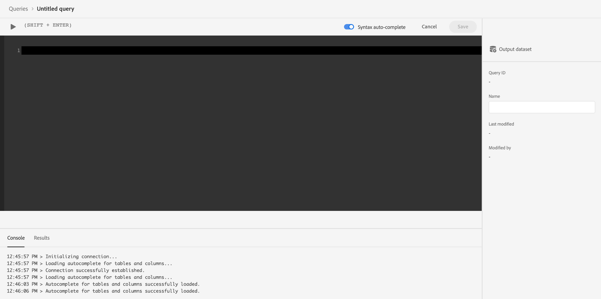

# Connexion des données Commerce à Adobe Experience Platform

Lorsque vous installez le connecteur Experience Platform, deux nouvelles pages de configuration s’affichent dans la section **Système** sous **Services** dans Commerce _Administration_.

- Connecteur Commerce Services
- Connecteur Experience Platform

Pour connecter votre instance Adobe Commerce à Adobe Experience Platform, vous devez configurer les deux connecteurs, en commençant par le connecteur Commerce Services puis en finissant avec le connecteur Experience Platform.

## Mise à jour du connecteur Commerce Services

Si vous avez précédemment installé un service Adobe Commerce, vous avez probablement déjà configuré le connecteur Commerce Services. Dans le cas contraire, vous devez effectuer les tâches suivantes sur la page [Connecteur Commerce Services](../landing/saas.md) page :

1. Connectez-vous à votre compte Commerce pour [récupération de vos clés d’API de production et d’environnement de test](../landing/saas.md#credentials).
1. Sélectionnez une [Espace de données SaaS](../landing/saas.md#saas-configuration).
1. Connectez-vous à votre compte Adobe pour [récupération de votre ID d’organisation](../landing/saas.md#ims-organization-optional).

Après avoir configuré le connecteur Commerce Services, vous pouvez configurer le connecteur Experience Platform.

## Mettre à jour le connecteur Experience Platform

Dans cette section, vous connectez votre instance Adobe Commerce à Adobe Experience Platform à l’aide de votre ID d’organisation. Vous pouvez ensuite spécifier le type de données - storefront et back office - à envoyer à l’Experience Platform edge.


## Général

1. Dans Admin, accédez à **Système** > Services > **Connecteur Experience Platform**.

1. Sur le **Paramètres** sous **Général**, vérifiez l’identifiant associé à votre compte Adobe Experience Platform, tel que configuré dans la variable [Connecteur Commerce Services](../landing/saas.md#organizationid). L’ID d’organisation est global. Un seul ID d’organisation peut être associé par instance Adobe Commerce.

1. Dans le **Portée** , définissez le contexte sur **Site Web**.

1. (Facultatif) Si vous avez déjà une [SDK Web AEP (allié)](https://experienceleague.adobe.com/docs/experience-platform/edge/home.html) déployé sur votre site, cochez la case et ajoutez le nom de votre SDK Web AEP. Sinon, laissez ces champs vides et le connecteur Experience Platform en déploie un pour vous.

   >[!NOTE]
   >
   >Si vous spécifiez votre propre SDK Web AEP, le connecteur Experience Platform utilise l’identifiant de flux de données associé à ce SDK et non l’identifiant de flux de données spécifié sur cette page (le cas échéant).

## Collecte de données

Dans cette section, vous indiquez le type de données à envoyer à l’Experience Platform Edge. Il existe deux types de données : côté client et côté serveur.

Les données côté client sont capturées sur le storefront. Cela inclut les interactions avec les acheteurs, telles que `View Page`, `View Product`, `Add to Cart`, et [liste des demandes](events.md#b2b-events) informations (pour les commerçants B2B). Les données côté serveur, ou les données de back-office, sont capturées dans les serveurs de commerce. Cela inclut des informations sur l’état d’une commande, par exemple si une commande a été passée, annulée, remboursée, expédiée ou terminée.

Pour vous assurer que votre instance Adobe Commerce peut commencer la collecte de données, consultez la section [conditions préalables](overview.md#prerequisites).

Consultez la rubrique Événements pour en savoir plus sur [storefront](events.md#storefront-events) et [back office](events.md#back-office-events) événements .

>[!NOTE]
>
>Tous les champs du champ **Collecte de données** s’appliquent à la section **Site Web** ou supérieure.

1. Sélectionner **Événements Storefront** si vous souhaitez envoyer des données comportementales storefront.

   >[!NOTE]
   >
   >La variable **Événements Storefront** est automatiquement activée si le SDK Web AEP et l’ID d’organisation sont valides.

1. Sélectionner **Événements de back-office** si vous souhaitez envoyer des informations sur l’état de la commande, par exemple si une commande a été passée, annulée, remboursée ou expédiée.

   >[!NOTE]
   >
   >Si vous sélectionnez **Événements de back-office**, toutes les données du back-office sont envoyées au serveur Edge de l’Experience Platform. Si un acheteur choisit de se désabonner de la collecte de données, vous devez définir explicitement la préférence de confidentialité de l’acheteur dans l’Experience Platform. Cela diffère des événements storefront où le collecteur gère déjà le consentement en fonction des préférences de l’acheteur. [En savoir plus](https://experienceleague.adobe.com/docs/experience-platform/landing/governance-privacy-security/consent/adobe/dataset.html) à propos de la définition de la préférence de confidentialité d’un acheteur dans l’Experience Platform.

1. Pour garantir les mises à jour des données d’événement du back-office selon un planning [cron](https://experienceleague.adobe.com/docs/commerce-admin/systems/tools/cron.html) , vous devez modifier la fonction `Sales Orders Feed` index à `Update by Schedule`.

   1. Sur le _Administration_ barre latérale, accédez à **[!UICONTROL System]** > _[!UICONTROL Tools]_>**[!UICONTROL Index Management]**.

   1. Cochez la case correspondant au `Sales Orders Feed` indexeur.

   1. Définir **[!UICONTROL Actions]** to `Update by Schedule`.

   1. Si vous activez les données du back-office pour la première fois, exécutez les commandes suivantes pour réindexer et déclencher une nouvelle synchronisation. Les resynchronisations suivantes se produisent automatiquement tant que la variable [cron](https://experienceleague.adobe.com/docs/commerce-admin/systems/tools/cron.html) est configurée correctement.

      ```bash
      bin/magento index:reindex sales_order_data_exporter_v2
      ```

      ```bash
      bin/magento saas:resync --feed orders
      ```

1. (Ignorez cette étape si vous utilisez votre propre SDK Web AEP.) [Créer](https://experienceleague.adobe.com/docs/experience-platform/edge/datastreams/configure.html#create) un flux de données dans Adobe Experience Platform ou sélectionnez un flux de données existant à utiliser pour la collecte.

1. (Ignorez cette étape si vous utilisez votre propre SDK Web AEP.) Dans le **Identifiant du flux de données** collez l’identifiant de ce flux de données nouveau ou existant.

## Descriptions des champs

| Champ | Description |
|--- |--- |
| Portée | Site web spécifique sur lequel vous souhaitez appliquer les paramètres de configuration. |
| ID d’organisation (global) | Identifiant appartenant à l’organisation qui a acheté le produit Adobe DX. Cet identifiant associe votre instance Adobe Commerce à Adobe Experience Platform. |
| Le SDK Web AEP est-il déjà déployé sur votre site ? | Cochez cette case si vous avez déployé votre propre SDK Web AEP sur votre site. |
| Nom du SDK Web AEP (global) | Si un SDK Web Experience Platform est déjà déployé sur votre site, indiquez le nom de ce SDK dans ce champ. Cela permet au collecteur d’événements Storefront et au SDK d’événements Storefront d’utiliser votre SDK web Experience Platform plutôt que la version déployée par le connecteur Experience Platform. Si aucun SDK Web Experience Platform n’est déployé sur votre site, laissez ce champ vide et le connecteur Experience Platform en déploie un pour vous. |
| Événements Storefront | Est coché par défaut tant que l’ID d’organisation et l’ID de flux de données sont valides. Les événements Storefront collectent des données comportementales anonymes de vos clients lorsqu’ils naviguent sur votre site. |
| Événements de back-office | Si cette case est cochée, la payload d’événement contient des informations d’état de commande anonymes, telles qu’une commande passée, annulée, remboursée ou expédiée. |
| Identifiant de flux de données (site web) | Identifiant qui permet aux données de passer de Adobe Experience Platform à d’autres produits DX d’Adobe. Cet identifiant doit être associé à un site web spécifique dans votre instance Adobe Commerce spécifique. Si vous spécifiez votre propre SDK Web Experience Platform, ne spécifiez pas d’identifiant de flux de données dans ce champ. Le connecteur Experience Platform utilise l’identifiant de flux de données associé à ce SDK et ignore tout identifiant de flux de données spécifié dans ce champ (le cas échéant). |

>[!NOTE]
>
>Une fois l’intégration effectuée, les données du storefront commencent à s’écouler vers le bord Experience Platform. Les données du back-office prennent environ cinq minutes pour s’afficher à la périphérie. Les mises à jour suivantes sont visibles à la périphérie en fonction de la planification cron.

## (Version bêta) Envoi de données de commande historiques

>[!NOTE]
>
>Cette fonctionnalité est disponible uniquement pour les utilisateurs bêta. Vous pouvez rejoindre la version bêta en envoyant un courrier électronique à l’adresse suivante : `dataconnection@adobe.com`.

Adobe Commerce collecte jusqu’à cinq années de données et d’état historiques des commandes. Vous pouvez utiliser le connecteur Experience Platform pour envoyer ces données historiques à l’Experience Platform afin d’enrichir vos profils clients en fonction de ces commandes passées. Les données sont stockées dans un jeu de données dans Experience Platform.

Bien que Commerce collecte déjà les données de commande historiques, vous devez effectuer plusieurs tâches pour envoyer ces données à Experience Platform. Les sections suivantes vous guident tout au long du processus.

### Installer la version bêta de l’ordre historique

Pour activer la collecte de données d’ordre historique pour la version bêta, vous devez mettre à jour la racine du projet. [!DNL Composer] `.json` comme suit :

1. Ouvrez la racine `composer.json` fichier et recherchez `magento/experience-platform-connector`.

1. Dans le `require` , mettez à jour le numéro de version comme suit :

   ```json
   "require": {
      ...
      "magento/experience-platform-connector": "^3.0.0-beta1",
      ...
    }
   ```

1. Pour les commerçants B2B, mettez à jour la variable `.json` comme suit :

   ```json
   "require": {
     ...
     "magento/experience-platform-connector-b2b": "^2.0.0-beta1"
     ...
   }
   ```

1. **Enregistrer** `composer.json`. Exécutez ensuite la commande suivante à partir de la ligne de commande :

   ```bash
   composer update magento/experience-platform-connector –-with-dependencies
   ```

   ou, pour les marchands B2B :

   ```bash
   composer update magento/experience-platform-connector-b2b --with-dependencies
   ```

### Configuration de la version bêta de l’ordre historique

Pour vous assurer que l’historique des commandes de vos clients peut être envoyé à Experience Platform, vous devez spécifier les informations d’identification qui relient votre instance Commerce à Experience Platform. Si vous avez déjà installé et activé la variable [Audience Activation](https://experienceleague.adobe.com/docs/commerce-admin/customers/audience-activation.html) , vous avez déjà spécifié les informations d’identification nécessaires et vous pouvez ignorer cette étape. Si vous n’avez pas encore installé et activé l’extension d’Audience Activation, procédez comme suit :

>[!NOTE]
>
>Dans cette section, vous saisissez des informations d’identification à partir de la console de développement. Assurez-vous que votre projet de console de développement dispose des [rôles et autorisations configurés](https://experienceleague.adobe.com/docs/experience-platform/landing/platform-apis/api-authentication.html#assign-api-to-a-role).

1. Sur le _Administration_ barre latérale, accédez à **[!UICONTROL Stores]** > _[!UICONTROL Settings]_>**[!UICONTROL Configuration]**.

1. Développer **[!UICONTROL Services]** et sélectionnez **[!UICONTROL Experience Platform Connector]**.

1. Saisissez les informations d’identification de configuration figurant dans le [console de développement](https://developer.adobe.com/console/home).

   {width="700" zoomable="yes"}

   >[!NOTE]
   >
   >Pour la version bêta, Commerce utilise les informations d’identification JSON Web Tokens (JWT) dans la console de développement. Après la version bêta, Commerce utilisera OAuth 2.0 dans la console de développement.

1. Cliquez sur **Enregistrer la configuration**.

### Configuration du service de synchronisation des commandes

Après avoir saisi les informations d’identification du développeur, vous pouvez configurer le service de synchronisation des commandes. Le service de synchronisation des commandes utilise la variable [Structure de la file d’attente des messages](https://developer.adobe.com/commerce/php/development/components/message-queues/) et RabbitMQ. Une fois ces étapes terminées, les données d’état de la commande peuvent être synchronisées avec SaaS, ce qui est nécessaire avant d’être envoyées à l’Experience Platform.

1. [Activer](https://experienceleague.adobe.com/docs/commerce-cloud-service/user-guide/configure/service/rabbitmq.html) RabbitMQ.

   >[!NOTE]
   >
   >RabbitMQ est déjà configuré pour Commerce versions 2.4.7 et ultérieures, mais vous devez activer les consommateurs.

1. Activation des consommateurs de la file de messages par tâche cron dans `.magento.env.yaml` using `CRON_CONSUMERS_RUNNER` Variable d’environnement.

   ```yaml
      stage:
        deploy:
          CRON_CONSUMERS_RUNNER:
            cron_run: true
   ```

   >[!NOTE]
   >
   >Voir [documentation sur les variables de déploiement](https://experienceleague.adobe.com/docs/commerce-cloud-service/user-guide/configure/env/stage/variables-deploy.html#cron_consumers_runner) pour en savoir plus sur toutes les options de configuration disponibles.

Une fois le service de synchronisation des commandes activé, vous pouvez spécifier la période de commande historique dans la page du connecteur Experience Platform.

### Définition de la période d’historique des commandes

Dans cette section, vous indiquez la période des commandes historiques que vous souhaitez envoyer à Experience Platform.

{width="700" zoomable="yes"}

1. Dans Admin, accédez à **Système** > Services > **Connecteur Experience Platform**.

1. Sélectionnez la variable **Historique des commandes** .

1. Sous **Synchronisation de l’historique des commandes**, saisissez la variable **Identifiant du jeu de données**. Il doit s’agir du même jeu de données associé au flux de données que celui spécifié dans la variable [collecte de données](#data-collection) ci-dessus.

   1. Pour accéder à l’identifiant du jeu de données, ouvrez l’interface utilisateur de l’Experience Platform et sélectionnez **Jeux de données** dans le volet de navigation de gauche pour ouvrir la **Jeux de données** tableau de bord. Le tableau de bord répertorie tous les jeux de données disponibles pour votre organisation. Des détails s’affichent pour chaque jeu de données répertorié, notamment son nom, le schéma auquel le jeu de données adhère et l’état de l’exécution d’ingestion la plus récente.
   1. Ouvrez le jeu de données associé à votre flux de données.
   1. Dans le volet de droite, vous trouverez des détails sur le jeu de données. Copiez l’identifiant du jeu de données.

   {width="700" zoomable="yes"}

1. Dans le **De** et **À** les champs spécifient la plage de données des données de commande historiques que vous souhaitez envoyer. Vous ne pouvez pas sélectionner de période supérieure à cinq ans.

1. Sélectionner [!UICONTROL Start Sync] pour déclencher la synchronisation. Les données d’ordre historique sont des données par lots, contrairement aux données de vitrine et de back-office qui diffusent des données en continu. Les données mises en cache prennent environ 45 minutes pour arriver en Experience Platform.

   >[!NOTE]
   >
   >Pour la version bêta, si vous déclenchez une synchronisation plusieurs fois sur la même période ou sur une période qui chevauche, des événements en double s’affichent dans le jeu de données.

## Confirmation que les données d’événement sont collectées

Pour confirmer que les données sont collectées à partir de votre boutique Commerce, utilisez la variable [Débogueur Adobe Experience Platform](https://experienceleague.adobe.com/docs/experience-platform/debugger/home.html) pour examiner votre site Commerce. Une fois que vous avez confirmé que les données sont en cours de collecte, vous pouvez vérifier que les données d’événement storefront et back-office s’affichent en périphérie en exécutant une requête qui renvoie les données de la variable [jeu de données que vous avez créé](overview.md#prerequisites).

1. Sélectionner **Requêtes** dans le volet de navigation de gauche de Experience Platform, cliquez sur [!UICONTROL Create Query].

   

1. À l’ouverture de Query Editor, saisissez une requête qui sélectionne les données du jeu de données.

   

   Par exemple, votre requête peut se présenter comme suit :

   ```sql
   SELECT * from `your_dataset_name` ORDER by TIMESTAMP DESC
   ```

1. Une fois la requête exécutée, les résultats s’affichent dans la variable **Résultats** en regard de l’onglet **Console** . Cette vue affiche la sortie tabulaire de votre requête.

   

Dans cet exemple, vous voyez les données d’événement de la variable [`commerce.productListAdds`](events.md#addtocart), [`commerce.productViews`](events.md#productpageview), [`web.webpagedetails.pageViews`](events.md#pageview), etc. Cette vue vous permet de vérifier que vos données Commerce sont arrivées à la périphérie.

Si les résultats ne correspondent pas à vos attentes, ouvrez votre jeu de données et recherchez les importations de lots ayant échoué. En savoir plus sur [dépannage des imports par lots](https://experienceleague.adobe.com/docs/experience-platform/ingestion/batch/troubleshooting.html).
