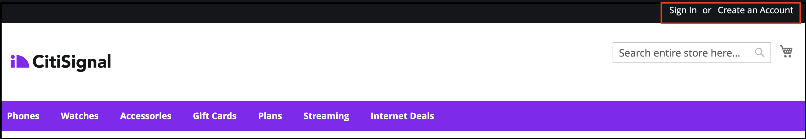
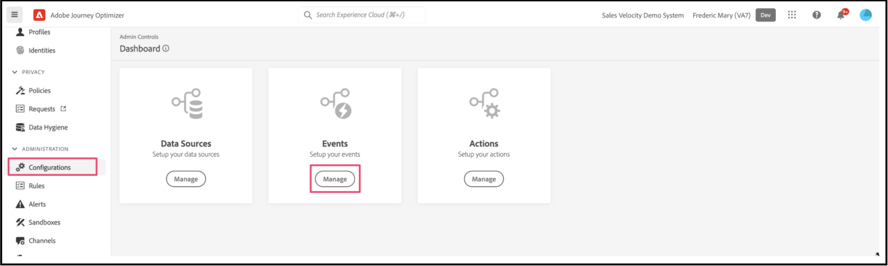

# Utilisation de Adobe Journey Optimizer pour envoyer un courrier électronique au panier abandonné

[Adobe Journey Optimizer](https://experienceleague.adobe.com/docs/journey-optimizer/using/get-started/get-started.html) vous aide à personnaliser l’expérience commerciale de vos clients. Par exemple, vous pouvez utiliser Journey Optimizer pour créer et diffuser des campagnes marketing planifiées, telles que des promotions hebdomadaires pour un magasin de détail, ou générer un e-mail de panier abandonné si un client a ajouté un produit à un panier, mais qu’il n’a pas terminé le processus de passage en caisse.

En suivant ces étapes, vous pouvez apprendre à écouter une `checkout` généré à partir de votre instance Commerce et répondez à cet événement dans Journey Optimizer pour créer un courrier électronique de panier abandonné.

>[!IMPORTANT]
>
>À des fins de démonstration, veillez à utiliser votre environnement de test Commerce. Cela permet de s’assurer que les données d’événement storefront et back-office que vous envoyez à Experience Platform ne diluent pas vos données d’événement de production.

## Conditions préalables

Avant de commencer, assurez-vous que :

- Vous êtes configuré pour utiliser Adobe Journey Optimizer.
- You [configuré](connect-data.md) Connecteur Experience Platform
- You [confirm](connect-data.md#confirm-that-event-data-is-collected) vos données d’événement Commerce arrivent à la périphérie Experience Platform

## Étape 1 : Création d’un utilisateur dans votre environnement de test Commerce

Créez un utilisateur dans votre environnement de test et vérifiez que les informations de compte utilisateur s’affichent dans Experience Platform. Assurez-vous que l’email que vous avez spécifié est valide, car il est utilisé ultérieurement dans cette section pour envoyer l’email du panier abandonné.

1. Connectez-vous ou créez un compte dans votre environnement de test Commerce.

   {width="700" zoomable="yes"}

   Une fois Experience Platform Connector installé et configuré, ces informations de compte sont envoyées à l’Experience Platform sous la forme d’un profil.

1. Vérifiez que les informations de votre compte d’utilisateur s’affichent dans la variable **[!UICONTROL Profile]** de l’Experience Platform.

   Accédez à **[!UICONTROL Profiles]** dans Adobe Experience Platform. Cliquez sur **[!UICONTROL Detail]** dans le profil pour afficher le profil que vous avez créé.

   {width="700" zoomable="yes"}

## Étape 2 : affichage des événements dans Journey Optimizer

Dans votre environnement de test Commerce, affichez les pages de produits, ajoutez des éléments à un panier et diverses autres activités qu’un acheteur doit exécuter. Ces activités déclenchent des événements sur votre vitrine. Vous pouvez maintenant confirmer que ces événements arrivent à Journey Optimizer.

1. Launch [Adobe Journey Optimizer](https://experienceleague.adobe.com/docs/journey-optimizer/using/get-started/user-interface.html).
1. Sélectionner **[!UICONTROL Profiles]**.
1. Définir **[!UICONTROL Identity namespace]** to `Email`.
1. Définissez la variable **[!UICONTROL Identity value]** à votre adresse électronique.
1. Sélectionnez votre profil, puis cliquez sur le bouton **[!UICONTROL Events]** .

   {width="700" zoomable="yes"}

   Recherchez le `commerce.checkouts` et examinez la payload de l’événement :

       &quot;json
       &quot;personID&quot;: &quot;84281643067178465783746543501073369488&quot;,
       &quot;eventType&quot;: &quot;commerce.checkouts&quot;,
       &quot;_id&quot;: &quot;4b41703f-e42e-485b-8d63-7001e3580856-0&quot;,
       &quot;commerce&quot;: {
       &quot;cart&quot;: {},
       &quot;checkouts&quot;: {
       &quot;value&quot;: 1
       }
       &quot;
   
   Comme vous pouvez le constater, la payload d’événement complète contient des données d’événement riches. Dans la section suivante, vous allez configurer les événements dans Journey Optimizer pour qu’ils écoutent les événements et y répondent. `commerce.checkouts` événement généré à partir de votre storefront Commerce.

## Étape 3 : configuration des événements dans Journey Optimizer

Configurez deux événements dans Journey Optimizer : un événement écoute les événements `commerce.checkouts` de Commerce, et l’autre est un événement de délai d’expiration de base qui attend un certain temps avant de déclencher un courrier électronique de panier abandonné.

### Créer un événement d’écouteur

1. Launch [Adobe Journey Optimizer](https://experienceleague.adobe.com/docs/journey-optimizer/using/get-started/user-interface.html).

1. Cliquez sur **[!UICONTROL Configurations]** sous le **[!UICONTROL Administration]** du volet de gauche.

1. Dans le **[!UICONTROL Events]** mosaïque, cliquez **[!UICONTROL Manage]**.

   {width="700" zoomable="yes"}

1. Sur le **[!UICONTROL Events]** page, cliquez sur **[!UICONTROL Create Event]**.

1. Dans le volet de navigation de droite, configurez votre événement comme suit :

   1. Définissez la variable **[!UICONTROL Name]** à : `firstname_lastname_checkout`.
   1. Définir **[!UICONTROL Type]** to **[!UICONTROL Unitary]**.
   1. Définir **[!UICONTROL Event id typ]e** to **[!UICONTROL Rule based]**.
   1. Définir **[!UICONTROL Schema]** à votre Commerce [schema](update-xdm.md).
   1. Sélectionner **[!UICONTROL Fields]** et dans le **[!UICONTROL Fields]** qui s’affiche, sélectionnez les champs utiles pour cet événement.

      Par exemple, sélectionnez tous les champs sous le **[!UICONTROL Product list items]**, **[!UICONTROL Commerce]**, **[!UICONTROL eventType]**, et **[!UICONTROL Web]**.

   1. Cliquez sur **[!UICONTROL OK]** pour enregistrer les champs sélectionnés.
   1. Cliquez dans la **[!UICONTROL Event id condition]** et créer une condition de `eventType` est égal à `commerce.checkouts` ET `personalEmail.address` est égal à l’adresse électronique que vous avez utilisée lors de la création du profil dans la section précédente.

      {width="700" zoomable="yes"}

   1. Cliquez sur **[!UICONTROL OK]**.
   1. Cliquez sur **[!UICONTROL Save]** pour enregistrer votre événement.

### Création d’un événement de délai d’expiration

1. Créez un événement dans Journey Optimizer comme vous le faisiez auparavant.

1. Dans le volet de navigation de droite, configurez votre événement comme suit :

   1. Définissez la variable **[!UICONTROL Name]** à : `firstname_lastname_timeout`.
   1. Définir **[!UICONTROL Type]** to **[!UICONTROL Unitary]**.
   1. Définir **[!UICONTROL Event id typ]e** to **[!UICONTROL Rule based]**.
   1. Définir **[!UICONTROL Schema]** à votre Commerce [schema](update-xdm.md).
   1. Définissez la variable **[!UICONTROL Schema]**, **[!UICONTROL Fields]**, et **[!UICONTROL Event id condition]** comme ci-dessus.
   1. Cliquez sur **[!UICONTROL Save]** pour enregistrer votre événement.

Une fois ces deux événements configurés, créez un parcours qui envoie un email de panier abandonné.

## Étape 4 : création d’un parcours de passage en caisse

Créez un parcours qui écoute les `commerce.checkouts` puis envoie un courrier électronique au panier abandonné après un délai spécifié.

1. Dans Journey Optimizer, sélectionnez **[!UICONTROL Journeys]** under **J[!UICONTROL OURNEY MANAGEMENT]**.
1. Cliquez sur **[!UICONTROL Create Journey]**.
1. Indiquez le nom de votre parcours.
1. Cliquez sur **[!UICONTROL OK]** pour enregistrer le parcours.
1. Dans le volet de navigation de gauche, sous **[!UICONTROL EVENTS]** , recherchez l’événement de passage en caisse que vous avez créé précédemment : `firstname_lastname_checkout` et faites-le glisser et déposez-le sur la zone de travail.

   >[!TIP]
   >
   >Double-cliquez sur l’événement pour l’ajouter automatiquement à la zone de travail.

1. Recherchez l’événement de délai d’expiration et ajoutez-le à la zone de travail.
1. Double-cliquez sur l’événement de dépassement de délai.

   1. Dans le **[!UICONTROL Timeout]** , sélectionnez **[!UICONTROL Define the event time]** .
   1. Dans le **[!UICONTROL Wait for]** entrée de champ `1` et `Minute`.
   1. Sélectionnez la variable **[!UICONTROL Set a timeout path]** .

   Avec cette configuration de délai d’expiration, un acheteur qui effectue un passage en caisse mais ne termine pas la commande en une minute déclenche cette branche de délai d’expiration. Dans un environnement de production réel, vous le définiriez sur une plus longue période, par exemple 24 heures.

1. Dans la navigation de gauche sous **[!UICONTROL ACTIONS]**, ajoutez le **[!UICONTROL Email]** à la branche timeout. Votre parcours doit se présenter comme suit :

   {width="700" zoomable="yes"}

### Créer un email de panier abandonné

Créez un email de panier abandonné qui est envoyé lorsqu’un panier abandonné est détecté.

1. Dans le parcours que vous avez créé ci-dessus, double-cliquez sur le **[!UICONTROL Email]** sur la zone de travail.

1. Suivez la [étapes](https://experienceleague.adobe.com/docs/journey-optimizer/using/content-management/personalization/personalization-use-cases/personalization-use-case-helper-functions.html#configure-email) dans le guide Journey Optimizer pour créer l’email du panier abandonné.

Vous disposez maintenant d’un parcours dans Journey Optimizer qui écoute le `commerce.checkouts` à partir de votre boutique Commerce et d’un email de panier abandonné envoyé après un certain temps. Dans la section suivante, vous allez tester le parcours.

## Étape 5 : déclencher l’événement de passage en caisse en temps réel

Dans cette section, vous testez l’événement en temps réel.

1. Dans Journey Optimizer, activez le mode Test.

   {width="700" zoomable="yes"}

1. Pour tester ce parcours en temps réel, ouvrez un autre onglet du navigateur et accédez à votre site web de commerce sandbox.

   1. Ajoutez un produit à votre panier.
   1. Accédez à la page de passage en caisse.
   1. Depuis la page de passage en caisse, abandonnez le panier en revenant à la page principale ou en fermant votre onglet.

      Le parcours est maintenant déclenché. Pour confirmer, ouvrez l’onglet contenant votre parcours dans Journey Optimizer. Vous devriez voir une flèche verte qui indique le chemin emprunté par votre utilisateur.

1. Recherchez le courrier électronique dans votre boîte de réception.
