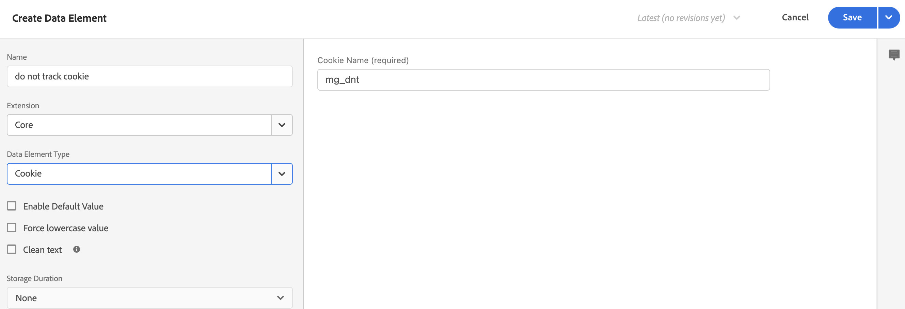

# Collecte de données commerciales à l’aide de balises Adobe Experience Platform

Bien que vous puissiez utiliser le connecteur Experience Platform pour publier des événements de storefront et vous y abonner, certains commerçants utilisent peut-être déjà une solution de collecte de données, telle que la variable [Balises Adobe Experience Platform](https://experienceleague.adobe.com/docs/platform-learn/data-collection/tags/create-a-property.html?lang=en). Pour ces commerçants, Adobe Commerce fournit une option de publication uniquement dans le connecteur Experience Platform qui utilise le SDK d’événement Adobe Commerce.


_Flux de données Experience Platform Connector avec balises_

Dans cette rubrique, vous apprendrez à mapper les valeurs d’événement storefront fournies par le connecteur Experience Platform à la solution de balises Adobe Experience Platform que vous utilisez déjà.

## Collecte de données d’événement à partir d’Adobe Commerce

Pour collecter des données d’événement Commerce :

- Installez le [SDK Adobe Commerce Events](https://github.com/adobe/commerce-events/tree/main/packages/commerce-events-sdk). Pour consulter les storefronts PHP, voir [install](install.md) rubrique. Pour consulter les storefronts des PWA Studio, voir [Guide du PWA Studio](https://developer.adobe.com/commerce/pwa-studio/integrations/adobe-commerce/aep/).

   >[!NOTE]
   >
   > Do **not** [configure](connect-data.md) l’ID d’organisation et l’ID de flux de données.

## Mappage des données du storefront Commerce à Adobe Experience Platform

Pour mapper les données de storefront Commerce à Adobe Experience Platform, configurez et installez les éléments suivants depuis les balises Adobe Experience Platform :

1. [Configuration d’une propriété de balise](https://experienceleague.adobe.com/docs/platform-learn/implement-in-websites/configure-tags/create-a-property.html?lang=en) dans la collecte de données Adobe Experience Platform.

1. Sous **Création**, sélectionnez **Extensions** et installez et configurez les extensions suivantes :

   - [Adobe de la couche de données client](https://experienceleague.adobe.com/docs/experience-platform/tags/extensions/adobe/client-data-layer/overview.html)

   - [SDK Web Adobe Experience Platform](https://experienceleague.adobe.com/docs/experience-platform/edge/fundamentals/installing-the-sdk.html)

1. [Balise de publication](https://experienceleague.adobe.com/docs/experience-platform/tags/publish/overview.html) à votre environnement de développement.

1. Suivez la **Mappage des événements** étapes ci-dessous pour configurer des éléments de données et des règles pour des événements spécifiques.

### Mappage des événements

La collecte de données à l’aide de balises diffère de l’utilisation du SDK d’événement Adobe Commerce. Il est donc important de comprendre les termes équivalents utilisés dans les deux frameworks.

| Terme des balises Adobe Experience Platform | Terme du SDK d’événement Adobe Commerce |
|---|---|
| _éléments de données_ | contexte |
| _rules_ | event |
|  | _conditions de règle_ - écouteurs d’événements (à partir d’ACDL)<br><br>_actions de règle_ - gestionnaires d’événements (envoyer à Adobe Experience Platform) |

Lorsque vous mettez à jour les éléments de données et les règles dans les balises Adobe Experience Platform avec des données d’événement spécifiques à Adobe Commerce, certaines étapes sont courantes.

Par exemple, ajoutons l’Adobe Commerce `signOut` vers les balises Adobe Experience Platform. Les étapes décrites ci-dessous, à l’exception des valeurs spécifiques que vous définissez, décrivent comment ajouter des [éléments de données](https://experienceleague.adobe.com/docs/experience-platform/collection/e2e.html#data-element) et [rules](https://experienceleague.adobe.com/docs/experience-platform/collection/e2e.html#create-a-rule), qui s’appliquent à tous les événements Adobe Commerce que vous ajoutez à des balises.

1. Création d’un élément de données :

   
   _Créer un élément de données_

1. Définir **Nom** to `Sign out`.

1. Définir **Extension** to `Adobe Experience Platform Web SDK`.

1. Définir **Type d’élément de données** to `XDM object`.

1. Sélectionnez la **Sandbox** et **Schéma** que vous souhaitez mettre à jour.

1. Sous **userAccount** > **déconnexion**, définissez la variable **value** in **Déconnexion du visiteur** to `1`.

   
   _Mettre à jour la valeur de connexion_

1. Création d’une règle :

   
   _Créer une règle_

1. Définir **Extension** to `Adobe Client Data Layer`.

1. Définir **Type d’événement** to `Data Pushed`.

1. Sélectionner **Evénement spécifique** et définissez la variable **Événement/Clé à enregistrer pour** to `sign-out`.

1. Ajoutez une action.

1. Définir **Extension** to `Adobe Experience Platform Web SDK`.

1. Définir **Type d’action** to `Send Event`.

1. Définir **Instance** to `Alloy`.

1. Définir **Type** to `userAccount.logout`.

1. Définir **Données XDM** to `%sign out%`.

1. Cliquez sur **Enregistrer**.

   Vous avez créé un élément de données dans votre schéma pour la variable `signOut` d’Adobe Commerce. En outre, vous avez créé une règle avec une action spécifique qui doit se produire lorsque cet événement est déclenché à partir du storefront Adobe Commerce.

Répétez les étapes ci-dessus dans les balises pour chacun des événements Adobe Commerce décrits ci-dessous.

### Événements disponibles

Pour chacun des événements suivants, mappez les événements Adobe Commerce à votre XDM en suivant les étapes ci-dessus.

- [`signOut`](#signout)
- [`signIn`](#signin)
- [`createAccount`](#createaccount)
- [`editAccount`](#editaccount)
- [`pageView`](#pageview)
- [`productView`](#productview)
- [`searchRequestSent`](#searchrequestsent)
- [`searchResponseReceived`](#searchresponsereceived)
- [`addToCart`](#addtocart)
- [`viewCart`](#viewcart)
- [`removeFromCart`](#removefromcart)
- [`initiateCheckout`](#initiatecheckout)
- [`placeOrder`](#placeorder)

### signOut {#signout}

#### Éléments de données

Créez l’élément de données suivant :

1. Déconnexion :

   - **Nom**: `Sign out`
   - **Extension**: `Adobe Experience Platform Web SDK`
   - **Type d’élément de données**: `XDM object`
   - **Groupe de champs**: `userAccount` > `logout`
   - **Déconnexion du visiteur**: **Valeur** = `1`

#### Règles 

- **Nom**: `Sign out`
- **Extension**: `Adobe Client Data Layer`
- **Type d’événement**: `Data Pushed`
- **Evénement spécifique**: `sign-out`

##### Actions

- **Extension**: `Adobe Experience Platform Web SDK`
- **Type d’action**: `Send event`
- **Type**: `userAccount.logout`
- **Données XDM**: `%sign-out%`

### signIn {#signin}

#### Éléments de données

Créez les éléments de données suivants :

1. Adresse électronique du compte :

   - **Nom**: `Account email`
   - **Extension**: `Adobe Client Data Layer`
   - **Type d’élément de données**: `Data Layer Computed State`
   - **[Facultatif] path**: `accountContext.emailAddress`

1. Type de compte :

   - **Nom**: `Account type`
   - **Extension**: `Adobe Client Data Layer`
   - **Type d’élément de données**: `Data Layer Computed State`
   - **[Facultatif] path**: `accountContext.accountType`

1. ID de compte :

   - **Nom**: `Account ID`
   - **Extension**: `Adobe Client Data Layer`
   - **Type d’élément de données**: `Data Layer Computed State`
   - **[Facultatif] path***: `accountContext.accountId`

1. Connexion :

   - **Nom**: `Sign in`
   - **Extension**: `Adobe Experience Platform Web SDK`
   - **Type d’élément de données**: `XDM object`
   - **Groupe de champs**: `userAccount` > `login`
   - **Connexion du visiteur**: **Valeur** = `1`

#### Règles 

- **Nom**: `Sign in`
- **Extension**: `Adobe Client Data Layer`
- **Type d’événement**: `Data Pushed`
- **Evénement spécifique**: `sign-in`

##### Actions

- **Extension**: `Adobe Experience Platform Web SDK`
- **Type d’action**: `Send event`
- **Type**: `userAccount.login`
- **Données XDM**: `%sign-in%`

### createAccount {#createaccount}

#### Éléments de données

Créez les éléments de données suivants :

1. Adresse électronique du compte :

   - **Nom**: `Account email`
   - **Extension**: `Adobe Client Data Layer`
   - **Type d’élément de données**: `Data Layer Computed State`
   - **[Facultatif] path**: `accountContext.emailAddress`

1. Type de compte :

   - **Nom**: `Account type`
   - **Extension**: `Adobe Client Data Layer`
   - **Type d’élément de données**: `Data Layer Computed State`
   - **[Facultatif] path**: `accountContext.accountType`

1. ID de compte :

   - **Nom**: `Account ID`
   - **Extension**: `Adobe Client Data Layer`
   - **Type d’élément de données**: `Data Layer Computed State`
   - **[Facultatif] path***: `accountContext.accountId`

1. Créer un compte :

   - **Nom**: `Create account`
   - **Extension**: `Adobe Experience Platform Web SDK`
   - **Type d’élément de données**: `XDM object`
   - **Groupe de champs**: `userAccount` > `createProfile`
   - **Création de profil de compte**: **Valeur** = `1`

#### Règles 

- **Nom**: `Create account`
- **Extension**: `Adobe Client Data Layer`
- **Type d’événement**: `Data Pushed`
- **Evénement spécifique**: `create-account`

##### Actions

- **Extension**: `Adobe Experience Platform Web SDK`
- **Type d’action**: `Send event`
- **Type**: `userAccount.createProfile`
- **Données XDM**: `%create account%`

### editAccount {#editaccount}

#### Éléments de données

Créez les éléments de données suivants :

1. Adresse électronique du compte :

   - **Nom**: `Account email`
   - **Extension**: `Adobe Client Data Layer`
   - **Type d’élément de données**: `Data Layer Computed State`
   - **[Facultatif] path**: `accountContext.emailAddress`

1. Type de compte :

   - **Nom**: `Account type`
   - **Extension**: `Adobe Client Data Layer`
   - **Type d’élément de données**: `Data Layer Computed State`
   - **[Facultatif] path**: `accountContext.accountType`

1. ID de compte :

   - **Nom**: `Account ID`
   - **Extension**: `Adobe Client Data Layer`
   - **Type d’élément de données**: `Data Layer Computed State`
   - **[Facultatif] path***: `accountContext.accountId`

1. Modifier le compte :

   - **Nom**: `Edit account`
   - **Extension**: `Adobe Experience Platform Web SDK`
   - **Type d’élément de données**: `XDM object`
   - **Groupe de champs**: `userAccount` > `updateProfile`
   - **Création de profil de compte**: **Valeur** = `1`

#### Règles

- **Nom**: `Edit account`
- **Extension**: `Adobe Client Data Layer`
- **Type d’événement**: `Data Pushed`
- **Evénement spécifique**: `edit-account`

##### Actions

- **Extension**: `Adobe Experience Platform Web SDK`
- **Type d’action**: `Send event`
- **Type**: `userAccount.updateProfile`
- **Données XDM**: `%edit account%`

### pageView {#pageview}

#### Éléments de données

Créez les éléments de données suivants :

1. Nom de la page :

   - **Nom**: `Page name`
   - **Extension**: `Adobe Client Data Layer`
   - **Type d’élément de données**: `Data Layer Computed State`
   - **[Facultatif] path**: `pageContext.pageName`

#### Règles 

- **Nom**: `Page view`
- **Extension**: `Adobe Client Data Layer`
- **Type d’événement**: `Data Pushed`
- **Evénement spécifique**: `Core-Library Loaded`

##### Actions

- **Extension**: `Adobe Experience Platform Web SDK`
- **Type d’action**: `Send event`
- **Type**: `web.webPageDetails.pageViews`
- **Données XDM**: `%page view%`

### productView {#productview}

#### Éléments de données

Créez les éléments de données suivants :

1. Nom du produit :

   - **Nom**: `Product name`
   - **Extension**: `Adobe Client Data Layer`
   - **Type d’élément de données**: `Data Layer Computed State`
   - **[Facultatif] path**: `productContext.name`

1. SKU du produit :

   - **Nom**: `Product sku`
   - **Extension**: `Adobe Client Data Layer`
   - **Type d’élément de données**: `Data Layer Computed State`
   - **[Facultatif] path**: `productContext.sku`

1. Devise du produit :

   - **Nom**: `Product currency`
   - **Extension**: `Adobe Client Data Layer`
   - **Type d’élément de données**: `Data Layer Computed State`
   - **[Facultatif] path**: `productContext.pricing.currencyCode`

1. Code de devise :

   - **Nom**: `Currency code`
   - **Extension**: `Core`
   - **Type d’élément de données**: `Custom Code`
   - **Ouvrir l’éditeur**:

   ```bash
   return _satellite.getVar('product currency') || _satellite.getVar('storefront').storeViewCurrencyCode
   ```

1. Prix spécial :

   - **Nom**: `Special price`
   - **Extension**: `Adobe Client Data Layer`
   - **Type d’élément de données**: `Data Layer Computed State`
   - **[Facultatif] path**: `productContext.pricing.specialPrice`

1. Prix normal :

   - **Nom**: `Regular price`
   - **Extension**: `Adobe Client Data Layer`
   - **Type d’élément de données**: `Data Layer Computed State`
   - **[Facultatif] path**: `productContext.pricing.regularPrice`

1. Prix du produit :

   - **Nom**: `Product price`
   - **Extension**: `Core`
   - **Type d’élément de données**: `Custom Code`
   - **Ouvrir l’éditeur**:

   ```bash
   return _satellite.getVar('product regular price') || _satellite.getVar('product special price')
   ```

1. Consultation produit :

   - **Nom**: `Product view`
   - **Extension**: `Adobe Experience Platform Web SDK`
   - **Type d’élément de données**: `XDM object`
   - **Groupe de champs**: `productListItems`. Sélectionner **Fournir des éléments individuels** et cliquez sur le bouton **Ajouter un élément** bouton . Comme cette vue est destinée à un PDP, vous pouvez renseigner un seul élément.

#### Règles 

- **Nom**: `Product view`
- **Extension**: `Adobe Client Data Layer`
- **Type d’événement**: `Data Pushed`
- **Evénement spécifique**: `product-page-view`

##### Actions

- **Extension**: `Adobe Experience Platform Web SDK`
- **Type d’action**: `Send event`
- **Type**: `commerce.productViews`
- **Données XDM**: `%product view%`

### searchRequestSent {#searchrequestsent}

#### Éléments de données

Créez les éléments de données suivants :

1. Entrée de recherche

   - **Nom**: `Search input`
   - **Extension**: `Adobe Client Data Layer`
   - **Type d’élément de données**: `Data Layer Computed State`
   - **[Facultatif] path**: `searchInputContext.units[0]`

1. Expression de saisie de recherche

   - **Nom**: `Search input phrase`
   - **Extension**: `Core`
   - **Type d’élément de données**: `Custom Code`
   - **Ouvrir l’éditeur**:

   ```bash
   return _satellite.getVar('search input').phrase;
   ```

1. Rechercher le tri des entrées

   - **Nom**: `Search input sort`
   - **Extension**: `Core`
   - **Type d’élément de données**: `Custom Code`
   - **Ouvrir l’éditeur**:

   ```bash
   const searchInput = _satellite.getVar('search input');
   const sortFromInput = searchInput ? searchInput.sort : [];
   const sort = sortFromInput.map((searchSort) => {
       return {
           attribute: searchSort.attribute,
           order: searchSort.direction,
       };
   });
   return sort;
   ```

1. Filtres de saisie de recherche

   - **Nom**: `Search input filters`
   - **Extension**: `Core`
   - **Type d’élément de données**: `Custom Code`
   - **Ouvrir l’éditeur**:

   ```bash
   const searchInput = _satellite.getVar('search input');
   const filtersFromInput = searchInput ? searchInput.filter : [];
   const filters = filtersFromInput.map(
       (searchFilter) => {
           let value = [];
           let isRange = false;
           if (searchFilter.eq) {
               value.push(searchFilter.eq);
           } else if (searchFilter.in) {
               value = searchFilter.in;
           } else if (searchFilter.range) {
               isRange = true;
               value.push(String(searchFilter.range.from));
               value.push(String(searchFilter.range.to));
           }
           return {
               attribute: searchFilter.attribute,
               value,
               isRange,
           };
       }
   );
   
   return filters;
   ```

1. Requête de recherche :

   - **Nom**: `Search request`
   - **Extension**: `Adobe Experience Platform Web SDK`
   - **Type d’élément de données**: `XDM object`
   - **Groupe de champs**: `siteSearch` > `phrase`
   - **value**: Pas encore disponible
   - **Groupe de champs**: `siteSearch` > `sort`. Sélectionner **Fournir un objet entier**.
   - **Groupe de champs**: `siteSearch` > `filter`. Sélectionner **Fournir un objet entier**.
   - **Groupe de champs**: `searchRequest` > `value`
   - **value**: **Valeur** = `1`

#### Règles 

- **Nom**: `Search request sent`
- **Extension**: `Adobe Client Data Layer`
- **Type d’événement**: `Data Pushed`
- **Evénement spécifique**: `search-request-sent`

##### Actions

- **Extension**: `Adobe Experience Platform Web SDK`
- **Type d’action**: `Send event`
- **Type**: `searchRequest`
- **Données XDM**: `%search request%`

### searchResponseReceived {#searchresponsereceived}

#### Éléments de données

Créez les éléments de données suivants :

1. Résultats de la recherche :

   - **Nom**: `Search results`
   - **Extension**: `Adobe Client Data Layer`
   - **Type d’élément de données**: `Data Layer Computed State`
   - **[Facultatif] path**: `searchResultsContext.units[0]`

1. Nombre de résultats de recherche de produits :

   - **Nom**: `Search result number of products`
   - **Extension**: `Core`
   - **Type d’élément de données**: `Custom Code`
   - **Ouvrir l’éditeur**:

   ```bash
   return _satellite.getVar('search result').products.length;
   ```

1. Résultats de la recherche :

   - **Nom**: `Search result products`
   - **Extension**: `Core`
   - **Type d’élément de données**: `Custom Code`
   - **Ouvrir l’éditeur**:

   ```bash
   const searchResult = _satellite.getVar('search result');
   const productsFromResult = searchResult.products ? searchResult.products : [];
   const products = productsFromResult.map(
       (product) => {
           return { SKU: product.sku, name: product.name };
       }
   );
   return products;
   ```

1. Suggestions de résultats de recherche :

   - **Nom**: `Search result products`
   - **Extension**: `Core`
   - **Type d’élément de données**: `Custom Code`
   - **Ouvrir l’éditeur**:

   ```bash
   const searchResult = _satellite.getVar('search result');
   const suggestionsFromResult = searchResult.suggestions ? searchResult.suggestions : [];
   const suggestions = suggestionsFromResult.map((suggestion) => suggestion.suggestion);
   return suggestions;
   ```

1. Réponse de recherche :

   - **Nom**: `Search response`
   - **Extension**: `Adobe Experience Platform Web SDK`
   - **Type d’élément de données**: `XDM object`
   - **Groupe de champs**: `siteSearch` > `suggestions`. Sélectionner **Fournir un objet entier**.
   - **Groupe de champs**: `siteSearch` > `numberOfResults`
   - **value**: `%search result number of products%`
   - **Groupe de champs**: `productListItems`. Sélectionner **Fournir un objet entier**.
   - **Groupe de champs**: `searchResponse` > `value`
   - **value**: **Valeur** = `1`

#### Règles 

- **Nom**: `Search Response Received`
- **Extension**: `Adobe Client Data Layer`
- **Type d’événement**: `Data Pushed`
- **Evénement spécifique**: `search-response-received`

##### Actions

- **Extension**: `Adobe Experience Platform Web SDK`
- **Type d’action**: `Send event`
- **Type**: `searchResponse`
- **Données XDM**: `%search response%`

### addToCart {#addtocart}

#### Éléments de données

Créez les éléments de données suivants :

1. Nom du produit :

   - **Nom**: `Product name`
   - **Extension**: `Adobe Client Data Layer`
   - **Type d’élément de données**: `Data Layer Computed State`
   - **[Facultatif] path**: `productContext.name`

1. SKU du produit :

   - **Nom**: `Product sku`
   - **Extension**: `Adobe Client Data Layer`
   - **Type d’élément de données**: `Data Layer Computed State`
   - **[Facultatif] path**: `productContext.sku`

1. Code de devise :

   - **Nom**: `Currency code`
   - **Extension**: `Adobe Client Data Layer`
   - **Type d’élément de données**: `Data Layer Computed State`
   - **[Facultatif] path**: `productContext.pricing.currencyCode`

1. Prix spécial du produit :

   - **Nom**: `Product special price`
   - **Extension**: `Adobe Client Data Layer`
   - **Type d’élément de données**: `Data Layer Computed State`
   - **[Facultatif] path**: `productContext.pricing.specialPrice`

1. Prix normal du produit :

   - **Nom**: `Product regular price`
   - **Extension**: `Adobe Client Data Layer`
   - **Type d’élément de données**: `Data Layer Computed State`
   - **[Facultatif] path**: `productContext.pricing.regularPrice`

1. Prix du produit :

   - **Nom**: `Product price`
   - **Extension**: `Core`
   - **Type d’élément de données**: `Custom Code`
   - **Ouvrir l’éditeur**:

   ```bash
   return _satellite.getVar('product regular price') || _satellite.getVar('product special price') 
   ```

1. Panier :

   - **Nom**: `Cart`
   - **Extension**: `Adobe Client Data Layer`
   - **Type d’élément de données**: `Data Layer Computed State`
   - **[Facultatif] path**: `shoppingCartContext`

1. ID de panier :

   - **Nom**: `Cart id`
   - **Extension**: `Core`
   - **Type d’élément de données**: `Custom Code`
   - **Ouvrir l’éditeur**:

   ```bash
   return _satellite.getVar('cart').id
   ```

1. Ajouter au panier :

   - **Nom**: `Add to cart`
   - **Extension**: `Adobe Experience Platform Web SDK`
   - **Type d’élément de données**: `XDM object`
   - **Groupe de champs**: `productListItems`. Sélectionner **Fournir des éléments individuels** et cliquez sur le bouton **Ajouter un élément** bouton . Comme cette vue est destinée à un PDP, vous pouvez renseigner un seul élément.
   - **Groupe de champs**: `commerce` > `cart` > `cartID`
   - **Identifiant du panier**: **Valeur** = `%cart id%`
   - **Groupe de champs**: `commerce` > `productListAdds` > `id`
   - **Identifiant unique**: **value** = `1`

#### Règles 

- **Nom**: `Add to cart`
- **Extension**: `Adobe Client Data Layer`
- **Type d’événement**: `Data Pushed`
- **Evénement spécifique**: `add-to-cart`

##### Actions

- **Extension**: `Adobe Experience Platform Web SDK`
- **Type d’action**: `Send event`
- **Type**: `commerce.productListAdds`
- **Données XDM**: `%add to cart%`

### viewCart {#viewcart}

#### Éléments de données

Créez les éléments de données suivants :

1. Storefront :

   - **Nom**: `Storefront`
   - **Extension**: `Adobe Client Data Layer`
   - **Type d’élément de données**: `Data Layer Computed State`
   - **[Facultatif] path**: `storefrontInstanceContext`

1. Panier :

   - **Nom**: `Cart`
   - **Extension**: `Adobe Client Data Layer`
   - **Type d’élément de données**: `Data Layer Computed State`
   - **[Facultatif] path**: `shoppingCartContext`

1. ID de panier :

   - **Nom**: `Cart id`
   - **Extension**: `Core`
   - **Type d’élément de données**: `Custom Code`
   - **Ouvrir l’éditeur**:

   ```bash
   return _satellite.getVar('cart').id
   ```

1. Éléments de la liste de produits :

   - **Nom**: `Product list items:`
   - **Extension**: `Core`
   - **Type d’élément de données**: `Custom Code`
   - **Ouvrir l’éditeur**:

   ```bash
   const storefrontContext = _satellite.getVar('storefront');
   const cart = _satellite.getVar('cart');
   
   const returnList = [];
   cart.items.forEach(item => {
       const selectedOptions = [];
       item.configurableOptions?.forEach(option => {
           selectedOptions.push({
               attribute: option.optionLabel,
               value: option.valueLabel,
           });
       });
   
       const productListItem = {
           SKU: item.product.sku,
           name: item.product.name,
           quantity: item.quantity,
           priceTotal: item.prices.price.value * item.quantity,
           currencyCode: item.prices.price.currency ? item.prices.price.currency : storefrontContext.storeViewCurrencyCode,
           selectedOptions: selectedOptions,
       };
   
       returnList.push(productListItem);
   });
   return returnList;
   ```

1. Afficher le panier :

   - **Nom**: `View cart`
   - **Extension**: `Adobe Experience Platform Web SDK`
   - **Type d’élément de données**: `XDM object`
   - **Groupe de champs**: `productListItems`. Pour `productListItems`, plusieurs éléments peuvent être précalculés. Sélectionner **productListItems** > **Renseigner le tableau entier**.
   - **Groupe de champs**: `commerce` > `cart` > `cartID`
   - **Identifiant du panier**: **Valeur** = `%cart id%`
   - **Groupe de champs**: `commerce` > `productListAdds` > `id`
   - **Identifiant unique**: **value** = `1`

#### Règles 

- **Nom**: `View cart`
- **Extension**: `Adobe Client Data Layer`
- **Type d’événement**: `Data Pushed`
- **Evénement spécifique**: `shopping-cart-view`

##### Actions

- **Extension**: `Adobe Experience Platform Web SDK`
- **Type d’action**: `Send event`
- **Type**: `commerce.productListViews`
- **Données XDM**: `%view cart%`

### removeFromCart {#removefromcart}

#### Éléments de données

Créez les éléments de données suivants :

1. Nom du produit :

   - **Nom**: `Product name`
   - **Extension**: `Adobe Client Data Layer`
   - **Type d’élément de données**: `Data Layer Computed State`
   - **[Facultatif] path**: `productContext.name`

1. SKU du produit :

   - **Nom**: `Product sku`
   - **Extension**: `Adobe Client Data Layer`
   - **Type d’élément de données**: `Data Layer Computed State`
   - **[Facultatif] path**: `productContext.sku`

1. Code de devise :

   - **Nom**: `Currency code`
   - **Extension**: `Adobe Client Data Layer`
   - **Type d’élément de données**: `Data Layer Computed State`
   - **[Facultatif] path**: `productContext.pricing.currencyCode`

1. Prix spécial du produit :

   - **Nom**: `Product special price`
   - **Extension**: `Adobe Client Data Layer`
   - **Type d’élément de données**: `Data Layer Computed State`
   - **[Facultatif] path**: `productContext.pricing.specialPrice`

1. Prix normal du produit :

   - **Nom**: `Product regular price`
   - **Extension**: `Adobe Client Data Layer`
   - **Type d’élément de données**: `Data Layer Computed State`
   - **[Facultatif] path**: `productContext.pricing.regularPrice`

1. Prix du produit :

   - **Nom**: `Product price`
   - **Extension**: `Core`
   - **Type d’élément de données**: `Custom Code`
   - **Ouvrir l’éditeur**:

   ```bash
   return _satellite.getVar('product regular price') || _satellite.getVar('product special price') 
   ```

1. Panier :

   - **Nom**: `Cart`
   - **Extension**: `Adobe Client Data Layer`
   - **Type d’élément de données**: `Data Layer Computed State`
   - **[Facultatif] path**: `shoppingCartContext`

1. ID de panier :

   - **Nom**: `Cart id`
   - **Extension**: `Core`
   - **Type d’élément de données**: `Custom Code`
   - **Ouvrir l’éditeur**:

   ```bash
   return _satellite.getVar('cart').id
   ```

1. Retirer du panier :

   - **Nom**: `Remove from cart`
   - **Extension**: `Adobe Experience Platform Web SDK`
   - **Type d’élément de données**: `XDM object`
   - **Groupe de champs**: `productListItems`. Sélectionner **Fournir des éléments individuels** et cliquez sur le bouton **Ajouter un élément** bouton . Comme cette vue est destinée à un PDP, vous pouvez renseigner un seul élément.
   - **Groupe de champs**: `commerce` > `cart` > `cartID`
   - **Identifiant du panier**: **Valeur** = `%cart id%`
   - **Groupe de champs**: `commerce` > `productListRemovals`
   - **Identifiant unique**: **value** = `1`

#### Règles 

- **Nom**: `Remove from cart`
- **Extension**: `Adobe Client Data Layer`
- **Type d’événement**: `Data Pushed`
- **Evénement spécifique**: `remove-from-cart`

##### Actions

- **Extension**: `Adobe Experience Platform Web SDK`
- **Type d’action**: `Send event`
- **Type**: `commerce.productListRemovals`
- **Données XDM**: `%remove from cart%`

### initiateCheckout {#initiatecheckout}

#### Éléments de données

Créez les éléments de données suivants :

1. Storefront :

   - **Nom**: `Storefront`
   - **Extension**: `Adobe Client Data Layer`
   - **Type d’élément de données**: `Data Layer Computed State`
   - **[Facultatif] path**: `storefrontInstanceContext`

1. Panier :

   - **Nom**: `Cart`
   - **Extension**: `Adobe Client Data Layer`
   - **Type d’élément de données**: `Data Layer Computed State`
   - **[Facultatif] path**: `shoppingCartContext`

1. ID de panier :

   - **Nom**: `Cart id`
   - **Extension**: `Core`
   - **Type d’élément de données**: `Custom Code`
   - **Ouvrir l’éditeur**:

   ```bash
   return _satellite.getVar('cart').id
   ```

1. Éléments de la liste de produits :

   - **Nom**: `Product list items`
   - **Extension**: `Core`
   - **Type d’élément de données**: `Custom Code`
   - **Ouvrir l’éditeur**:

   ```bash
   const storefrontContext = _satellite.getVar('storefront');
   const cart = _satellite.getVar('cart');
   
   const returnList = [];
   cart.items.forEach(item => {
       const selectedOptions = [];
       item.configurableOptions?.forEach(option => {
           selectedOptions.push({
               attribute: option.optionLabel,
               value: option.valueLabel,
           });
       });
   
       const productListItem = {
           SKU: item.product.sku,
           name: item.product.name,
           quantity: item.quantity,
           priceTotal: item.prices.price.value * item.quantity,
           currencyCode: item.prices.price.currency ? item.prices.price.currency : storefrontContext.storeViewCurrencyCode,
           selectedOptions: selectedOptions,
       };
   
       returnList.push(productListItem);
   });
   return returnList;
   ```

1. Lancer le passage en caisse :

   - **Nom**: `Initiate checkout`
   - **Extension**: `Adobe Experience Platform Web SDK`
   - **Type d’élément de données**: `XDM object`
   - **Groupe de champs**: `productListItems`. Pour `productListItems`, plusieurs éléments peuvent être précalculés. Sélectionner **productListItems** > **Renseigner le tableau entier**.
   - **Groupe de champs**: `commerce` > `cart` > `cartID`
   - **Identifiant du panier**: **Valeur** = `%cart id%`
   - **Groupe de champs**: `commerce` > `checkouts`
   - **Identifiant unique**: **value** = `1`

#### Règles 

- **Nom**: `Initiate checkout`
- **Extension**: `Adobe Client Data Layer`
- **Type d’événement**: `Data Pushed`
- **Evénement spécifique**: `initiate-checkout`

##### Actions

- **Extension**: `Adobe Experience Platform Web SDK`
- **Type d’action**: `Send event`
- **Type**: `commerce.checkouts`
- **Données XDM**: `%initiate checkout%`

### placeOrder {#placeorder}

#### Éléments de données

Créez les éléments de données suivants :

1. Storefront :

   - **Nom**: `Storefront`
   - **Extension**: `Adobe Client Data Layer`
   - **Type d’élément de données**: `Data Layer Computed State`
   - **[Facultatif] path**: `storefrontInstanceContext`

1. Panier :

   - **Nom**: `Cart`
   - **Extension**: `Adobe Client Data Layer`
   - **Type d’élément de données**: `Data Layer Computed State`
   - **[Facultatif] path**: `shoppingCartContext`

1. ID de panier :

   - **Nom**: `Cart id`
   - **Extension**: `Core`
   - **Type d’élément de données**: `Custom Code`
   - **Ouvrir l’éditeur**:

   ```bash
   return _satellite.getVar('cart').id
   ```

1. Ordre :

   - **Nom**: `Order`
   - **Extension**: `Adobe Client Data Layer`
   - **Type d’élément de données**: `Data Layer Computed State`
   - **[Facultatif] path**: `orderContext`

1. Commande commerciale :

   - **Nom**: `Commerce order`
   - **Extension**: `Core`
   - **Type d’élément de données**: `Custom Code`
   - **Ouvrir l’éditeur**:

   ```bash
   const order = _satellite.getVar('order');
   const storefront = _satellite.getVar('storefront');
   
   if (order.payments && order.payments.length) {
       payments = order.payments.map(payment => {
           return {
               paymentAmount: payment.total,
               paymentType: payment.paymentMethodCode,
               transactionID: order.orderId.toString(),
           };
       });
   } else {
       payments = [
           {
               paymentAmount: order.grandTotal,
               paymentType: order.paymentMethodCode,
               transactionID: order.orderId.toString(),
           },
       ];
   }
   
   return {
       purchaseID: order.orderId.toString(),
       currencyCode: storefront.storeViewCurrencyCode,
       payments,
   };
   ```

1. Commande d’expédition :

   - **Nom**: ` Order shipping`
   - **Extension**: `Core`
   - **Type d’élément de données**: `Custom Code`
   - **Ouvrir l’éditeur**:

   ```bash
   const order = _satellite.getVar('order');
   return {
       shippingMethod: order.shipping.shippingMethod,
       shippingAmount: order.shipping.shippingAmount || 0,
   }
   ```

1. Identifiant de la promotion :

   - **Nom**: `Promotion id`
   - **Extension**: `Core`
   - **Type d’élément de données**: `Custom Code`
   - **Ouvrir l’éditeur**:

   ```bash
   return _satellite.getVar('order').appliedCouponCode
   ```

1. Éléments de la liste de produits :

   - **Nom**: `Product list items`
   - **Extension**: `Core`
   - **Type d’élément de données**: `Custom Code`
   - **Ouvrir l’éditeur**:

   ```bash
   const storefrontContext = _satellite.getVar('storefront');
   const cart = _satellite.getVar('cart');
   
   const returnList = [];
   cart.items.forEach(item => {
       const selectedOptions = [];
       item.configurableOptions?.forEach(option => {
           selectedOptions.push({
               attribute: option.optionLabel,
               value: option.valueLabel,
           });
       });
   
       const productListItem = {
           SKU: item.product.sku,
           name: item.product.name,
           quantity: item.quantity,
           priceTotal: item.prices.price.value * item.quantity,
           currencyCode: item.prices.price.currency ? item.prices.price.currency : storefrontContext.storeViewCurrencyCode,
           selectedOptions: selectedOptions,
       };
   
       returnList.push(productListItem);
   });
   return returnList;
   ```

1. Passer commande :

   - **Nom**: `Place order`
   - **Extension**: `Adobe Experience Platform Web SDK`
   - **Type d’élément de données**: `XDM object`
   - **Groupe de champs**: `productListItems`. Pour `productListItems`, plusieurs éléments peuvent être précalculés. Sélectionner **productListItems** > **Renseigner le tableau entier**.
   - **Groupe de champs**: `commerce` > `order`
   - **Identifiant unique**: **Valeur** = `%commerce order%`
   - **Groupe de champs**: `commerce` > `shipping`
   - **Identifiant unique**: **value** = ` %order shipping%`
   - **Groupe de champs**: `commerce` > `promotionID`
   - **Identifiant de promotion**: **Valeur** = `%promotion id%`
   - **Groupe de champs**: `commerce` > `purchases` > `value`
   - **Valeur**: **Valeur** = `1`

#### Règles 

- **Nom**: `Place order`
- **Extension**: `Adobe Client Data Layer`
- **Type d’événement**: `Data Pushed`
- **Evénement spécifique**: `place-order`

##### Actions

- **Extension**: `Adobe Experience Platform Web SDK`
- **Type d’action**: `Send event`
- **Type**: `commerce.order`
- **Données XDM**: `%place order%`

## Définition d’une identité

Les profils du connecteur Experience Platform sont unis et générés en fonction des `personID` et le `personalEmail` champs d’identité dans les événements d’expérience XDM. 

Si une configuration précédente repose sur différents champs, vous pouvez continuer à les utiliser. Pour définir les champs d’identité de profil du connecteur Experience Platform, vous devez définir les champs suivants :

- `personalEmail` - Événements de compte uniquement : suivez les étapes décrites ci-dessus pour les événements de compte.
- `personID` - Tous les autres événements :

   - Si vous capturez déjà `ECID` dans les balises , vous pouvez définir `personID` dans toutes vos règles de SDK Web Adobe Experience Platform à `%ECID%`.
   - Pour capturer `ECID` dans les balises , vous devez ajouter une **Code personnalisé** à vos règles d’événement d’envoi en suivant la procédure [Documentation sur les balises](https://experienceleague.adobe.com/docs/experience-platform/edge/extension/accessing-the-ecid.html). Voir l’exemple ci-dessous.

### Exemple

Les illustrations suivantes expliquent comment configurer une `pageView` avec `personID` dans le connecteur Experience Platform :

1. Configurez l’élément de données avec du code personnalisé pour ECID :

   
   _Configuration d’un élément de données avec du code personnalisé_

1. Ajoutez du code personnalisé ECID :

   
   _Code pour définir ECID dans l’élément de données_

1. Mettez à jour le schéma XDM avec personID défini comme ECID :

   
   _Définition de personID comme ECID_

1. Définissez les actions de règle qui récupèrent l’ECID :

   
   _Récupération d’ECID_

## Définition du consentement

Le consentement pour la collecte de données des connecteurs Adobe Commerce et Experience Platform est activé par défaut. L’exclusion est gérée par le biais du [`mg_dnt` cookie](https://docs.magento.com/user-guide/stores/cookie-reference.html). Vous pouvez suivre les étapes décrites ici si vous choisissez d’utiliser `mg_dnt` pour gérer le consentement. Le [Documentation du SDK Web de Adobe Experience Platform](https://experienceleague.adobe.com/docs/experience-platform/edge/consent/supporting-consent.html?lang=en) comporte plusieurs options supplémentaires pour gérer le consentement.

1. Créez un **Code personnalisé principal** élément de données (`%do not track cookie%`) pour la variable `mg_dnt` cookie :

   
   _Créer ne suit pas l’élément de données_

1. Créez un **Code personnalisé principal** élément de données (`%consent%`) qui renvoie `out` si le cookie est défini et `in` sinon :

   
   _Création d’un élément de données de consentement_

1. Configuration de l’extension SDK Web Adobe Experience Platform avec `%consent%` élément de données :

   
   _Mise à jour du SDK avec consentement_

## Avertissements

- Si vous ne suivez pas les étapes pour désactiver les collections Experience Platform, les événements sont comptabilisés deux fois.
- Le fait de ne pas configurer les mappages/événements comme décrit dans cette rubrique peut avoir une incidence sur les panoramas Adobe Analytics.
- Vous ne pouvez pas configurer Target via le connecteur Experience Platform si la collecte de données est désactivée.
