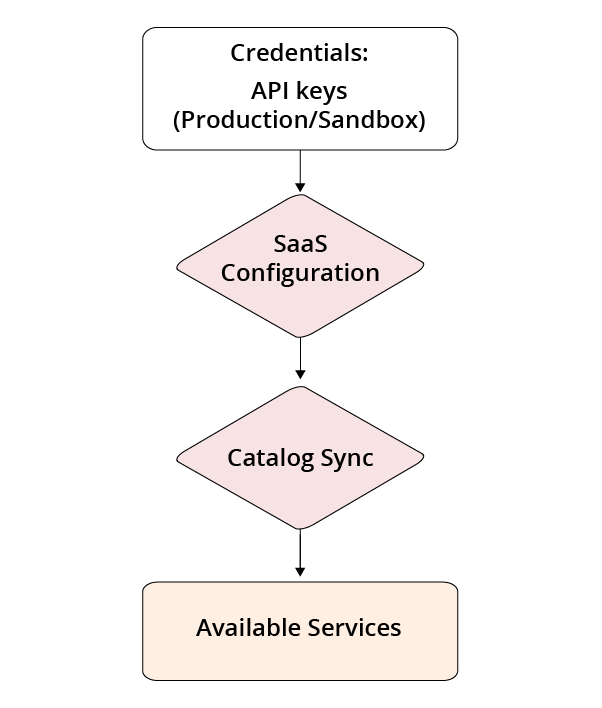

# [!DNL Commerce Services Connector]

Certaines fonctionnalités Adobe Commerce et Magento Open Source sont optimisées par [!DNL Commerce Services]  et déployé en tant que SaaS (logiciel en tant que service). Pour utiliser ces services, vous devez connecter votre [!DNL Commerce] à l’aide des clés d’API de production et d’environnement de test, et spécifiez l’espace de données dans la variable [configuration](https://experienceleague.adobe.com/docs/commerce-admin/config/services/saas.html). Vous n’avez besoin de le configurer qu’une seule fois.

## Services disponibles {#availableservices}

La liste suivante répertorie les [!DNL Commerce] fonctions auxquelles vous pouvez accéder via [!DNL Commerce Services Connector]:

| Service | Disponibilité |
| ---|--- |
| [[!DNL Product Recommendations]](/help/product-recommendations/overview.md) optimisé par Adobe Sensei | Adobe Commerce |
| [[!DNL Live Search]](/help/live-search/overview.md) optimisé par Adobe Sensei | Adobe Commerce |
| [[!DNL Payment Services]](/help/payment-services/overview.md) | Adobe Commerce et Magento Open Source |
| [[!DNL Channel Manager]](https://experienceleague.adobe.com/docs/commerce-channels/channel-manager/intro-to-channel-manager/overview.html) | Adobe Commerce et Magento Open Source |
| [[!DNL Site-Wide Analysis Tool]](https://experienceleague.adobe.com/docs/commerce-operations/tools/site-wide-analysis-tool/intro.html) | Adobe Commerce |
| [[!DNL Catalog Service]](/help/catalog-service/overview.md) | Adobe Commerce |
| [Connecteur Experience Platform](/help/experience-platform-connector/overview.md) | Adobe Commerce |

## Architecture

À un niveau élevé, la variable [!DNL Commerce Services Connector] est constitué des éléments principaux suivants :

Les sections suivantes abordent plus en détail chacun de ces éléments.

## Informations d’identification {#apikey}

Les clés d’API de production et d’environnement de test sont générées à partir de la variable [!DNL Commerce] compte du détenteur de licence, qui est identifié par une variable [!DNL Commerce] ID (MageID). Pour transmettre la validation des droits pour des services tels que [!DNL Product Recommendations] ou [!DNL Live Search], le détenteur de licence de l’organisation du commerce peut générer le jeu de clés API tant que le compte est en règle. Les clés peuvent être partagées sur la base du &quot;besoin de savoir&quot; avec l’intégrateur système ou l’équipe de développement qui gère les projets et les environnements pour le compte du détenteur de licence. En outre, les intégrateurs de solution sont également autorisés à utiliser [!DNL Commerce Services]. Si vous êtes un intégrateur de solution, le signataire de [!DNL Commerce] le contrat de partenaire doit générer les clés d’API.

### Génération des clés d’API de production et d’environnement de test {#genapikey}

1. Connectez-vous à [!DNL Commerce] compte à l’adresse [https://account.magento.com](https://account.magento.com/){:target=&quot;_blank&quot;}.

1. Sous , **Magento** onglet, sélectionnez **Portail API** dans la barre latérale.

1. Dans la _Environnement_ menu, sélectionnez **Production** ou **Sandbox**.

1. Saisissez un nom dans le champ _Clés API_ et cliquez sur **Ajouter**.

   Une boîte de dialogue s’ouvre alors pour télécharger la nouvelle clé.

   

   >[!WARNING]
   >
   > Il s’agit de la seule opportunité que vous avez pour copier ou télécharger vos clés.

1. Cliquez sur **Télécharger** puis cliquez sur **Annuler**.

1. Répétez les étapes ci-dessus pour chaque environnement (production et environnement de test).

   La variable **Clés API** affiche désormais vos clés d’API. Vous avez besoin des clés de production et d’environnement de test lorsque vous [sélectionner ou créer un projet SaaS ;](#createsaasenv).

## Configuration SaaS {#saasenv}

[!DNL Commerce] Les instances doivent être configurées avec un projet SaaS et un espace de données SaaS afin que [!DNL Commerce Services] peut envoyer des données à l’emplacement approprié. Un projet SaaS regroupe tous les espaces de données SaaS. Les espaces de données SaaS sont utilisés pour collecter et stocker des données qui activent [!DNL Commerce Services] au travail. Certaines de ces données peuvent être exportées à partir de la variable [!DNL Commerce] et certains peuvent être collectés à partir du comportement de l’acheteur sur le storefront. Ces données sont ensuite conservées pour sécuriser l’espace de stockage dans le cloud.

Pour [!DNL Product Recommendations], l’espace de données SaaS contient des données de catalogue et des données comportementales. Vous pouvez pointer une [!DNL Commerce] à un espace de données SaaS en [la sélectionner](https://docs.magento.com/user-guide/configuration/services/saas.html) dans le [!DNL Commerce] configuration.

>[!WARNING]
>
> Utiliser votre espace de données SaaS de production uniquement sur votre production [!DNL Commerce] installation pour éviter les collisions de données. Sinon, vous risquez de polluer les données de votre site de production avec des données de test, ce qui entraîne des retards de déploiement. Par exemple, vos données de produit de production peuvent être écrasées par erreur des données d’évaluation, telles que les URL d’évaluation.

### Sélection ou création d’un projet SaaS {#createsaasenv}

>[!NOTE]
>
> Si vous ne voyez pas le **[!UICONTROL Commerce Services Connector]** dans la section [!DNL Commerce] configuration, vous devez installer le [!DNL Commerce] modules pour répondre à vos besoins [[!DNL Commerce] service](#availableservices).

Pour sélectionner ou créer un projet SaaS, demandez la variable [!DNL Commerce] Clé API de [!DNL Commerce] détenteur de licence pour votre boutique.

1. Sur le _Administration_ barre latérale, accédez à **Système** > Services > **Connecteur Commerce Services**.

1. Dans le _Clés d’API Sandbox_ et _Clés d’API de production_ , collez vos valeurs clés.

   Les clés privées doivent inclure `----BEGIN PRIVATE KEY---` au début de la clé et `----END PRIVATE KEY----` à la fin de la clé privée.

1. Cliquez sur **Enregistrer**.

Tous les projets SaaS associés à vos clés apparaissent dans le **Projet** dans le champ **Identifiant SaaS** .

1. Si aucun projet SaaS n’existe, cliquez sur **Créer un projet**. Ensuite, dans le **Projet** , saisissez un nom pour votre projet SaaS.

   Lorsque vous créez un projet SaaS, [!DNL Commerce] génère un ou plusieurs espaces de données SaaS en fonction de votre [!DNL Commerce] license :
   - Adobe Commerce : un espace de données de production ; deux espaces de données de test
   - Magento Open Source : un espace de données de production ; aucun espace de données de test

1. Sélectionnez la variable **Espace de données** à utiliser pour la configuration actuelle de votre [!DNL Commerce] magasin.

>[!WARNING]
>
> Si vous générez de nouvelles clés dans la section Portail API de Mon compte, mettez immédiatement à jour les clés API dans la configuration Admin. Si vous générez de nouvelles clés sans les mettre à jour dans l’Admin, vos extensions SaaS ne fonctionnent plus et vous perdez des données importantes.

Pour modifier les noms des projets ou espaces de données SaaS, cliquez sur **Renommer**.

## Organisation IMS (facultatif) {#organizationid}

Pour connecter votre instance Adobe Commerce à Adobe Experience Platform, connectez-vous à votre compte Adobe à l’aide de votre Adobe ID. Une fois connecté, l’organisation IMS associée à votre compte d’Adobe s’affiche dans cette section.

## Synchronisation des catalogues

Lorsque la variable [!DNL Commerce] l’instance se connecte correctement à [!DNL Commerce Services], le processus de synchronisation de catalogue exporte les données de produit de votre [!DNL Commerce] serveur à [!DNL Commerce Services]. Actuellement, seul le Recommendations de produit utilise le service de synchronisation de catalogue. [En savoir plus](catalog-sync.md) à propos du processus de synchronisation de catalogue.
