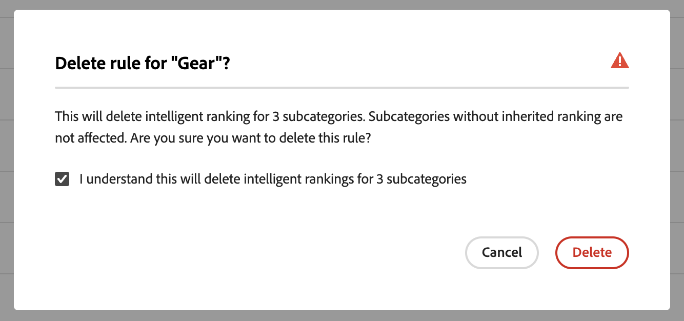

# Marchandisage des catégories

Le marchandisage des catégories permet aux propriétaires de magasins d’appliquer le [!DNL Live Search] classement intelligent [rules](rules.md) aux catégories de produits et aux sous-catégories.

Cette vidéo présente le marchandisage par catégorie.

>[!VIDEO](https://video.tv.adobe.com/v/3424617)

Cette fonctionnalité est accessible dans l’administrateur à l’adresse **Marketing** > Recherche et optimisation pour les moteurs de recherche > **[!DNL Live Search]** > **Marchandisage par catégorie**.

>[!NOTE]
>
>Le marchandisage des catégories est disponible avec [!DNL Live Search] [3.0.0 ou version ultérieure](release-notes.md). Si l’espace de travail Marchandisage des catégories s’affiche, mais qu’il n’est pas rempli de données, mettez à jour le module [!DNL Live Search].

La vue Marchandisage des catégories affiche les règles de catégorie définies, avec des colonnes pour :

* Catégorie
* Stratégie de classement
* Classement hérité
* Dernière mise à jour
* Action

Vous pouvez rechercher une catégorie ou une sous-catégorie dans le champ &quot;Rechercher par catégorie&quot;.

## Stratégies de classement

Le marchandisage des catégories utilise les mêmes types de classement que pour [produits individuels](rules-workspace.md).
Il existe deux types de classement : Intelligent et manuel.

**Le classement intelligent** exploite l’analyse des données comportementales du storefront par [Adobe Sensei](https://www.adobe.com/sensei.html) pour trier tous les produits dans les catégories sélectionnées par un certain algorithme. Une fois qu’un classement intelligent est sélectionné, l’ordre spécifique des produits doit changer au fil du temps, car les données sous-jacentes sont régulièrement réanalysées par Adobe Sensei. Par exemple, les produits les plus tendance changent automatiquement au fil du temps à mesure que les préférences des acheteurs changent.
Les méthodes de classement intelligentes sont les suivantes :

* Les produits les plus achetés : classe les produits selon la fréquence à laquelle ils ont été achetés par les acheteurs au cours des sept derniers jours.
* Les produits les plus ajoutés au panier : classe les produits selon la fréquence à laquelle ils ont été ajoutés au panier par les acheteurs au cours des sept derniers jours.
* Les plus consultés : classe les produits selon la fréquence à laquelle ils ont été consultés par les acheteurs au cours des sept derniers jours.
* Recommandé pour vous : en fonction du comportement actuel et précédent de chaque acheteur sur site, classe les produits en fonction de la probabilité d’interaction de l’acheteur avec chacun d’eux.
* Trending : classe les produits selon les récentes augmentations de popularité en fonction des vues.
* Aucun : classe les produits par ordre par défaut.

**Le classement manuel** permet aux utilisateurs de remplacer l’ordre de tri automatique des produits en définissant des règles manuelles de pin, de dynamisation, d’enterrage et de masquage.

## Classement hérité

En tant que marchandiseur, vous pouvez sélectionner toutes les catégories de vêtements pour femmes à trier par &quot;tendance&quot;. Cela inclut les sous-catégories &quot;Pantalon pour femmes&quot;, &quot;Chemises pour femmes&quot; et &quot;accessoires pour femmes&quot;. Les catégories masculines ne devraient pas être affectées. Pour ce faire, vous pouvez utiliser les classements hérités.

Lors de la sélection d’une méthode de classement intelligent pour une catégorie ou une sous-catégorie comportant des sous-catégories, vous pouvez activer l’option **Appliquer un classement intelligent aux sous-catégories** . Cette méthode applique la méthode de classement à toutes les sous-catégories.

Ces sous-catégories héritent désormais de cette règle de la catégorie parente (&quot;Oui&quot; dans la colonne Classement hérité). Dans la colonne Action, les seules options disponibles sont **Modifier la règle** et **Afficher les détails**. L’option **Supprimer** est désactivée pour les règles héritées sur les sous-catégories. La suppression de l’héritage des sous-catégories nécessite l’annulation de l’héritage de la catégorie parente.

Une seule catégorie ou sous-catégorie peut avoir un classement intelligent appliqué à la fois. D’autres classements manuels peuvent également leur être appliqués.

Si vous appliquez un classement intelligent à une catégorie et activez l’option **Appliquer un classement intelligent aux sous-catégories**, tout classement intelligent déjà appliqué aux sous-catégories est remplacé.

{width="700"}

Si vous cliquez sur **Afficher tout**, une boîte de dialogue s’ouvre avec les détails des modifications proposées.

Lors de l’ajout d’un classement intelligent directement à une catégorie qui possède un classement intelligent hérité, l’héritage est remplacé par le nouveau classement intelligent.

Lors de la suppression du classement intelligent de la catégorie, l’héritage est rétabli.
Dans les deux scénarios, tout classement manuel est conservé.

Si vous supprimez un classement intelligent d’une catégorie et que l’héritage de sous-catégorie est sélectionné, seuls les classements intelligents hérités sont supprimés des sous-catégories. Les classements manuels ne sont pas soumis à l’héritage et le resteront.

Une boîte de dialogue s’affiche pour expliquer quelles sous-catégories héritées sont affectées par les modifications apportées à une catégorie de niveau supérieur.

{width="1200"}

## Créer une règle de catégorie

Pour créer une règle de catégorie :

1. Cliquez sur le bouton **Ajouter une règle** .
1. Dans la vue _Select Category_, cliquez sur les catégories et sous-catégories.
1. Cochez la case pour sélectionner la catégorie que vous souhaitez classer.
1. Cliquez sur **Apply**.

   

1. Dans la vue _Ajouter une règle de catégorie_, sélectionnez la méthode de classement intelligent que vous souhaitez appliquer à la catégorie.
La page Aperçu des catégories affiche les résultats réels du classement sélectionné, à l’aide de vos données de recherche en direct.
1. Cliquez sur **Enregistrer et Publish** pour enregistrer la règle.

Le service [!DNL Live Search] traite la règle et l’active dans le magasin une fois terminé.

## Modification d’une règle de catégorie

Pour modifier une règle existante :

1. Cliquez sur **...** dans la colonne Action et choisissez **Modifier**.
1. Dans la vue Modifier la règle de catégorie, apportez les modifications requises, puis cliquez sur **Enregistrer et Publish**.

Les modifications sont répercutées sur le magasin lorsque [!DNL Live Search] a traité la modification.

## Supprimer une règle de catégorie

Pour supprimer une règle de catégorie :

1. Cliquez sur **...** dans la colonne Action et choisissez **Supprimer**.
1. Dans le modal _Supprimer la règle_, sélectionnez **Supprimer** pour supprimer la règle ou **Annuler** pour annuler l’action.

## Classement manuel

Le classement manuel vous permet de remplacer l’ordre des produits déterminé par des règles de classement intelligent (le cas échéant) et de contrôler manuellement l’emplacement des produits dans les résultats.

Les événements sont des actions qui modifient les résultats de la recherche lorsque des conditions définies sont remplies. Un classement manuel peut comporter jusqu’à 25 événements.

* Amplifier : déplace un produit plus haut dans les résultats de recherche.
* Bury : déplace un produit plus bas dans les résultats de recherche.
* Epingler un produit : déplace un produit vers une position spécifique dans les résultats.
* Masquer un produit : exclut un produit des résultats de recherche.

Créez un classement manuel :

1. Configurez une règle de classement intelligent pour une catégorie, comme décrit ci-dessus. Les résultats de la requête s’affichent dans la vue Page de catégorie de prévisualisation. Cela utilise vos données de recherche en direct réelles pour prévisualiser les résultats.

1. Cliquez sur un produit et faites-le glisser dans la page Aperçu de la catégorie. Faites-la glisser et déposez-la à l’emplacement souhaité. Les champs Produit et Position sont automatiquement renseignés dans le volet Événements .

Vous pouvez également cliquer sur l’icône en forme d’épingle pour épingler un produit à son emplacement actuel. Utilisez le menu contextuel des points de suspension pour &quot;Epingler au haut&quot; ou &quot;Epingler au bas&quot;.

Pour ajouter manuellement un événement :

1. Sous Classement manuel, cliquez sur le menu **Sélectionner un événement** et choisissez un événement à avoir lorsque les conditions associées sont remplies.
1. Saisissez le nom du produit que vous souhaitez affecter. Les produits sont proposés au fur et à mesure que vous tapez.
1. Pour plusieurs événements, choisissez les autres événements à déclencher lorsque les conditions sont remplies.
