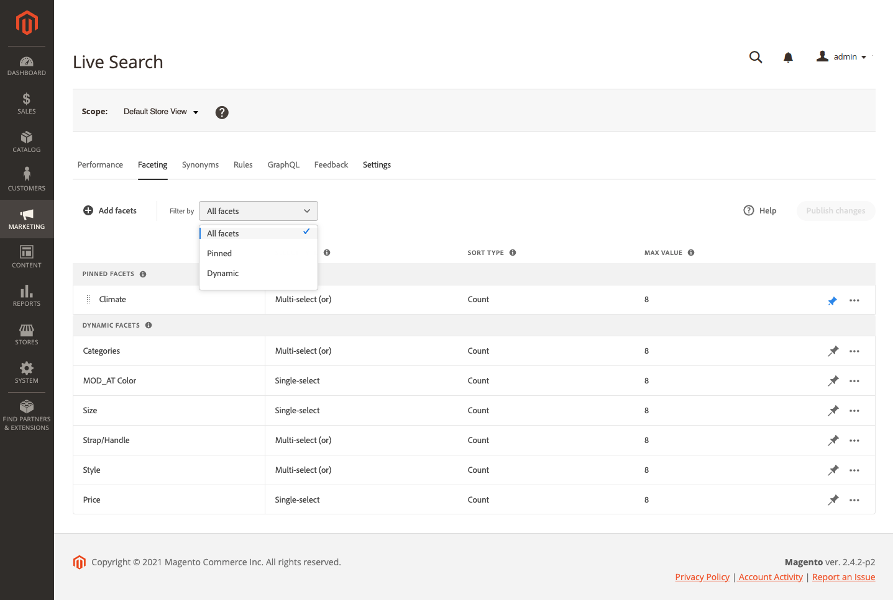

# Facturation de Workspace

Le [!DNL Live Search] workspace répertorie toutes les facettes actuellement disponibles et permet d’accéder aux outils dont vous avez besoin pour configurer et gérer les facettes. Les facettes épinglées apparaissent en premier dans la liste des facettes existantes, suivies de facettes dynamiques. La liste peut être filtrée pour afficher toutes les facettes ou uniquement celles qui sont épinglées ou dynamiques.

## Définir la portée

Si votre installation Adobe Commerce comprend plusieurs vues de magasin, définissez **Portée** au [vue de magasin](https://docs.magento.com/user-guide/configuration/scope.html) où s’appliquent vos paramètres de facette.

## Filtrer la liste

1. Cliquez sur le bouton **Filtrer par** contrôle.
1. Choisissez l’une des options suivantes :

   * Tous les filtres
   * Pindu
   * Dynamique

   

## Ajout d’une facette

1. Cliquez sur **Ajout de facettes**.
1. Voir [Ajout de facettes](facets-add.md) pour obtenir des instructions détaillées.

## Descriptions des colonnes

| Colonne | Description |
|--- |--- |
| (première colonne) | Répertorie les facettes codées et dynamiques par le [label](facets-type.md) qui est visible par l’acheteur. |
| Sélectionner un type | Le [méthode de sélection](facets-type.md) qui est affecté à l’attribut de produit correspondant. Le `single select` type est utilisé pour tous les [!DNL Commerce] storefronts. Pour les implémentations sans interface utilisateur graphique, `multi-select` peut être affecté avec un opérateur logique (`or` ou `and`) pour déterminer l’ensemble des produits renvoyés. |
| Type de tri | Le [ordre de tri](facets-type.md) de valeurs de facette. Les facettes sont triées par ordre alphabétique pour toutes les [!DNL Commerce] storefronts. Pour [headless] implémentations, les facettes peuvent être triées soit par ordre alphabétique, soit par nombre. Options : Alphabétique, Comptage (sans tête uniquement) |
| Valeur maximale | Nombre de valeurs de facette disponibles dans le storefront sous forme de filtres, avec un maximum de 10. |

## Contrôles

| Contrôle | Description |
|--- |--- |
| Ajout de facettes | Ouvre la [éditeur de facettes](facets-add.md). |
| Filtrer par | Détermine la variable [type de facettes](facets-type.md) qui apparaissent dans la liste. Options : Tout, épinglé, dynamique |
