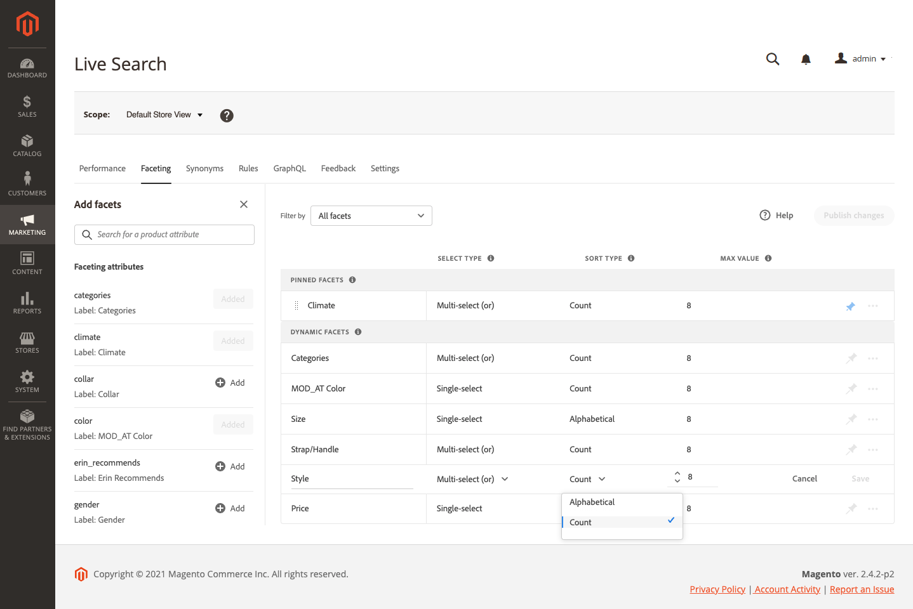
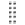

# Ajout de facettes

Tout attribut de produit filtrable peut être utilisé comme facette. Le panneau *Ajouter des facettes* répertorie les facettes actives et facilite l’affectation d’attributs de produit supplémentaires en tant que facettes. Au cours de ce processus en trois étapes, un attribut est sélectionné pour être utilisé comme facette, les propriétés sont modifiées si nécessaire et les modifications publiées sur le storefront.

## Étape 1 : Ajout d’une facette

1. Dans l’administrateur, accédez à **Marketing** > Recherche et optimisation pour les moteurs de recherche > **[!DNL Live Search]**.
1. Sur l’onglet *Faceting*, cliquez sur **Ajouter des facettes**.
1. Dans la liste *Ajouter des facettes*, chaque attribut disponible comporte un  distinct. Procédez de l’une des manières suivantes :

   * Dans la liste *Attributs de facette*, sélectionnez l’attribut de produit que vous souhaitez utiliser comme facette et cliquez sur **Ajouter**.
   * Pour rechercher un attribut de produit spécifique, saisissez les premiers caractères du nom de l’attribut dans la zone *Rechercher*. Cliquez ensuite sur **Ajouter**.

     Pour configurer des intervalles et des groupements de facettes de prix, reportez-vous à la section [Paramètres](settings.md). Pour en savoir plus, consultez [Types de facettes](facets-type.md).
La facette est ajoutée au bas de la liste *Facettes dynamiques* et le bouton *Modifications de Publish* devient disponible.

1. Si la facette que vous souhaitez ajouter est introuvable, accédez à **Magasins** > Attributs > **Produit** et vérifiez que l’attribut contient les [propriétés requises](facets.md) à utiliser comme facette. Si nécessaire, mettez à jour les propriétés storefront suivantes de l’attribut :

   * Utilisation dans la recherche - `Yes`
   * Utilisation dans la navigation par couches des résultats de recherche - `Yes`
   * Utilisation dans la navigation par couches - `Filterable (with results)`

1. Lorsque vous y êtes invité, actualisez le cache.

   La facette devient disponible dans le storefront la prochaine fois que le catalogue est synchronisé avec [!DNL Live Search]. Si la facette n’est pas disponible au bout de deux heures, reportez-vous à la section [Synchronisation des données de catalogue](install.md#synchronize-catalog-data).

## Étape 2 : modification des propriétés de facette (facultatif)

1. Pour modifier les propriétés de la facette, cliquez sur les options **Plus** () dans la colonne d’extrême droite.
1. Dans le menu, cliquez sur **Modifier**. Ensuite, ajustez les propriétés suivantes selon les besoins.

   * Libellé - ([Sans affichage](facets-type.md) uniquement) Saisissez le libellé de la facette que vous souhaitez utiliser.
   * Type de tri : les facettes sont triées par ordre alphabétique pour toutes les [!DNL Commerce] vitrines. Pour les implémentations sans interface utilisateur graphique, les facettes peuvent être triées soit par ordre alphabétique, soit par nombre. Options : Alphabétique, Comptage (headless uniquement)
   * Max Value : saisissez le nombre maximal de valeurs de facette affichées dans le storefront. Entrées valides : 0 à 30 ; Par défaut : 8

1. Une fois l’opération terminée, cliquez sur **Enregistrer**.

   

1. Pour épingler la facette en haut de la liste *Filtres*, cliquez sur la punaise grise ().
1. Pour modifier l’ordre de la facette épinglée, cliquez sur l’icône **Déplacer** () et faites glisser la ligne vers un nouvel emplacement dans la section *Facettes épinglées*.

## Étape 3 : modifications Publish

1. Une fois la facette terminée, cliquez sur **Modifications de Publish**.
1. Attendez que la facette apparaisse dans le magasin.
Si la facette n’est pas disponible au bout de deux heures, voir [Vérifier l’exportation](install.md#synchronize-catalog-data) dans les instructions d’installation.

## Descriptions des champs

| Champ | Description |
|--- |--- |
| Libellé | ([Sans affichage](facets-type.md) uniquement) Le [libellé de facette](facets-type.md) visible sur le storefront peut être modifié pour être cohérent avec votre marque. |
| Type de tri | Méthode utilisée pour les facettes [sort](facets-type.md). Toutes les [!DNL Commerce] storefronts trient les facettes par ordre alphabétique uniquement. Les implémentations sans affichage peuvent également être triées par `Count`. Options : Alphabétique - Trie les facettes par ordre alphabétique. Nombre - (Sans affichage uniquement) Trie les facettes en fonction du nombre de correspondances trouvées. |
| Valeur max. | Nombre maximal de valeurs pouvant être affichées dans le storefront pour chaque facette. Les facettes qui représentent une plage de valeurs sont uniformément réparties. Entrées valides : 0 à 30 ; Par défaut : 8 |

### Contrôles

| Contrôle | Description |
|--- |--- |
|  | Épingle ou annule une facette en haut de la liste *Filtres*. |
|  | Affiche un menu d’actions supplémentaires pouvant être appliquées à la facette sélectionnée. Options : modification, suppression |
|  | Utilisez l’icône *Déplacer* pour faire glisser une facette épinglée vers un autre emplacement de la section *Facettes pincées* . |
