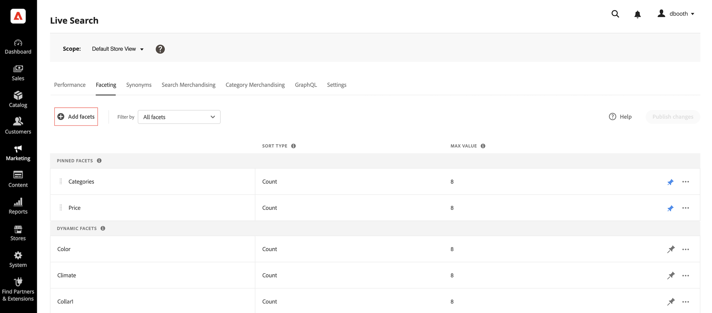

# Ajout de facettes

Tout attribut de produit filtrable peut être utilisé comme facette. Le *Ajout de facettes* répertorie les facettes actives et facilite l’affectation d’attributs de produit supplémentaires en tant que facettes. Au cours de ce processus en trois étapes, un attribut est sélectionné pour être utilisé comme facette, les propriétés sont modifiées si nécessaire et les modifications publiées sur le storefront.

## Étape 1 : Ajout d’une facette

1. Dans Admin, accédez à **Marketing** > SEO &amp; Search > **[!DNL Live Search]**.
1. Sur le *Facturation* , cliquez sur **Ajout de facettes**.
1. Dans le *Ajout de facettes* liste, chaque attribut disponible possède une propriété distincte *Ajouter* bouton . Effectuez l’une des opérations suivantes :

   

   * Dans le *Attributs de facette* , sélectionnez l’attribut de produit à utiliser comme facette, puis cliquez sur **Ajouter**.
   * Pour rechercher un attribut de produit spécifique, saisissez les premiers caractères du nom de l’attribut dans la variable *Rechercher* de la boîte. Cliquez ensuite sur **Ajouter**.

      Pour configurer les intervalles et les groupements de facettes de prix, reportez-vous à la section [Paramètres](settings.md). Pour en savoir plus, accédez à [Types de facettes](facets-type.md).
La facette est ajoutée au bas de la *Facettes dynamiques* et la liste *Publier les modifications* devient disponible.
   

1. Si la facette que vous souhaitez ajouter est introuvable, accédez à **Magasins** > Attributs > **Produit** et vérifiez que l’attribut a la valeur [propriétés requises](facets.md) à utiliser comme facette. Si nécessaire, mettez à jour les propriétés storefront suivantes de l’attribut :

   * Utiliser dans la recherche - `Yes`
   * Utilisation dans la navigation par couches des résultats de recherche - `Yes`
   * Utilisation dans la navigation par couches - `Filterable (with results)`

1. Lorsque vous y êtes invité, actualisez le cache.

   La facette devient disponible dans le storefront la prochaine fois que le catalogue est synchronisé avec [!DNL Live Search]. Si la facette n’est pas disponible au bout de deux heures, voir [Synchronisation des données de catalogue](install.md#synchronize-catalog-data).

## Étape 2 : Modification des propriétés de facette (facultatif)

1. Pour modifier les propriétés de la facette, cliquez sur **Plus** ( dans la colonne extrême droite.
1. Dans le menu, cliquez sur **Modifier**. Ensuite, ajustez les propriétés suivantes si nécessaire.

   * Libellé - ([Headless](facets-type.md) uniquement) Saisissez le libellé de la facette à utiliser.
   * Select type - The *Sélectionner un type* utilisé pour tous [!DNL Commerce] storefronts est `single select`. Pour les implémentations sans interface utilisateur graphique, `multi-select` peut être affecté avec un opérateur logique (`or` ou `and`) pour déterminer l’ensemble des produits renvoyés.
   * Type de tri : les facettes sont triées par ordre alphabétique pour toutes les [!DNL Commerce] storefronts. Pour les implémentations sans interface utilisateur graphique, les facettes peuvent être triées soit par ordre alphabétique, soit par nombre. Options : Alphabétique, Comptage (sans tête uniquement)
   * Max Value : saisissez le nombre maximal de valeurs de facette affichées dans le storefront. Entrées valides : 0 à 10

1. Une fois l’opération terminée, cliquez sur **Enregistrer**.

   

1. Pour épingler la facette en haut de la page *Filtres* , cliquez sur la punaise grise (.
1. Pour modifier l’ordre de la facette épinglée, cliquez sur le bouton **Déplacer** ( et faites glisser la rangée vers un nouvel emplacement dans le *Facettes épinglées* .

## Étape 3 : Publier les modifications

1. Une fois la facette terminée, cliquez sur **Publier les modifications**.
1. Attendez que la facette apparaisse dans le magasin.
Si la facette n’est pas disponible au bout de deux heures, voir [Vérifier l’exportation](install.md#synchronize-catalog-data) dans les instructions d’installation.

## Descriptions des champs

| Champ | Description |
|--- |--- |
| Libellé | ([Headless](facets-type.md) uniquement) La variable [libellé de la facette](facets-type.md) qui est visible dans le storefront peut être modifié pour être cohérent avec votre marque. |
| Sélectionner un type | Affiche la variable [méthode de sélection](facets-type.md) qui est associé à l’attribut product . Toutes les facettes de la variable [!DNL Commerce] les vitrines sont `Single select` uniquement. Les mises en oeuvre sans affichage prennent également en charge `Multi-select` avec les opérateurs logiques `OR` et `AND`. |
| Type de tri | La méthode utilisée pour [sort](facets-type.md) facettes. Tous [!DNL Commerce] storefronts sort les facettes par ordre alphabétique uniquement. Les implémentations sans affichage peuvent également être triées par `Count`. Options : Alphabétique : trie les facettes par ordre alphabétique. Nombre : (sans affichage uniquement) trie les facettes en fonction du nombre de correspondances trouvées. |
| Valeur max. | Nombre maximal de valeurs pouvant être affichées dans le storefront pour chaque facette. Les facettes qui représentent une plage de valeurs sont uniformément réparties. Valeur par défaut : 8 |

### Contrôles

| Contrôle | Description |
|--- |--- |
|  | Epinglage ou désolidarisation d’une facette en haut de l’écran *Filtres* liste. |
|  | Affiche un menu d’actions supplémentaires pouvant être appliquées à la facette sélectionnée. Options : Modifier, supprimer |
|  | Utilisez la variable *Déplacer* pour faire glisser une facette épinglée vers un autre emplacement de la *Facettes Pindu* . |
