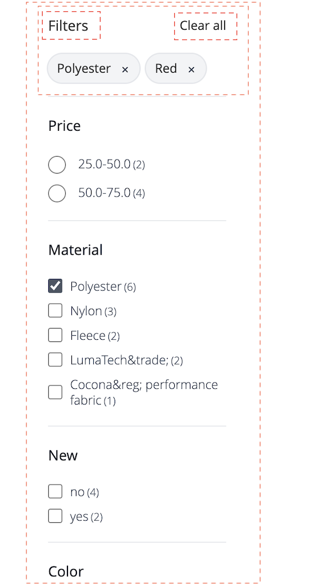

# Widget de page de liste de produits

La variable [!DNL Live Search Product Listing Page Widget] (PLP) utilise la plateforme Commerce Services pour fournir une page de liste de produits performante, indexable et facettable. Cette rubrique décrit comment activer et mettre en forme le widget PLP.

## Activation du widget PLP

Lorsque la variable [!DNL Live Search] est installé, la fonctionnalité de recherche par défaut est convertie en [!DNL Live Search] automatiquement.

La variable [!DNL Live Search] Le widget PLP est activé par défaut pour les nouvelles installations. Si vous effectuez une mise à niveau [!DNL Live Search] et le widget PLP a déjà été désactivé, il le restera.

>[!IMPORTANT]
>
>Lorsque la variable [!DNL Live Search Product Listing Page Widget] est activée, la direction de l’ordre de tri sur une page de liste de produits ne peut pas être modifiée.

## Désactivation du widget PLP

Pour désactiver le widget PLP :

1. Accédez à **Magasins** > Paramètres > **Configuration** > **[!DNL Live Search]** > **Fonctionnalités de Storefront** et défini **Activation des widgets de liste de produits** à &quot;Non&quot;.
1. Sélectionner **Enregistrer la configuration** pour enregistrer le paramètre.

## Fonctionnalités des widgets

Le widget PLP fournit toute une gamme de fonctionnalités attendues dans une page de produits pouvant faire l’objet d’une recherche. Il s’agit notamment :

* Filtrage par attributs
* Prise en charge des échantillons de couleurs
* Fonction Ajouter au panier
* Prise en charge de plusieurs langues
* Curseurs de prix

## Exemple de style

Vous pouvez personnaliser l’aspect du widget PLP pour qu’il corresponde à votre site à l’aide de [CSS](https://developer.adobe.com/commerce/frontend-core/guide/css/).

>[!NOTE]
>
>Les éléments avec des classes personnalisées dans un thème Adobe Commerce ne sont pas hérités. Ces éléments doivent être ciblés par leur classe spécifique pour correspondre aux classes personnalisées ; les classes d’action principales ne fonctionneront pas sur un bouton de widget.
>Les éléments ciblés génériques dans le CSS sont hérités ; `button` s’applique aux boutons de widget.

Les divisions en surbrillance contiennent la classe cible `ds-sdk-product-item__product-name`.


Personnalisez le nom du produit en ajoutant une règle pour le mettre en majuscules.

```css
.ds-sdk-product-item__product-name {
 text-transform: uppercase;
}
```


## Classes CSS

### Liste de produits

* `.ds-sdk-product-list`: div externe
* `.ds-sdk-product-list__grid`: div interne


#### Pagination de la liste de produits

* `.ds-plp-pagination`


* `.ds-plp-pagination_item`


* `.ds-plp-pagination_item--current`


### Widgets

* `.ds-widgets`: div externe
* `.ds-widgets__actions`: div interne du côté gauche
* `.ds-widgets__results`: div interne du côté droit


### Menu déroulant Trier

* `.ds-sdk-sort-dropdown`


* `.ds-sdk-sort-dropdown__button`


* `.ds-sdk-sort-dropdown__items`


* `.ds-sdk-sort-dropdown__items--item`


* `.ds-sdk-sort-dropdown__items--item-selected`


* `.ds-sdk-sort-dropdown__items--item-active`


### Facettes

* `.ds-plp-facets`
* `.ds-plp-facets__header`
* `.ds-plp-facets__header_title`
* `.ds-plp-facets__header__clear-all`

{width="350"}

* `.ds-plp-facets__pills`
* `.ds-sdk-pill`

{width="350"}

* `.ds-sdk-pill__label`
* `.ds-sdk-pill__cta`

{width="350"}

* `.ds-plp-facets__list`

{width="350"}

* `.ds-sdk-input`
* `.ds-sdk-input__label`
* `.ds-sdk-product-item__product-swatch-group`
* `ds-sdk-product-item__product-swatch-item`
* `.ds-sdk-input_fieldset_show-more`


* `.ds-sdk-labelled-input`


* `.ds-sdk-labelled-input__input`
* `.ds-sdk-labelled-input__label`


### Élément de produit

* `.ds-sdk-product-item`
* `.ds-sdk-product-item__image`
* `.ds-sdk-product-item__product-name`
* `.ds-sdk-product-item__product-options`
* `.ds-sdk-product-price`
   * `.ds-sdk-product-price--no-discount`
   * `.ds-sdk-product-price--grouped`
   * `.ds-sdk-product-price--bundle`
   * `.ds-sdk-product-price--discount`


### Chargement

* `.ds-sdk-loading`
* `.ds-sdk-loading__spinner`
* `.ds-sdk-loading__spinner-label`


