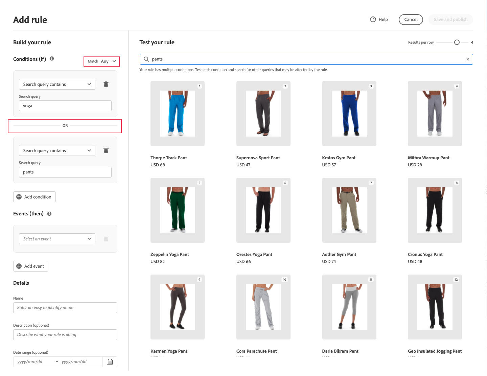

# Ajout de règles

Pour créer une règle, la première étape consiste à utiliser l’éditeur de règles pour définir les conditions dans le texte de requête de l’acheteur qui déclenchent les événements associés. Renseignez ensuite les détails de la règle, testez les résultats et publiez la règle.

## Ajouter une règle

1. Dans Admin, accédez à **Marketing** > SEO &amp; Search > **[!DNL Live Search]**.
1. Définissez la variable **Portée** pour identifier la variable [vue de magasin](https://experienceleague.adobe.com/docs/commerce-admin/start/setup/websites-stores-views.html#scope-settings) lorsque la règle s’applique.
1. Cliquez sur le bouton **Marchandisage des recherches** .
1. Cliquez sur **Ajouter une règle** pour lancer l’éditeur de règles.

## Type de règle

Une requête de recherche permet de définir un terme de recherche spécifique, des conditions et des types de classement.

Une règle Par défaut peut être définie et s’appliquer à toutes les requêtes, sauf si une requête de recherche plus spécifique est définie. Une seule règle par défaut peut être définie et ne peut contenir aucune condition. Si vous sélectionnez Par défaut, l’interface Conditions ne s’affiche pas.
Choisissez le type de classement intelligent par défaut et tout classement manuel à appliquer à toutes les recherches par défaut. Les classements manuels sont toujours appliqués.

## Conditions

Les conditions sont les conditions requises pour déclencher un événement. Une règle peut comporter jusqu’à dix conditions et 25 événements. Une règle par défaut ne peut pas avoir de conditions.

>[!NOTE]
>
>Actuellement, il n’est pas possible de cibler des règles sur un groupe de clients spécifique.

### Condition unique

1. Sous *Créer votre règle*, sélectionnez la variable **Condition** et suivez les instructions pour remplir l’instruction .

   * Requête de recherche contenant : entrez la chaîne de texte qui doit se trouver dans la requête de l’acheteur. Le paramètre Correspondance détermine le degré auquel la requête de l’acheteur correspond au catalogue. Options :  N’importe lequel : toute partie du texte de requête de l’acheteur peut correspondre à la condition. Tous : toutes les requêtes de l’acheteur doivent correspondre à la condition .
   * La requête de recherche est : entrez une chaîne de texte correspondant exactement à la requête de l’acheteur. Par exemple : &quot;pantalon de yoga&quot;. Règles avec `Search query is` et correspondre `All` ne peut comporter qu’une seule condition.
   * La requête de recherche commence par : saisissez un caractère ou une chaîne de texte qui doit se trouver au début de la requête du client.
   * La requête de recherche se termine par : saisissez un caractère ou une chaîne de texte qui doit se trouver à la fin de la requête du client.

   Les résultats apparaissent immédiatement dans la variable *Tester votre règle* et sont numérotés par priorité. Vous pouvez utiliser la variable *Résultats par ligne* curseur dans le coin supérieur droit pour modifier le nombre de produits dans chaque ligne.

   

1. Pour tester d’autres requêtes, modifiez le texte de la requête dans la variable *Tester votre règle* zone de recherche et appuyez sur **Retour**.
Au départ, le volet de test effectue le rendu de la requête à partir de la zone de recherche Conditions. Mais maintenant, la requête est rendue à partir de la boîte de requête de test. Le volet de test effectue le rendu d’une seule requête à la fois.
1. Si vous souhaitez le résultat, mettez à jour le texte dans la variable *Conditions* zone de recherche. Cliquez ensuite n’importe où sur la page pour mettre à jour les résultats dans le volet de test.
1. Pour créer une règle simple avec une condition, accédez à l’étape 3 : [Ajout d’événements](#events).

### Conditions multiples

1. Pour créer une règle avec plusieurs conditions, cliquez sur **Ajouter une condition**.
Une règle peut comporter jusqu&#39;à dix conditions. L’opérateur logique qui rejoint deux conditions est basé sur la condition actuelle *Correspondance* . Par défaut, *Correspondance* is `All` et l’opérateur logique est `AND`.

1. Sélectionnez la seconde condition et saisissez le texte de la requête.

1. Pour modifier la logique de la règle, modifiez la variable **Correspondance** pour déterminer dans quelle mesure les critères de recherche de l’acheteur doivent correspondre à la condition de requête. Définir **Correspondance** à l’une des options suivantes :

   * Any - (par défaut) Tous les opérateurs logiques de la règle sont définis sur `OR` et les résultats s’affichent dans le volet test.
   * Tous : tous les opérateurs logiques de la règle sont définis sur `AND` et les résultats s’affichent dans le volet test.

   La variable *Correspondance* détermine l’opérateur logique utilisé pour joindre plusieurs conditions. Changement de la variable *Correspondance* modifie tous les opérateurs logiques de la règle. Il n’est pas possible de combiner des `AND` et `OR` dans la même règle.

   Dans cet exemple, plutôt que de rechercher &quot;pantalon de yoga&quot;, il existe deux requêtes distinctes qui recherchent &quot;yoga&quot; ou &quot;pantalon&quot;. Cette règle est moins spécifique et est déclenchée plus souvent dans le storefront que l’autre.

   

1. Pour ajouter une autre condition, cliquez sur **Ajouter une condition** et répétez le processus.

## Classement intelligent

Le classement intelligent combine les comportements des utilisateurs et les statistiques du site pour déterminer le classement des produits.
Les propriétaires de magasins peuvent configurer les types de stratégies de classement suivants :

* Le plus acheté : les produits sont classés par total d’achats par SKU au cours des 7 jours précédents.
* Le plus ajouté au panier : Classement par ordre d’importance des activités &quot;Ajouter au panier&quot; totales au cours des 7 jours précédents.
* Le plus consulté : classe le nombre total de vues par SKU au cours des 7 jours précédents.
* Recommandé pour vous : permet d’utiliser la variable `viewed-viewed` point de données : les acheteurs qui ont consulté ce SKU ont également consulté ces autres SKU.
* Tendance : recherche les événements de page vue des dernières 72 heures pour les événements d’arrière-plan et 24 heures pour les événements de premier plan.
* Aucun : les produits sont commandés selon la pertinence

1. Sélectionnez le type de stratégie de la règle. La fenêtre Tester votre règle affiche les résultats attendus.

>[!NOTE]
>
>Les apostrophes et guillemets dans les requêtes peuvent entraîner des problèmes mineurs de classement et de pertinence dans certaines langues.

## Classement manuel

Le classement manuel (anciennement appelé Événements) sont des actions qui modifient les résultats de la recherche lorsque les conditions définies sont remplies. Une seule règle peut comporter jusqu’à 25 événements.

* Amplifier : déplace un produit plus haut dans les résultats de recherche.
* Bury : déplace un SKU plus bas dans les résultats de recherche.
* Epingler un produit : le produit s’affiche dans la &quot;position&quot; sélectionnée sur la page.
* Masquer un produit : exclut un SKU des résultats de recherche.

La méthode la plus simple pour épingler un produit consiste à le faire glisser et à le déposer.

1. Cliquez sur un produit et faites-le glisser dans le volet Test . Faites-la glisser et déposez-la à l’emplacement souhaité. Les champs Produit et Position sont automatiquement renseignés dans le volet Événements .

   

Vous pouvez également cliquer sur l’icône en forme d’épingle pour épingler un produit à son emplacement actuel. Utilisez le menu contextuel des points de suspension pour &quot;Epingler au haut&quot; ou &quot;Epingler au bas&quot;.

>[!NOTE]
>
>Vous ne pouvez épingler que les produits renvoyés dans la requête.

Ou les événements peuvent être définis manuellement :

1. Sous *Événements*, choisissez la variable **Événement** à se produire lorsque les conditions associées sont remplies.

   Par exemple, choisissez `Hide a product`. Saisissez ensuite le nom du produit que vous souhaitez masquer. Les produits sont proposés au fur et à mesure que vous tapez.

1. Pour plusieurs événements, choisissez les autres événements à déclencher lorsque les conditions sont remplies.

## Informations supplémentaires

Les informations saisies ici apparaissent dans le [Détails de la règle](rules-workspace.md) du panneau.

1. Sous *Détails*, saisissez une **Nom** pour la règle. Tous les noms de règle doivent être uniques.
1. Entrez un résumé **Description** de la règle.
1. Saisissez le **Date de début** et **Date de fin** pour que la règle soit active ou sélectionnez les dates du calendrier.

   Pour sélectionner une plage de dates, cliquez sur la première date et faites glisser le curseur pour la sélectionner.

   

## Finaliser la règle

1. Examinez les résultats de la règle dans le volet de test.
1. Si la règle comporte plusieurs requêtes, testez chacune d’elles susceptibles d’être affectées par la règle.
1. Lorsque vous avez terminé, cliquez sur **Enregistrer et publier**.

   La règle est ajoutée à la liste dans l’espace de travail des règles.

1. Bien que les règles actives entrent immédiatement en vigueur, vous devrez peut-être attendre jusqu’à 15 minutes que les résultats de la requête mise en cache dans le storefront soient actualisés.

## Descriptions des champs

### Conditions (si)

| Condition | Description |
|--- |--- |
| La requête de recherche contient | Caractère ou chaîne de texte inclus dans la requête de l’acheteur. La requête du client ne doit correspondre qu’à un seul caractère pour remplir cette condition. |
| La requête de recherche est | Caractère ou chaîne de texte correspondant exactement à la requête de l’acheteur. Les requêtes complexes avec plusieurs conditions ne peuvent pas être composées lorsque cette condition est utilisée. |
| La requête de recherche commence par | La requête de l’acheteur commence par ce caractère ou cette chaîne de texte. |
| La requête de recherche se termine par | La requête de l’acheteur se termine par ce caractère ou cette chaîne de texte. |

### Opérateurs logiques

| Opérateur | Description |
|--- |--- |
| OU | (Par défaut) L’opérateur logique `OR` compare deux conditions et répond aux exigences afin de déclencher un événement si au moins une condition est vraie. |
| ET | Opérateur logique `AND` compare deux conditions et répond aux exigences afin de déclencher un événement si les deux conditions sont vraies. |

### Opérateurs de correspondance

| Opérateur | Description |
|--- |--- |
| Quelconque | Modifie tous les opérateurs logiques de la règle en `OR` et renvoie l’ensemble des produits correspondants. |
| Tous | Modifie tous les opérateurs logiques de la règle en `AND` et renvoie l’ensemble des produits correspondants. |

### Classement manuel

| Événement | Description |
|--- |--- |
| Amplifier | Déplace un SKU ou une plage de SKU plus haut dans les résultats de recherche. Chacun d’eux est marqué d’un badge d’aperçu &quot;rechargé&quot; dans les résultats de recherche du test. |
| Bury | Déplace un SKU ou une plage de SKU vers le bas dans les résultats de recherche. Chacun est marqué d’un badge d’aperçu &quot;enterré&quot; dans les résultats de recherche du test. |
| Epinglage d’un produit | Associe un seul SKU à une position spécifique dans les résultats de recherche. Le produit est marqué d’un badge d’aperçu &quot;épinglé&quot; dans les résultats de la recherche de test. |
| Masquer un produit | Exclut un SKU, ou une plage de SKU, des résultats de recherche. |

### Détails

| Champ | Description |
|--- |--- |
| Nom | Nom de la règle. Les noms des règles doivent être uniques. |
| Type de règle | Valeur par défaut ou Requête. La valeur par défaut est appliquée à toutes les règles, sauf si une règle de requête plus spécifique est définie. |
| Date de début | Date de début de la règle, le cas échéant. |
| Date de fin | Date de fin de la règle, le cas échéant. |
| Description | Brève description de la règle. |
