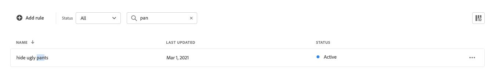

# Espace de travail des règles

L’espace de travail des règles répertorie la sélection actuelle des règles et leur état, et permet d’accéder aux outils dont vous avez besoin pour créer et gérer des règles. Dans l’espace de travail, vous pouvez :

* Recherche de règles
* Afficher les détails des règles
* Activer/désactiver des règles
* Supprimer des règles
* Accès à l’éditeur de règles

## Définir la portée

Si votre installation Adobe Commerce comprend plusieurs vues de magasin, définissez **Portée** au [vue de magasin](https://docs.magento.com/user-guide/configuration/scope.html) où vos règles s’appliquent.

## Afficher/masquer les colonnes

1. Dans le coin supérieur droit, cliquez sur **Afficher/masquer**  colonnes.
Les colonnes visibles sont cochées en bleu dans le menu d’options. Le nom de la règle est la seule colonne qui ne peut pas être masquée.

   

1. Dans le menu, effectuez l’une des opérations suivantes :

   * Pour afficher une colonne masquée, cliquez sur le nom d’une colonne sans coche.
   * Pour masquer une colonne visible, cliquez sur le nom d’une colonne avec une coche.

   

## Filtrage des règles par statut

1. Si votre boutique comporte de nombreuses règles, vous pouvez les filtrer par statut afin de les raccourcir. Par défaut, la liste Règles affiche toutes les règles.

   

1. Pour répertorier uniquement les règles avec un paramètre d’état spécifique, définissez **État** à l’une des options suivantes :

   * Tous
   * Principal
   * Inactif
   * Planifié

   

## Règles de recherche par nom

Commencez à saisir le nom de la règle ou tout mot du nom de la règle.
La recherche trouve la ou les règles correspondantes lorsque vous tapez. La chaîne des caractères correspondants est mise en surbrillance dans le nom de chaque règle trouvée.

## Afficher les détails

Le panneau Détails affiche le nom, l’état, les conditions et événements de la règle, la date de début et de fin, la description et la date de dernière modification de la règle. Les règles peuvent être activées, modifiées et supprimées du panneau Détails.

1. Sur le *Règles* , recherchez la règle dans la grille à afficher, puis cliquez sur **Plus** (...).
1. Cliquez sur **Afficher les détails**.
Vous pouvez effectuer l’une des opérations suivantes à partir du panneau Afficher les détails :

   * Modifier la règle
   * Supprimer la règle
   * Activer/Désactiver la règle

1. Pour fermer la variable *Afficher les détails* panneau, cliquez sur **Fermer** (X) dans le coin supérieur droit.

   

## Descriptions des colonnes

| Colonne | Description |
|--- |--- |
| Nom | Nom de la règle. |
| Dernière mise à jour | Date de la dernière mise à jour de la règle. |
| Date de début | Date de début d’une règle planifiée. |
| Date de fin | Date de fin d’une règle planifiée. |
| État | L’état codé par couleur indique l’état actuel de la règle. Utilisez le contrôle État situé au-dessus de la grille pour filtrer les règles par état. Valeurs : Tout état : affiche toutes les règles, quel que soit l’état. Principal (bleu) : affiche uniquement les règles principales. Planifié (orange) : affiche uniquement les règles planifiées. Inactif (gris) : affiche uniquement les règles inactives. |

## Contrôles

| Contrôle | Description |
|--- |--- |
| Ajouter une règle | Ouvre la [éditeur de règles](). |
| État | Filtre la liste des règles par statut. Options : Tout, Principal, Inactif, Planifié |
|  | Spécifie les colonnes visibles dans la grille. Options : Dernière mise à jour, Date de début, Date de fin, État |
| Rechercher | Recherche une règle par nom complet ou correspondance partielle. |
|  | Affiche un menu d’actions supplémentaires pouvant être appliquées à la règle sélectionnée. Options : Modifier, afficher les détails, supprimer |

## Détails de la règle

| Champ | Description |
|--- |--- |
| État | État actuel de la règle. |
| Conditions | Requête de recherche qui décrit la ou les conditions associées à la règle. |
| Date de début | Date d’entrée en vigueur de la règle, le cas échéant. |
| Date de fin | Date d’expiration de la règle, le cas échéant. |
| Description | Brève description de la règle. |
| Dernière mise à jour | Date et heure de la dernière mise à jour de la règle. |
| Activé | Contrôle qui modifie l’état de la règle. Options : Activé/Désactivé |
