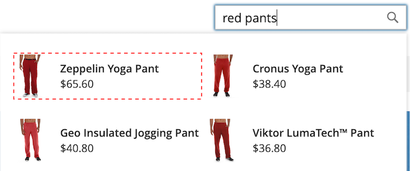

# [!DNL Storefront Popover]

When [!DNL Live Search] is [installé](install.md), un [!DNL popover] apparaît dans le storefront lorsque les clients saisissent dans la variable [Rechercher](https://experienceleague.adobe.com/docs/commerce-admin/catalog/catalog/search/search.html#quick-search) de la boîte. Avec chaque caractère saisi, la variable [!DNL popover] est mis à jour avec des suggestions de produits et des images miniatures des principaux résultats de recherche.

[!DNL Live Search] renvoie les résultats d’une requête de deux caractères ou plus. Pour une correspondance partielle, le nombre maximal de caractères par mot est de 20. Le nombre de caractères d’une requête &quot;Rechercher lorsque vous tapez&quot; n’est pas configurable.

Par défaut, [!DNL Live Search] prend [redirections de termes de recherche](https://experienceleague.adobe.com/docs/commerce-admin/catalog/catalog/search/search-terms.html).

![[!DNL Live Search popover]](assets/storefront-search-as-you-type.png)

>[!TIP]
>
>Découvrez comment définir les attributs de produit pouvant faire l’objet d’une recherche dans le [Configuration de la recherche en direct](workspace.md) article.

## [!DNL Popover] taille de page

Taille de page de la variable [!DNL popover] détermine le nombre de lignes de produits à terminer automatiquement qui peuvent être renvoyées. Pendant l’installation de Live Search, la variable `page_size` change en fonction de la valeur actuelle de la variable [Recherche catalogue](https://experienceleague.adobe.com/docs/commerce-admin/config/catalog/catalog.html) - `Autocomplete Limit` .

Par défaut, la valeur Recherche catalogue - Limite de saisie automatique est définie sur huit lignes (ou lignes). Pour modifier la taille de page de la variable [!DNL popover], procédez comme suit :

1. Sur le *Administration* barre latérale, accédez à **Magasins** > Paramètres > **Configuration**.
1. Dans le panneau de gauche, développez **Catalogue** et choisissez **Catalogue** dans la liste des paramètres.
1. Développez l’objet *Recherche catalogue* .
1. Définissez la variable **Limite de saisie automatique** au nombre de lignes que vous souhaitez autoriser dans la variable [!DNL popover].
1. Lorsque vous avez terminé, cliquez sur **Enregistrer la configuration**.

## Style [!DNL Popover] example

Vous pouvez personnaliser l’aspect du [!DNL Popover] widget correspondant aux directives de style et de marque de votre entreprise.

La variable [!DNL storefront popover] affiche toujours le produit `name` et `price`et la sélection des champs n’est pas configurable. Cependant, [!DNL popover] Les éléments peuvent être stylisés à l’aide de [CSS](https://developer.adobe.com/commerce/frontend-core/guide/css/) classes. Par exemple, les déclarations suivantes modifient la couleur d’arrière-plan de la variable [!DNL popover] conteneur et pied de page.

```css
.livesearch.popover-container {
    background-color: lavender;
}

.livesearch.view-all-footer {
    background-color: magenta;
}
```

## Visibilité des conteneurs

Le composant parent du `.livesearch.popover-container` is `.search-autocomplete`.  La variable `.active` indique la visibilité du conteneur. La variable `.active` est ajoutée de manière conditionnelle lorsque la variable [!DNL popover] est ouvert.

```css
.search-autocomplete.active   /* visible */
.search-autocomplete          /* not visible */
```

Pour plus d’informations sur le style des éléments storefront, reportez-vous à la section [Feuilles de style en cascade (CSS)](https://developer.adobe.com/commerce/frontend-core/guide/css/) dans le [Guide du développeur de Frontend](https://developer.adobe.com/commerce/frontend-core/guide/).

## Sélecteurs de classe

Vous pouvez utiliser les sélecteurs de classe suivants pour appliquer un style au conteneur et aux éléments de produit dans la variable [!DNL popover].

- `.livesearch.popover-container`
- `.livesearch.view-all-footer`
- `.livesearch.products-container`
- `.livesearch.product-result`
- `.livesearch.product-name`
- `.livesearch.product-price`

### Sélecteurs de classe de conteneur

#### .livesearch.popover-container

![[!DNL Popover] container](assets/livesearch-popover-container.png)

#### .livesearch.view-all-footer


### Sélecteurs de classe de produits

#### .livesearch.products-container


#### .livesearch.product-result



#### .livesearch.product-name


#### .livesearch.product-price


#### .livesearch product-link


## Utilisation d’un thème modifié {#working-with-modified-theme}

Vous pouvez utiliser la variable [!DNL storefront popover] avec une [thème](https://developer.adobe.com/commerce/frontend-core/guide/themes/) qui hérite des fichiers requis de *Luma*. La variable `top.search` dans le `header-wrapper` de `Magento_Search` ne doit pas être modifié.

```html
<referenceContainer name="header-wrapper">
   <block class="Magento\Framework\View\Element\Template" name="top.search" as="topSearch" template="Magento_Search::form.mini.phtml">
      <arguments>
         <argument name="configProvider" xsi:type="object">Magento\Search\ViewModel\ConfigProvider</argument>
      </arguments>
   </block>
</referenceContainer>
```

## Désactivation de la variable [!DNL popover]

Pour désactiver la fonction [!DNL popover] et restaurer la norme [Recherche rapide](https://experienceleague.adobe.com/docs/commerce-admin/catalog/catalog/search/search.html#quick-search) , saisissez la commande suivante :

```bash
bin/magento module:disable Magento_LiveSearchStorefrontPopover
```

## Implémentations sans affichage

Pour ceux qui disposent d’implémentations sans interface utilisateur graphique, vous pouvez installer le [!DNL Live Search popover] en utilisant une [package npm](https://www.npmjs.com/package/@magento/ds-livesearch-storefront-utils).
