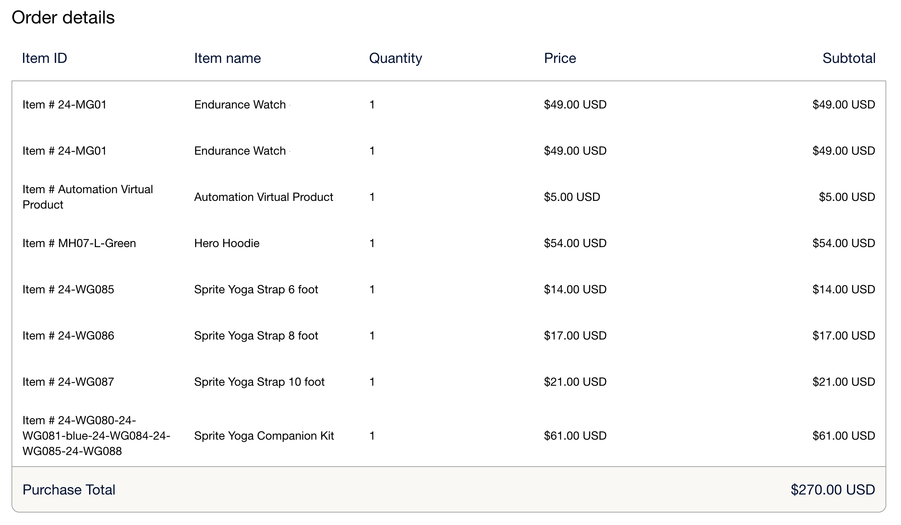

# Éléments de ligne pour [!DNL Payment Services]

Les éléments de ligne pour [!DNL Payment Services] sont les éléments inclus dans une commande. Ces éléments de ligne fournissent des informations telles que :

* Détails du produit
* Quantité
* Prix (taxes, escomptes et autres informations pertinentes)

Ces informations sont utiles pour le service client, la gestion des commandes et une facturation appropriée.

Cette fonctionnalité est activée par défaut pour [!DNL Payment Services]. Pour afficher les éléments de ligne :

1. Accédez à votre [tableau de bord des commerçants PayPal](https://www.paypal.com/merchant/){target=_blank}.

1. Cliquez sur **Activité** > **Toutes les transactions**.

1. Sélectionnez l’ordre souhaité et affichez ses éléments de ligne :

   > Exemple d’éléments de ligne dans la vue du tableau de bord de l’acheteur

   {width="500" zoomable="yes"}

## Attributs d’éléments de ligne

Les éléments de ligne sont générés lorsque la commande est passée via Adobe Commerce et que des informations sont envoyées à PayPal, avec les attributs suivants :

| Attribut | Type de données | Description |
| --- | --- | --- |
| `name` | Chaîne ! | Nom de l’élément. Si un article comporte plusieurs lignes en raison de plusieurs quantités ou d’un problème d’arrondi de la taxe, le nom de l’article reste le même pour toutes les lignes, mais le prix affiché peut varier légèrement en raison de l’arrondi. |
| `unit_amount` | Objet ! | Prix ou taux de l’article par unité. Inclut les attributs suivants : `currency_code` et `value`. |
| `tax` | Objet | La taxe d’article pour chaque unité. Inclut les attributs suivants : `currency_code` et `value`. |
| `quantity` | Chaîne ! | Quantité d’article. Sera un nombre entier. |
| `description` | Chaîne | Description détaillée de l’élément. |
| `sku` | Chaîne | Unité de gestion des stocks (ou SKU) de l’article. |
| `url` | Chaîne | `URL` sur l’article en cours d’achat. Visible pour les acheteurs et utilisée dans les expériences client. |
| `upc` | Objet | Code de produit universel (ou CUP) de l’élément. |
| `category` | Chaîne | Type de catégorie d’élément. |

### `unit_amount` attributs

L’objet `unit_amount` contient les attributs suivants :

| Attribut | Type de données | Description |
| --- | --- | --- |
| `currency_code` | Chaîne ! | Code de devise [ISO-4217 à trois caractères](https://developer.paypal.com/api/rest/reference/currency-codes/) qui identifie la devise. |
| `value` | Chaîne ! | Indique la valeur de l’élément. Le `currency_code` détermine le nombre de décimales requis, le cas échéant. |

### `tax` attributs

L’objet `tax` contient les attributs suivants :

| Attribut | Type de données | Description |
| --- | --- | --- |
| `currency_code` | Chaîne ! | Code de devise [ISO-4217 à trois caractères](https://developer.paypal.com/api/rest/reference/currency-codes/) qui identifie la devise. |
| `value` | Chaîne ! | Indique la valeur de l’élément. Dépend de chaque `currency_code` pour le nombre de décimales requis. |

### `upc` attributs

L’objet `upc` contient les attributs suivants :

| Attribut | Type de données | Description |
| --- | --- | --- |
| `type` | string ! | Type CUP. |
| `code` | string ! | Code de produit CUP de l’élément. |

+++Exemple d’éléments de ligne

```json
{
    "name": "Crown Summit Backpack - 1",
    "unit_amount": {
        "currency_code": "USD",
        "value": "38.50"
    },
    "tax": {
        "currency_code": "USD"
        "value": "3.13"
    },
    "quantity": "1",
    "description": "The Crown Summit Backpack is equally at home in a gym locker, study cube or a pup tent, so be sure yours is packed with books,",
    "sku": "24-MB03",
    "url": "https://magento.test/crown-summit-backpack.html",
    "upc": {
        "type": "UPC-A",
        "code": "000003"
    },
    "category": "PHYSICAL_GOODS"
},
{
    "name": "Crown Summit Backpack - 2",
    "unit_amount": {
        "currency_code": "USD",
        "value": "38.50"
    },
    "tax": {
        "currency_code": "USD",
        "value": "3.14"
    },
    "quantity": "1",
    "description": "The Crown Summit Backpack is equally at home in a gym locker, study cube or a pup tent, so be sure yours is packed with books,",
    "sku": "24-MB03",
    "url": "https://magento.test/crown-summit-backpack.html",
    "upc": {
        "type": "UPC-A",
        "code": "000003"
    },
    "category": "PHYSICAL_GOODS"
}
```

+++

Pour plus d’informations sur ces champs et leurs limites, consultez la [documentation destinée aux développeurs PayPal sur les éléments de ligne](https://developer.paypal.com/docs/api/orders/v2/#definition-line_item){target=_blank} .

## Gestion des éléments de ligne

Adobe Commerce [ calcule la taxe en fonction du montant total de chaque ligne ](https://experienceleague.adobe.com/en/docs/commerce-admin/stores-sales/site-store/taxes/taxes#warning-messages){target=_blank}, ce qui peut entraîner des problèmes d&#39;arrondi si plusieurs quantités d&#39;un même article sont commandées ou si des prix inclusifs sont affichés dans le catalogue. Dans ce cas, la quantité totale peut être divisée en deux lignes, mais la quantité sera égale au total des articles commandés.

> Exemple d’éléments de ligne avec des problèmes d’arrondi dans la vue du tableau de bord du commerce

{width="600" zoomable="yes"}

+++Comment Adobe Commerce calcule un problème d’arrondi dans les éléments de ligne

Les éléments de ligne pour [!DNL Payment Services] équilibrent ce problème d’arrondi de sorte que la valeur `unit_amount` ou `unit_tax` corresponde au montant total de la commande. Un élément peut être divisé en deux lignes pour résoudre ce problème d’arrondi :

* Lorsque le problème d’arrondi apparaît sur la `unit_amount`, le marchand doit voir une différence de prix sur cette ligne supplémentaire.
* Lorsque le problème d’arrondi s’affiche sur l’élément `unit_tax`, aucune différence ne s’affiche sur les éléments de ligne individuels, car l’élément `tax` n’est pas affiché dans la grille, mais uniquement sous la forme d’un total en bas.

+++
