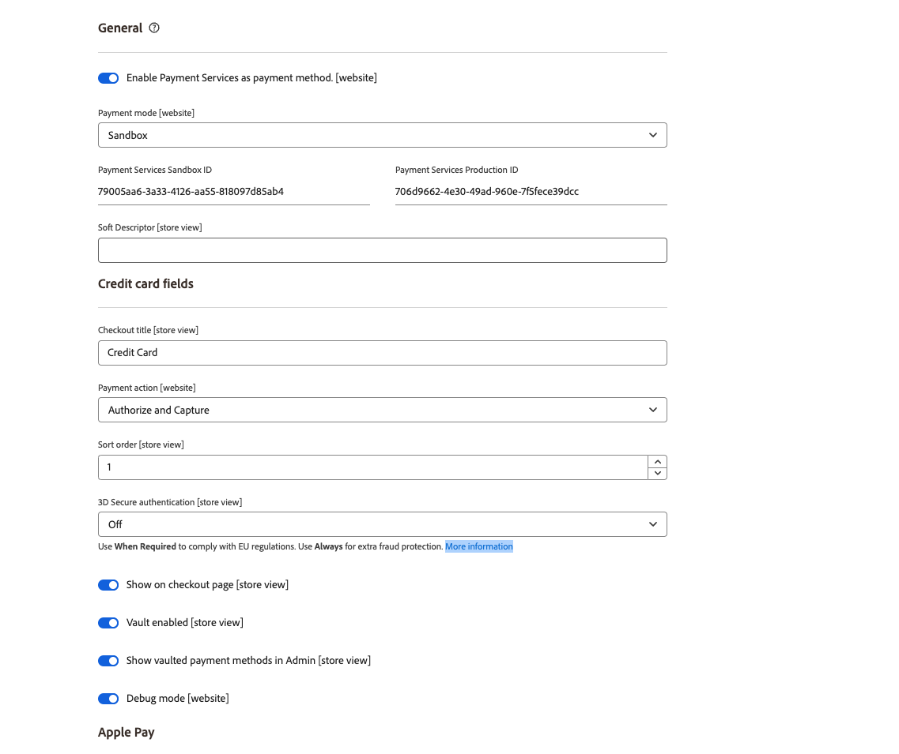

# Paramètres

Vous pouvez personnaliser [!DNL Payment Services] en fonction de vos besoins avec des paramètres utiles dans la [!DNL Payment Services] Accueil.

Pour configurer [!DNL Payment Services] pour [!DNL Adobe Commerce] et [!DNL Magento Open Source], cliquez sur **[!UICONTROL Settings]**. Ces options de configuration s’appliquent uniquement à l’environnement défini dans le champ _[!UICONTROL Payment mode]_des options de configuration[_ General _](#configure-general-settings).

Pour une configuration multi-magasin ou héritée, voir [Configuration dans l’Admin](configure-admin.md).

## Configuration des paramètres généraux

Les paramètres [!UICONTROL General] permettent d’activer ou de désactiver les services de paiement comme mode de paiement et d’ajouter des informations aux transactions client pour marquer ou préfixer un site web ou stocker des informations personnalisées.

### Activation des services de paiement

Vous pouvez activer [!DNL Payment Services] pour votre site web et activer le test sandbox ou les paiements en direct.

1. Sur la barre latérale _Admin_, accédez à **[!UICONTROL Sales]** > **[!UICONTROL Payment Services]**.

1. Cliquez sur **[!UICONTROL Settings]**. Pour plus d’informations, voir [Introduction à [!DNL Payment Services] Home](payments-home.md) .

   {width="500" zoomable="yes"}

   La section _[!UICONTROL General]_comprend les paramètres utilisés pour activer [!DNL Payment Services] comme méthode de paiement.

1. Pour activer [!DNL Payment Services] comme mode de paiement pour votre boutique, dans la section _[!UICONTROL General]_, faites basculer **[!UICONTROL Enable Payment Services as payment method]**sur `Yes`.

1. Si vous testez toujours [!DNL Payment Services] pour votre boutique, définissez **Mode de paiement** sur `Sandbox`. Si vous êtes prêt à activer les paiements en direct, définissez-le sur `Production`.

1. Vos valeurs **[!UICONTROL Payment Services Sandbox ID]** et **[!UICONTROL Payment Services Production ID]** sont automatiquement renseignées une fois que vous avez configuré le [Connecteur Commerce Services](https://experienceleague.adobe.com/en/docs/commerce-merchant-services/user-guides/integration-services/saas){target=_blank} et que vous avez consulté le tableau de bord [!DNL Payment Services] pour la première fois. Procédez comme suit pour terminer l’intégration de votre environnement de test et/ou de vos environnements de production. Ces valeurs associent votre ID SaaS à [!DNL Payment Services].

   >[!WARNING]
   >
   > Si vous réinitialisez vos [!DNL Payment Services] ID, vous devez à nouveau les intégrer.

1. Cliquez sur **[!UICONTROL Save]**.

   Si vous essayez de quitter cette vue sans enregistrer vos modifications, un modal s’affiche pour vous inviter à ignorer les modifications, à continuer les modifications ou à les enregistrer.

1. Accédez à **[!UICONTROL System]** > **[!UICONTROL Cache Management]** et cliquez sur **[!UICONTROL Flush Cache]** pour actualiser tous les caches non valides.

Vous pouvez maintenant modifier les paramètres par défaut des fonctions [options de paiement](#configure-payment-options) et de l’affichage du storefront.

### Ajout d’un descripteur logiciel

Vous pouvez ajouter un [!UICONTROL Soft Descriptor] à la configuration de vos sites web ou vues de magasin individuelles. Les descripteurs Soft s’affichent sur les relevés bancaires des transactions client. Si vous avez plusieurs magasins/marques/catalogues, par exemple, vous pouvez facilement les délimiter en ajoutant du texte personnalisé au champ [!UICONTROL Soft Descriptor].

1. Sur la barre latérale _Admin_, accédez à **[!UICONTROL Sales]** > **[!UICONTROL Payment Services]**.
1. Cliquez sur **[!UICONTROL Settings]**. Pour plus d’informations, voir [Introduction à [!DNL Payment Services] Home](payments-home.md) .
1. Sélectionnez la vue du site web ou du magasin, dans le menu déroulant **[!UICONTROL Scope]**, pour laquelle vous souhaitez créer un descripteur logiciel. Pour la configuration initiale, laissez **[!UICONTROL Default]** comme valeur par défaut.
1. Ajoutez votre texte personnalisé (jusqu’à 22 caractères) dans le champ de texte, en remplaçant `Soft descriptor`.
1. Cliquez sur **[!UICONTROL Save]**.
1. Pour créer un descripteur logiciel autre que la valeur par défaut configurée pour un site web ou une vue de magasin :
   1. Sélectionnez la vue du site web ou du magasin, dans le menu déroulant **[!UICONTROL Scope]**, pour laquelle vous souhaitez créer un descripteur logiciel.
   1. Active/désactive _off_ **[!UICONTROL Use website]** (ou **[!UICONTROL Use default]**, selon l’étendue que vous avez sélectionnée).
   1. Ajoutez votre texte personnalisé dans le champ de texte.
   1. Cliquez sur **[!UICONTROL Save]**.
1. Pour activer pour un site web ou un magasin, consultez le descripteur logiciel par défaut _ou_ utilisé pour le site web parent :
   1. Sélectionnez la vue du site web ou du magasin, dans le menu déroulant **[!UICONTROL Scope]**, pour laquelle vous souhaitez activer un descripteur logiciel existant.
   1. Active/désactive _on_ **[!UICONTROL Use website]** (ou **[!UICONTROL Use default]**, selon la portée que vous avez sélectionnée).
   1. Cliquez sur **[!UICONTROL Save]**.

   Si vous essayez de quitter cette vue sans enregistrer vos modifications, un modal s’affiche pour vous inviter à ignorer les modifications, à continuer les modifications ou à les enregistrer.

### Options de configuration

| Champ | Champ d’application | Description |
|---|---|---|
| [!UICONTROL Enable] | site web | Activez ou désactivez [!DNL Payment Services] pour votre site web. Options : [!UICONTROL Off] / [!UICONTROL On] |
| [!UICONTROL Payment mode] | vue de magasin | Définissez la méthode, ou l’environnement, de votre magasin. Options : [!UICONTROL Sandbox] / [!UICONTROL Production] |
| [!UICONTROL Payment Services Sandbox ID] | vue de magasin | Votre ID de marchand d’environnement de test, qui est généré automatiquement lors de l’intégration des environnements de test. |
| [!UICONTROL Payment Services Production ID] | vue de magasin | Votre identifiant commercial de production, qui est généré automatiquement lors de l’intégration (en direct) en production. |
| [!UICONTROL Soft Descriptor] | site web ou vue de magasin | Ajoutez un descripteur logiciel à votre ou vos sites web et vues de magasin pour ajouter des informations aux transactions client qui délimitent les marques, les magasins ou les lignes de produits. Le bouton d’activation/désactivation [!UICONTROL Use website] applique tout descripteur logiciel ajouté au niveau du site web. Le bouton d’activation/désactivation [!UICONTROL Use default] applique tout descripteur de type Soft ajouté comme valeur par défaut. |

## Configuration des options de paiement

Maintenant que vous avez activé [!UICONTROL Payment Services] pour votre site web, vous pouvez modifier les paramètres par défaut des fonctions de paiement et de l’affichage du storefront.

1. Sur la barre latérale _Admin_, accédez à **[!UICONTROL Sales]** > **[!UICONTROL Payment Services]**.
1. Cliquez sur **[!UICONTROL Settings]**. Pour plus d’informations, voir [Introduction à [!DNL Payment Services] Home](payments-home.md) .
1. Configurez les options de paiement pour les [cartes de crédit](#credit-card-fields), les [ boutons de paiement](#payment-buttons) et le [style de bouton](#button-style), selon les sections suivantes.

### Champs de carte de crédit

Les paramètres _[!UICONTROL Credit Card Fields]_offrent une option de paiement simple et sécurisée pour les modes de paiement par carte de crédit ou carte de débit.

Voir [Options de paiement](payments-options.md#credit-card-fields) pour plus d’informations.

1. Sur la barre latérale _Admin_, accédez à **[!UICONTROL Sales]** > **[!UICONTROL Payment Services]**.
1. Sélectionnez la vue du magasin, dans le menu déroulant **[!UICONTROL Scope]**, pour laquelle vous souhaitez activer un mode de paiement.
1. Dans la section **[!UICONTROL Credit card fields]** , modifiez la valeur du champ **[!UICONTROL Checkout title]** pour modifier le nom du mode de paiement affiché lors du passage en caisse.
1. Pour [ définir l’action de paiement ](production.md#set-payment-services-as-payment-method), basculez **[!UICONTROL Payment action]** sur `Authorize` ou `Authorize and Capture`.
1. Pour donner la priorité à un mode de paiement sur la page de passage en caisse, indiquez une valeur `Numeric Only` dans le champ **[!UICONTROL Sort order]**.
1. Pour activer l’authentification [3DS Secure authentication](security.md#3ds) (`Off` par défaut), faites basculer le sélecteur **[!UICONTROL 3DS Secure authentication]** sur `Always` ou `When required`.
1. Pour activer ou désactiver les champs de carte de crédit sur la page de passage en caisse, faites basculer le sélecteur **[!UICONTROL Show on checkout page]**.
1. Pour activer ou désactiver la [valeur de carte](#card-vaulting), faites basculer le sélecteur **[!UICONTROL Vault enabled]**.
1. Pour activer ou désactiver les [méthodes de paiement en valeur Vault dans l’Admin](#card-vaulting) (pour que les marchands exécutent les commandes pour les clients dans l’Admin à l’aide de leur méthode de paiement en valeur), faites basculer le sélecteur **[!UICONTROL Show vaulted methods in Admin]**.
1. Pour activer ou désactiver le mode de débogage, faites basculer le sélecteur **[!UICONTROL Debug Mode]**.
1. Cliquez sur **[!UICONTROL Save]**.

   Si vous essayez de quitter cette vue sans enregistrer vos modifications, un modal s’affiche pour vous inviter à ignorer les modifications, à continuer les modifications ou à les enregistrer.

1. [Videz le cache](#flush-the-cache).

#### Options de configuration

| Champ | Champ d’application | Description |
|---|---|---|
| [!UICONTROL Title] | vue de magasin | Ajoutez le texte à afficher comme titre de cette option de paiement dans la vue Mode de paiement lors de l’extraction. Options : [!UICONTROL text field] |
| [!UICONTROL Payment Action] | site web | [action de paiement](https://experienceleague.adobe.com/en/docs/commerce-admin/config/sales/payment-methods/payment-methods#payment-actions){target="_blank"} pour le mode de paiement spécifié. Options : [!UICONTROL Authorize] / [!UICONTROL Authorize and Capture] |
| [!UICONTROL Sort order] | vue de magasin | Ordre de tri du mode de paiement spécifié sur la page de passage en caisse. `Numeric Only` value |
| [!UICONTROL 3DS Secure authentication] | site web | Activez ou désactivez l’ [authentification sécurisée 3DS](security.md#3ds). Options : [!UICONTROL Always] / [!UICONTROL When Required] / [!UICONTROL Off] |
| [!UICONTROL Show on checkout page] | site web | Activez ou désactivez les champs de carte de crédit à afficher sur la page de paiement. Options : [!UICONTROL Off] / [!UICONTROL On] |
| [!UICONTROL Vault enabled] | vue de magasin | Activez ou désactivez la [valeur de carte de crédit](vaulting.md). Options : [!UICONTROL Off] / [!UICONTROL On] |
| [!UICONTROL Show vaulted payment methods in Admin] | vue de magasin | Activez ou désactivez la possibilité pour le marchand d’exécuter des commandes pour les clients dans l’ [ administrateur à l’aide d’un mode de paiement Vault ](vaulting.md). Options : [!UICONTROL Off] / [!UICONTROL On] |
| [!UICONTROL Debug Mode] | site web | Activez ou désactivez le mode de débogage. Options : [!UICONTROL Off] / [!UICONTROL On] |

### Apple Pay

L’option de paiement de bouton [!UICONTROL Apple Pay] vous permet de fournir un bouton de paiement [!UICONTROL Apple Pay] dans l’extraction de votre boutique à partir du navigateur Safari (pour 99 domaines par compte marchand).

Vous ne pouvez utiliser le paiement Apple que si vous effectuez l’ [auto-inscription Apple Pay via Paypal](https://developer.paypal.com/docs/checkout/apm/apple-pay/#register-your-live-domain) , puis [ configurez le paiement Apple](settings.md/#payment-buttons) pour vos magasins. Voir [Options de paiement](payments-options.md#apple-pay-button) pour plus d’informations.

Vous pouvez activer et configurer l’option de paiement du bouton [!UICONTROL Apple Pay] :

1. Sur la barre latérale _Admin_, accédez à **[!UICONTROL Sales]** > **[!UICONTROL Payment Services]**.
1. Sélectionnez la vue du magasin, dans le menu déroulant **[!UICONTROL Scope]**, pour laquelle vous souhaitez activer un mode de paiement.
1. Dans la section **[!UICONTROL Apple Pay]** , modifiez la valeur du champ _[!UICONTROL Checkout title]_pour modifier le nom du mode de paiement affiché lors du passage en caisse.
1. Pour [ définir l’action de paiement ](production.md#set-payment-services-as-payment-method), basculez **[!UICONTROL Payment action]** sur `Authorize` ou `Authorize and Capture`.
1. Pour activer ou désactiver Apple Pay sur la page de passage en caisse, faites basculer le sélecteur **[!UICONTROL Show Apple Pay on checkout page]**.
1. Pour activer ou désactiver le paiement Apple sur la page des détails du produit, faites basculer le sélecteur **[!UICONTROL Show Apple Pay on product detail page]**.
1. Pour activer ou désactiver l’option de paiement Apple sur l’aperçu du mini panier, faites basculer le sélecteur **[!UICONTROL Show Apple Pay on the mini cart preview]**.
1. Pour activer ou désactiver le paiement Apple sur la page du panier, faites basculer le sélecteur **[!UICONTROL Show Apple Pay on cart page]**.
1. Pour activer ou désactiver le mode de débogage, faites basculer le sélecteur **[!UICONTROL Debug Mode]**.
1. Cliquez sur **[!UICONTROL Save]**.

   Si vous essayez de quitter cette vue sans enregistrer vos modifications, un modal s’affiche pour vous inviter à ignorer les modifications, à continuer les modifications ou à les enregistrer.

1. [Videz le cache](#flush-the-cache).

#### Options de configuration

| Champ | Champ d’application | Description |
|---|---|---|
| [!UICONTROL Checkout title] | vue de magasin | Ajoutez le texte à afficher comme titre de cette option de paiement dans la vue Mode de paiement lors de l’extraction. Options : [!UICONTROL text field] |
| [!UICONTROL Payment Action] | site web | [action de paiement](https://experienceleague.adobe.com/en/docs/commerce-admin/config/sales/payment-methods/payment-methods#payment-actions) pour le mode de paiement spécifié. Options : [!UICONTROL Authorize] / [!UICONTROL Authorize and Capture] |
| [!UICONTROL Show on checkout page] | site web | Activez ou désactivez le bouton Payer Apple à afficher sur la page de paiement. Options : [!UICONTROL Off] / [!UICONTROL On] |
| [!UICONTROL Show on checkout page] | site web | Activez ou désactivez le bouton Payer Apple pour afficher sur la page des détails du produit. Options : [!UICONTROL Off] / [!UICONTROL On] |
| [!UICONTROL Show on mini cart preview] | site web | Activez ou désactivez le bouton Payer Apple pour afficher l’aperçu du mini panier. Options : [!UICONTROL Off] / [!UICONTROL On] |
| [!UICONTROL Show on cart page] | site web | Activez ou désactivez le bouton Payer Apple à afficher sur la page du panier. Options : [!UICONTROL Off] / [!UICONTROL On] |
| [!UICONTROL Debug Mode] | site web | Activez ou désactivez le mode de débogage. Options : [!UICONTROL Off] / [!UICONTROL On] |

### Boutons de paiement

Les options de paiement [!DNL PayPal payment buttons] offrent un processus de paiement simple, rapide et sécurisé pour votre client. Voir [Options de paiement](payments-options.md#paypal-smart-buttons) pour plus d’informations.

Vous pouvez activer et configurer les options de paiement des boutons de paiement PayPal :

1. Sélectionnez la vue du magasin, dans le menu déroulant **[!UICONTROL Scope]**, pour laquelle vous souhaitez activer un mode de paiement.
1. Pour modifier le nom du mode de paiement comme indiqué lors du passage en caisse, modifiez la valeur du champ **[!UICONTROL Checkout Title]**.
1. Pour [ définir l’action de paiement ](production.md#set-payment-services-as-payment-method), basculez **[!UICONTROL Payment action]** sur `Authorize` ou `Authorize and Capture`.
1. Pour donner la priorité à un mode de paiement sur la page de passage en caisse, indiquez une valeur `Numeric Only` dans le champ **[!UICONTROL Sort order]**.
1. Utilisez les sélecteurs de basculement pour activer ou désactiver les fonctions d&#39;affichage [!DNL PayPal smart button] :

   - **[!UICONTROL Show PayPal buttons on product checkout page]**
   - **[!UICONTROL Show PayPal buttons on product detail page]**
   - **[!UICONTROL Show PayPal buttons in mini-cart preview]**
   - **[!UICONTROL Show PayPal buttons on cart page]**
   - **[!UICONTROL Show PayPal Pay Later button]**
   - **[!UICONTROL Show PayPal Pay Later message]**
   - **[!UICONTROL Show Venmo button]**
   - **[!UICONTROL Show Apple Pay button]**
   - **[!UICONTROL Show PayPal Credit and Debit Card button]**

     >[!NOTE]
     >
     > Pour utiliser Apple Pay, [ doit disposer d’un compte de test Apple sandbox ](https://developer.apple.com/apple-pay/sandbox-testing/#create-a-sandbox-tester-account) (avec une fausse carte de crédit et des informations de facturation) pour le tester. Lorsque vous êtes prêt à utiliser le mode de production sandbox _ou_ d’Apple Pay, après avoir terminé tout [test et validation](test-validate.md#test-in-sandbox-environment), effectuez l’[auto-enregistrement avec [!DNL Apple Pay]](https://developer.paypal.com/docs/checkout/apm/apple-pay/#register-your-live-domain) (_enregistrer votre domaine actif_ uniquement) et [configurez-le pour vos magasins dans  [!DNL Payment Services]](settings.md#payment-buttons).

     Lorsque vous activez/désactivez la visibilité des boutons de paiement ou le message PayPal Pay Later, un aperçu visuel de cette configuration s’affiche au bas de la page Paramètres .

1. Pour activer le mode de débogage, faites basculer le sélecteur **[!UICONTROL Debug Mode]**.
1. Cliquez sur **[!UICONTROL Save]**.

   Si vous essayez de quitter cette vue sans enregistrer vos modifications, un modal s’affiche pour vous inviter à ignorer les modifications, à continuer les modifications ou à les enregistrer.

1. [Videz le cache](#flush-the-cache).

#### Options de configuration

| Champ | Champ d’application | Description |
|---|---|---|
| [!UICONTROL Title] | vue de magasin | Ajoutez le texte à afficher comme titre pour cette option de paiement dans la vue Mode de paiement lors de l’extraction. Options : champ de texte |
| [!UICONTROL Payment Action] | site web | [action de paiement](https://experienceleague.adobe.com/en/docs/commerce-admin/config/sales/payment-methods/payment-methods#payment-actions){target="_blank"} pour le mode de paiement spécifié. Options : [!UICONTROL Authorize] / [!UICONTROL Authorize and Capture] |
| [!UICONTROL Sort order] | vue de magasin | Ordre de tri du mode de paiement spécifié sur la page de passage en caisse. `Numeric Only` value |
| [!UICONTROL Show PayPal buttons on checkout page] | vue de magasin | Activez ou désactivez [!DNL PayPal payment buttons] sur la page de passage en caisse. Options : [!UICONTROL  Yes] / [!UICONTROL No] |
| [!UICONTROL Show PayPal buttons on product detail page] | vue de magasin | Activez ou désactivez [!DNL PayPal payment buttons] sur la page des détails du produit. Options : [!UICONTROL  Yes] / [!UICONTROL No] |
| [!UICONTROL Show PayPal buttons in mini-cart preview] | vue de magasin | Activez ou désactivez [!DNL PayPal payment buttons] dans l’aperçu du mini-panier. Options : [!UICONTROL Off] / [!UICONTROL On] |
| [!UICONTROL Show PayPal buttons on cart page] | vue de magasin | Activez ou désactivez [!DNL PayPal payment buttons] sur la page du panier. Options : [!UICONTROL Off] / [!UICONTROL On] |
| [!UICONTROL Show PayPal Pay Later button] | vue de magasin | Activez ou désactivez l’aspect de l’option de paiement ultérieur lorsque des boutons de paiement s’affichent. Options : [!UICONTROL Off] / [!UICONTROL On] |
| [!UICONTROL Show PayPal Pay Later Message] | site web | Activez ou désactivez la messagerie Payer plus tard dans le panier, la page du produit, le mini-panier et pendant le flux de passage en caisse. Options : [!UICONTROL Off] / [!UICONTROL On] |
| [!UICONTROL Show Venmo button] | vue de magasin | Activez ou désactivez l’option de paiement Venmo lorsque les boutons de paiement s’affichent. Options : [!UICONTROL Off] / [!UICONTROL On] |
| [!UICONTROL Show Apple Pay button] | vue de magasin | Activez ou désactivez l’option Paiement Apple dans laquelle les boutons de paiement s’affichent. Options : [!UICONTROL Off] / [!UICONTROL On] |
| [!UICONTROL Show PayPal Credit and Debit card button] | vue de magasin | Activez ou désactivez l’option de paiement par carte de crédit et de débit où des boutons de paiement s’affichent. Options : [!UICONTROL Off] / [!UICONTROL On] |
| [!UICONTROL Debug Mode] | site web | Activez ou désactivez le mode de débogage. Options : [!UICONTROL Off] / [!UICONTROL On] |

### Style de bouton

Vous pouvez également configurer les options _[!UICONTROL Button style]_des boutons de paiement :

1. Pour modifier le **[!UICONTROL Layout]**, sélectionnez `Vertical` ou `Horizontal`.

   >[!NOTE]
   >
   > Si le style du bouton est configuré comme `Horizontal` et que votre boutique est configurée pour afficher plusieurs boutons de paiement, vous ne pouvez afficher que deux boutons sur la page du produit, la page de passage en caisse et le mini-panier, et un bouton affiché dans le panier.

1. Pour activer le tag dans une disposition horizontale, faites basculer le sélecteur **[!UICONTROL Show tagline]**.
1. Pour modifier le **[!UICONTROL Color]**, sélectionnez l’option de couleur de votre choix.
1. Pour modifier le **[!UICONTROL Shape]**, sélectionnez `Pill` ou `Rectangle`.
1. Pour activer le sélecteur de hauteur de bouton, faites basculer le sélecteur **[!UICONTROL Responsive button height]**.
1. Pour modifier le **[!UICONTROL Label]**, sélectionnez l’option d’étiquette de votre choix.

   Lorsque vous modifiez les options de configuration pour la disposition, la couleur, la forme, la hauteur et le libellé, un aperçu visuel de cette configuration s’affiche au bas de la page Paramètres . Dans l’image ci-dessous, **[!UICONTROL Shape]** est défini sur _Rectangle_ et **[!UICONTROL Label]** sur _PayPal (recommandé)_.

   ![[!DNL PayPal payment buttons] options](assets/payment-buttons.png){width="400" zoomable="yes"}

1. Cliquez sur **[!UICONTROL Save]**.

   Si vous essayez de quitter cette vue sans enregistrer vos modifications, un modal s’affiche pour vous inviter à ignorer les modifications, à continuer les modifications ou à les enregistrer.

1. [Videz le cache](#flush-the-cache).

Vous pouvez configurer le style des boutons de paiement [ dans la configuration héritée dans l’Admin](configure-admin.md#configure-paypal-smart-buttons) ou ici dans [!DNL Payment Services Home]. Pour plus d’informations sur le style des boutons de paiement PayPal, consultez le [guide de style Boutons de PayPal](https://developer.paypal.com/docs/checkout/standard/customize/buttons-style-guide/) .

#### Options de configuration

| Champ | Champ d’application | Description |
|--- |--- |--- |
| [!UICONTROL Layout] | Affichage en magasin | Définissez le style de mise en page des boutons de paiement. Options : [!UICONTROL Vertical] / [!UICONTROL Horizontal] |
| [!UICONTROL Tagline] | Affichage en magasin | Activez/désactivez tagline. Options : [!UICONTROL Off] / [!UICONTROL On] |
| [!UICONTROL Color] | Affichage en magasin | Définissez la couleur des boutons de paiement. Options : [!UICONTROL Blue] / [!UICONTROL Gold] / [!UICONTROL Silver] / [!UICONTROL White] / [!UICONTROL Black] |
| [!UICONTROL Shape] | Affichage en magasin | Définissez la forme des boutons de paiement. Options : [!UICONTROL Rectangular] / [!UICONTROL Pill] |
| [!UICONTROL Responsive Button Height] | Affichage en magasin | Définit si les boutons de paiement utilisent une hauteur par défaut. Options : [!UICONTROL Off] / [!UICONTROL On] |
| [!UICONTROL Height] | Affichage en magasin | Définissez la hauteur des boutons de paiement. Valeur par défaut : aucune |
| [!UICONTROL Label] | Affichage en magasin | Définissez le libellé qui apparaît dans les boutons de paiement. Options : [!UICONTROL PayPal] / [!UICONTROL Checkout] / [!UICONTROL Buynow] / [!UICONTROL Pay] / [!UICONTROL Installment] |

## Configuration des rôles

Pour vous assurer que les utilisateurs administrateurs peuvent créer et gérer des commandes dans l’administrateur Commerce, activez les ressources spécifiques à [!DNL Payment Services] pour les rôles utilisateur.

Voir [Rôles utilisateur](https://experienceleague.adobe.com/docs/commerce-admin/systems/user-accounts/permissions-user-roles.html) pour apprendre à gérer les rôles.

Lorsque vous attribuez des ressources au rôle, vous devez sélectionner :

- **Payer avec[!DNL Payment Services]** : cette ressource garantit que lorsque vous créez une commande dans l’administrateur, [!DNL Payment Services] cartes de crédit sont disponibles en tant que méthode de paiement. Si vous sélectionnez la ressource parent **Actions**, cette ressource sera également sélectionnée.
- **[!DNL Payment Services]** : cette ressource comprend les ressources **Tableau de bord** et **Proxy de services SaaS**, qui doivent également être sélectionnées. Ils s’assurent que [!DNL Payment Services] apparaît dans le menu _Sales_ .

  {width="400" zoomable="yes"}

## Vider le cache

Si vous modifiez la configuration dans _Paramètres_, par exemple en activant les boutons Payer, Venmo ou PayPal plus tard dans Apple, videz manuellement le cache afin que votre boutique affiche les dernières configurations.

1. Sur la barre latérale _Admin_, accédez à **[!UICONTROL System]** > **[!UICONTROL Cache Management]**.
1. Cliquez sur **[!UICONTROL Flush Cache]** pour actualiser tous les caches non valides.

Si un type de cache dans la table Gestion du cache a l’état `INVALIDATED`, votre magasin peut ne pas afficher la configuration la plus récente pour cet élément. Videz le cache pour mettre à jour votre magasin afin d’afficher la configuration la plus récente.

Pour vous assurer que votre magasin affiche la configuration correcte, [videz régulièrement le cache](https://experienceleague.adobe.com/en/docs/commerce-admin/systems/tools/cache-management).

## Valorisation des cartes

Vous pouvez activer une fonctionnalité qui permet à vos clients de sauvegarder (ou &quot;enregistrer&quot;) leurs informations de carte de crédit dans leur compte pour les utiliser pour de futurs achats.

Vous pouvez également utiliser la mise en valeur de carte dans l’administrateur pour terminer les commandes suivantes pour les clients existants.

Activez ou désactivez la valeur de la carte dans les [Paramètres des champs de carte de crédit](#credit-card-fields).

Pour plus d’informations, voir [Valorisation des cartes de crédit](vaulting.md) .

## 3DS

3DS protège les clients et les commerçants contre les activités frauduleuses dans leurs magasins et permet la conformité aux normes de l’Union européenne (UE).

Activez ou désactivez 3DS dans les [Paramètres des champs de carte de crédit](#credit-card-fields).

Voir [3DS dans Security](security.md#3ds) pour plus d’informations.

## Utilisation de plusieurs comptes PayPal

Dans [!UICONTROL Payment Services], vous pouvez utiliser plusieurs comptes PayPal dans un compte marchand **un** au niveau du site web. Par exemple, si vous gérez votre ou vos magasins dans plusieurs pays (qui utilisent des [devises](https://experienceleague.adobe.com/en/docs/commerce-admin/stores-sales/site-store/currency/currency) différentes) ou si vous souhaitez utiliser Adobe Commerce pour certaines parties de votre entreprise, mais pas _tous_, vous pouvez configurer votre compte marchand pour utiliser plusieurs comptes PayPal.

Pour plus d’informations sur la hiérarchie des sites web, des magasins et des vues, voir [Portée du site, du magasin et de la vue](https://experienceleague.adobe.com/docs/commerce-admin/start/setup/websites-stores-views.html) .

Votre représentant commercial peut créer une [portée](https://experienceleague.adobe.com/docs/commerce-admin/start/setup/websites-stores-views.html#scope-settings) pour votre compte marchand et embarquer sur le site supplémentaire avec PayPal afin que tous les boutons PayPal que vous configurez s’affichent sur votre site. Contactez votre représentant commercial pour obtenir de l’aide sur l’utilisation de plusieurs comptes PayPal pour vos sites web.
