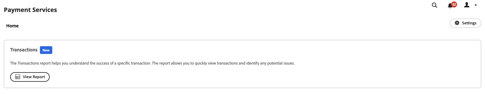

# Rapport de transactions

[!DNL Payment Services] pour [!DNL Adobe Commerce] et [!DNL Magento Open Source] vous offre des rapports complets afin que vous puissiez obtenir une vue claire des transactions, commandes et paiements de votre boutique.

{width="700" zoomable="yes"}

Le rapport Transactions offre une visibilité sur les taux d’autorisation des transactions et les tendances des transactions négatives afin que vous puissiez contrôler efficacement l’intégrité de votre magasin et identifier et résoudre de manière préventive les problèmes de transaction.

Découvrez les transactions individuelles pour les commandes passées sur le storefront et leurs modes de paiement, les résultats, les codes de réponse aux paiements, etc.

Les informations fournies dans le rapport Transactions sont destinées uniquement à un usage commercial. Ne partagez pas ces informations avec des clients ou d’autres fraudeurs potentiels. Les informations sur les transactions peuvent être utilisées pour contourner les contrôles de sécurité ou passer des commandes qui génèrent des recharges.

Vous pouvez télécharger le rapport Transactions au format .csv pour l&#39;utiliser dans un logiciel de comptabilité ou de gestion de commandes existant.

>[!NOTE]
>
>Vous ne pouvez pas afficher de rapports financiers si vous n’avez pas [intégré et activé le mode réel](production.md#enable-live-payments) pour [!DNL Payment Services].

## Consultation du rapport sur les transactions

La vue du rapport Transactions est disponible dans la vue Transactions des Services de paiement. Elle contient toutes les informations disponibles sur les transactions pour votre ou vos magasins.

Sur la barre latérale _Admin_, accédez à **[!UICONTROL Sales]** > **[!UICONTROL Payment Services]** > _[!UICONTROL Transactions]_>**[!UICONTROL View Report]**pour afficher la vue tabulaire détaillée du rapport de transactions.

{width="600" zoomable="yes"}

Vous pouvez configurer cette vue, selon les sections de cette rubrique, pour présenter au mieux les données que vous souhaitez afficher.

Consultez les ID de transaction de commande et de fournisseur Commerce liés, les montants des transactions, le mode de paiement par transaction, etc., dans ce rapport.

Tous les modes de paiement ne fournissent pas la même granularité d’informations. Par exemple, les transactions par carte de crédit fournissent des codes de réponse, AVS et CCV, ainsi que les quatre derniers chiffres de la carte dans le rapport des transactions. Ce n’est pas le cas des boutons de paiement PayPal.

Vous pouvez [télécharger des transactions](#download-transactions) au format de fichier .csv pour les utiliser dans des logiciels de comptabilité ou de gestion de commandes existants.

>[!WARNING]
>
> Le rapport des transactions ne contiendra aucune capture effectuée en dehors de [!DNL Payment Services].

### Sélectionner la source de données

Dans la vue de rapport des transactions, vous pouvez sélectionner la source de données, **[!UICONTROL Live]** ou **[!UICONTROL Sandbox]**, pour laquelle vous souhaitez afficher les résultats du rapport.

{width="300" zoomable="yes"}

Si _[!UICONTROL Live]_est la source de données sélectionnée, vous pouvez afficher les informations de rapport pour vos magasins qui utilisent [!DNL Payment Services] en mode de production. Si_[!UICONTROL Sandbox]_ est la source de données sélectionnée, vous pouvez afficher les informations de rapport pour votre mode sandbox.

Les sélections de sources de données fonctionnent comme suit :

* Si vous ne disposez d’aucun magasin utilisant [!DNL Payment Services] en mode de production, la sélection de source de données est définie par défaut sur _[!UICONTROL Sandbox]_.
* Si des magasins (un ou plusieurs) utilisent [!DNL Payment Services] en mode de production, la sélection de source de données est définie par défaut sur _[!UICONTROL Live]_.
* Les exportations de rapports respectent toujours la sélection de la source de données.

Pour sélectionner la source de données de votre rapport [!UICONTROL Transactions] :

1. Sur la barre latérale _Admin_, accédez à **[!UICONTROL Sales]** > **[!UICONTROL [!DNL Payment Services]]** > _[!UICONTROL Transactions]_>**[!UICONTROL View Report]**.
1. Cliquez sur **[!UICONTROL Data source]** et sélectionnez **[!UICONTROL Live]** ou **[!UICONTROL Sandbox]**.

   Les résultats du rapport se régénèrent en fonction de la source de données sélectionnée.

### Personnalisation de la période de dates

Dans la vue Rapport des transactions, vous pouvez personnaliser la période des transactions à afficher en sélectionnant des dates spécifiques. Par défaut, 30 jours de transactions sont affichés dans la grille.

1. Sur la barre latérale _Admin_, accédez à **[!UICONTROL Sales]** > **[!UICONTROL [!DNL Payment Services]]** > _[!UICONTROL Transactions]_>**[!UICONTROL View Report]**.
1. Cliquez sur le filtre du sélecteur de calendrier **[!UICONTROL Transaction dates]**.
1. Sélectionnez la période applicable.
1. Affichez les transactions pour les dates spécifiées dans la grille.

### Filtrage des informations sur le rapport

Depuis la vue Rapport des transactions, vous pouvez filtrer les résultats des états que vous souhaitez afficher en sélectionnant des critères de filtrage.

1. Sur la barre latérale _Admin_, accédez à **[!UICONTROL Sales]** > **[!UICONTROL [!DNL Payment Services]]** > _[!UICONTROL Transactions]_>**[!UICONTROL View Report]**.
1. Cliquez sur le sélecteur **[!UICONTROL Filter]**.
1. Activez/désactivez les options _[!UICONTROL Transaction Result]_pour afficher les résultats du rapport uniquement pour les transactions de commande sélectionnées.
1. Sélectionnez le _[!UICONTROL Card Type]_pour afficher les résultats du rapport pour le type de carte sélectionné. Une info-bulle contenant plus d’informations s’affiche lorsque le processeur de paiement ne parvient pas à identifier le type de carte.
1. Sélectionnez le _[!UICONTROL Card Brand]_pour afficher les résultats du rapport pour la marque de carte sélectionnée. Une info-bulle contenant plus d’informations s’affiche lorsque le processeur de paiement ne parvient pas à identifier la marque de carte.
1. Activez/désactivez les options _[!UICONTROL Payment Method]_pour afficher les résultats des rapports uniquement pour les méthodes de paiement sélectionnées.
1. Saisissez un _Montant de la commande min._ ou _Montant de la commande max._ pour afficher les résultats du rapport dans cette période.
1. Saisissez un _[!UICONTROL Order ID]_pour rechercher une transaction spécifique.
1. Introduisez _[!UICONTROL Card Last Four Digits]_pour rechercher une carte de crédit ou de débit spécifique.
1. Saisissez un _[!UICONTROL Customer ID]_pour afficher toutes les transactions d’un client spécifique.
1. Saisissez le _[!UICONTROL Customer Email]_pour filtrer les transactions de cet email.
1. Cliquez sur **[!UICONTROL Hide filters]** pour masquer le filtre.

### Afficher et masquer les colonnes

Le rapport Transactions affiche toutes les colonnes d&#39;informations disponibles par défaut. Vous pouvez toutefois personnaliser les colonnes affichées dans votre rapport.

1. Sur la barre latérale _Admin_, accédez à **[!UICONTROL Sales]** > **[!UICONTROL [!DNL Payment Services]]** > _[!UICONTROL Transactions]_>**[!UICONTROL View Report]**.
1. Cliquez sur l&#39;icône **[!UICONTROL Column settings]** {width="20" zoomable="yes"}.
1. Pour personnaliser les colonnes affichées dans le rapport, cochez ou décochez les colonnes de la liste.

   Le rapport Transactions affiche immédiatement les modifications que vous avez apportées au menu Paramètres de colonne . Les préférences de colonne sont enregistrées et restent en vigueur si vous quittez la vue du rapport.

### Mise à jour des données de rapport

La vue du rapport Transactions affiche un horodatage _[!UICONTROL Last updated]_qui indique la dernière fois que les informations du rapport ont été mises à jour. Par défaut, les données du rapport des transactions sont automatiquement actualisées toutes les trois heures.

Vous pouvez également forcer manuellement une actualisation des données du rapport afin d’afficher les informations les plus récentes.

1. Sur la barre latérale _Admin_, accédez à **[!UICONTROL Sales]** > **[!UICONTROL [!DNL Payment Services]]** > _[!UICONTROL Transactions]_>**[!UICONTROL View Report]**.
1. Cliquez sur l’icône _Actualiser_ ({width="20" zoomable="yes"}).

   Les données du rapport Transactions sont actualisées, une confirmation *[!UICONTROL Update complete]* s&#39;affiche et les dernières informations sont présentes dans la grille.

### Téléchargement de transactions

Vous pouvez télécharger un fichier .csv avec toutes les transactions visibles dans la grille d’affichage des transactions, que vous visualisiez les 30 jours de transactions par défaut ou une période personnalisée.

1. Sur la barre latérale _Admin_, accédez à **[!UICONTROL Sales]** > **[!UICONTROL [!DNL Payment Services]]** > **[!UICONTROL Transactions]**.
1. Si vous souhaitez afficher les transactions pour une période autre que les 30 derniers jours, [personnalisez la période de la période de vos états](#customize-dates-timeframe).
1. Cliquez sur l&#39;icône _Télécharger_ {width="20" zoomable="yes"} .

Vos transactions sont téléchargées au format .csv.

### Descriptions des colonnes

Les rapports sur les transactions comprennent les informations suivantes.

| Colonne | Description |
| ------------ | -------------------- |
| [!UICONTROL Order ID] | ID de commande Commerce (contient uniquement les valeurs pour les transactions réussies et est vide pour les transactions rejetées)   Pour afficher les [informations sur la commande](https://docs.magento.com/user-guide/sales/orders.html){target="_blank"} associées, cliquez sur l’ID. |
| [!UICONTROL Provider Transaction ID] | ID de transaction fourni par le fournisseur de paiement ; contient uniquement les valeurs pour les transactions réussies et contient un tiret pour les transactions rejetées. |
| [!UICONTROL Customer ID] | ID de client Commerce d’une commande   Pour plus d’informations, consultez la rubrique [informations sur le client](https://experienceleague.adobe.com/en/docs/commerce-admin/customers/customer-accounts/account-create){target="_blank"} . |
| [!UICONTROL Transaction Date] | Date et heure des transactions |
| [!UICONTROL Payment Method] | Mode de paiement de la transaction avec des informations détaillées sur la marque et le type de carte. Pour plus d’informations, voir [types de carte](https://developer.paypal.com/docs/api/orders/v2/#definition-card_type) ; disponibles pour les versions 1.6.0 et ultérieures de Services de paiement |
| [!UICONTROL Card Last Four Digits] | Quatre derniers chiffres des cartes de crédit ou de débit utilisées pour la transaction |
| [!UICONTROL Result] | Résultat de la transaction : *[!UICONTROL OK]* (transaction réussie), *[!UICONTROL Rejected by Payment Provider]* (rejeté par PayPal), *[!UICONTROL Rejected by Bank]* (rejeté par la banque qui a émis la carte) |
| [!UICONTROL Response Code] | Code d’erreur qui indique la raison du rejet de la part du fournisseur de paiement ou de la banque. Consultez la liste des codes de réponse possibles et les descriptions pour [`Rejected by Bank` status](https://developer.paypal.com/docs/api/orders/v2/#definition-processor_response) et [`Rejected by Payment Provider` status](https://developer.paypal.com/api/rest/reference/orders/v2/errors/). |
| [!UICONTROL AVS Code] | Code du service de vérification de l’adresse ; les informations de réponse du processeur pour les demandes de paiement. Pour plus d’informations, consultez la [liste des codes et descriptions possibles](https://developer.paypal.com/docs/api/orders/v2/#definition-processor_response). |
| [!UICONTROL CVV Code] | Code de valeur de vérification de carte pour les cartes de crédit et de débit. Pour plus d’informations, consultez la [liste des codes et descriptions possibles](https://developer.paypal.com/docs/api/orders/v2/#definition-processor_response). |
| [!UICONTROL Amount] | Montant de la commande |
| [!UICONTROL Currency] | Devise utilisée pour la commande dans la transaction |
| [!UICONTROL Type] | [Action de paiement](../payment-services/production.md#set-payment-services-as-payment-method) pour la transaction—`Authorize` ou `Authorize and Capture` |

### Codes de réponse d’erreur

La colonne _Code de réponse_ affiche une erreur ou un code de réussite spécifique associé à la transaction. Voici quelques codes d’erreur courants qui peuvent s’afficher :

* `PAYMENT_DENIED` : PayPal a refusé une transaction parce qu&#39;elle était suspectée de fraude.
* `INTERNAL_SERVER_ERROR` : la transaction a été refusée par PayPal et une erreur de serveur PayPal s’est produite. La transaction peut être relancée.
* `INSTRUMENT_DECLINED` : le client a été refusé par PayPal par mode de paiement sélectionné. Une transaction peut être retentée avec un autre mode de paiement.
* `9500` : la transaction a été refusée par la banque associée parce qu&#39;elle était suspectée de fraude.
* `5120` : la transaction a été refusée par la banque associée parce que le client ne disposait pas de fonds suffisants pour le paiement.
* `5650` : la transaction a été refusée par la banque associée car la banque nécessite une authentification forte du client ([3DS](security.md#3ds)).

Des codes détaillés de réponse aux erreurs pour les transactions en échec sont disponibles pour les transactions ultérieures au 1er juin 2023. Des données de rapport partielles s’afficheront pour les transactions antérieures au 1er juin 2023.
