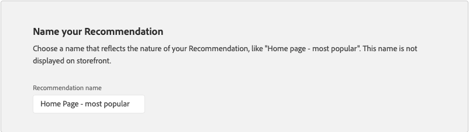

# Modifier la recommandation

La page Modifier la recommandation vous permet d’ajuster les paramètres individuels qui constituent la recommandation. Tous les paramètres peuvent être modifiés, à l’exception du type de page et du type de recommandation. Les paramètres suivants peuvent être modifiés :

- [Nom de la recommandation](#name)
- [Libellé du storefront](#label)
- [Nombre de produits](#number)
- [Emplacement et position](#placement)
- [Filtrage des produits](#filters)

L’aperçu sur le côté droit de la page indique comment la recommandation avec les paramètres actuels peut apparaître dans le storefront. L’ _aperçu des produits recommandés_ reste visible à titre de référence lorsque vous faites défiler la page vers le bas. L’aperçu affiche une image miniature du produit, le nom du produit, le SKU, le prix et le type de résultat pour chaque produit renvoyé. Le type de résultat indique s’il existe suffisamment de données comportementales primaires pour générer la recommandation ou s’il utilise des données comportementales de sauvegarde.

## Modifier une recommandation

1. Sur la barre latérale _Admin_, accédez à **Marketing** > _Promotions_ > **Recommendations de produit**.

1. Sélectionnez la recommandation à modifier.

1. Cliquez sur **Modifier**. Suivez ensuite les instructions ci-dessous pour apporter les modifications dont vous avez besoin.

1. Une fois l’opération terminée, cliquez sur **Enregistrer les modifications**.

### Nom de la recommandation {#name}

Choisissez un nom explicite indiquant l’objectif de la recommandation. Le nom est à titre de référence interne et n’apparaît pas dans le storefront.

### Libellé du storefront {#label}

Saisissez le texte que vous souhaitez utiliser comme libellé pour l’unité de recommandation dans le storefront.

### Nombre de produits {#number}

Réglez le curseur pour afficher jusqu’à 20 produits dans l’unité de recommandation.

### Emplacement et position {#placement}

1. Sélectionnez l’emplacement de la page où l’unité de recommandation doit apparaître dans le storefront.

   - Au bas du contenu principal
   - En haut du contenu principal

   

1. Pour modifier l’ordre des recommandations incluses dans l’unité, utilisez le contrôle **Déplacer**  pour faire glisser les recommandations en position.

   

### Filtrage des produits {#filters}

Toutes les modifications apportées aux [filtres](filters.md) du produit sont répercutées dans l’ _aperçu des produits recommandés_. Seuls les produits qui correspondent aux filtres d’inclusion peuvent être recommandés. Les produits qui correspondent à des filtres d’exclusion ne sont pas recommandés.

Les onglets _Inclusions_ et _Exclusions_ répertorient les filtres disponibles de chaque type. Dans la liste, chaque filtre actif est marqué d’un point bleu.

- Pour afficher les détails de chaque filtre, cliquez sur le nom du filtre.
- Pour modifier l’état du filtre, définissez la bascule **Activer le filtre** sur la position `on` ou `off`.

Les paramètres de filtre décrivent les produits à inclure ou à exclure dans l’unité de recommandation. Par exemple, les paramètres d’inclusion de filtre _Catégorie_ indiquent au système d’inclure uniquement les produits des catégories sélectionnées.

