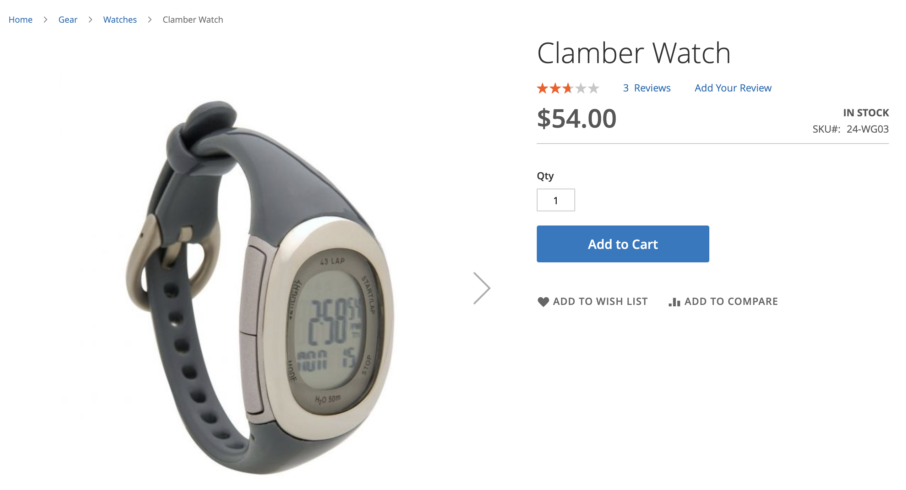

# Types de recommandations

Adobe Commerce fournit un vaste ensemble de recommandations que vous pouvez déployer sur différentes pages de votre site. À titre de référence simple, les types de recommandations sont regroupés comme suit :

- [Personnalisé](#personalized)
- [Ventes croisées et ventes incitatives](#crossup)
- [Popularité](#popularity)
- [Très performant](#highperf)

En règle générale, Adobe recommande les directives suivantes lorsque vous utilisez des recommandations :

- Vous pouvez diversifier vos types de recommandations. Les clients commencent à ignorer les recommandations s’ils suggèrent les mêmes produits encore et encore.

- Ne déployez pas les mêmes recommandations sur la page de votre panier et la page de confirmation de commande. Envisager d’utiliser `Most Added to Cart` pour la page panier et `Bought This, Bought That` pour la page de confirmation de commande.

- Maintenez votre site en ordre. Ne déployez pas plus de trois unités de recommandations sur la même page.

- Si votre boutique vend des vêtements, la variable `More like this` La recommandation peut suggérer des éléments spécifiques au genre qui ne correspondent pas au genre du produit consulté. N’utilisez ce type de recommandation que pour les catégories autres que vêtements.

## Personnalisé {#personalized}

| Type | Description |
|---|---|
| Recommandé pour vous | Recommande des éléments en fonction du comportement actuel et précédent de chaque client sur site. Présente des recommandations hautement pertinentes en fonction de l’historique de navigation et d’achat de l’acheteur. Ce type de recommandation est effectif sur la page d’accueil où la plupart des acheteurs commencent leur parcours sur un site. Pour les nouveaux acheteurs de votre site qui n’ont généré aucun signal pour personnaliser leur expérience, Adobe Commerce affiche des éléments en fonction du type de recommandation Le plus consulté. Cependant, lorsque l’acheteur commence à interagir avec les produits sur le site, les produits recommandés s’adaptent en temps réel à leur comportement.  Ont été utilisées :  - Page d’accueil - Catégorie  Étiquettes proposées :   - Juste pour vous - Recommandé pour vous - Inspiré par vos tendances d’achat |
| Récemment consultés | Affiche les produits les plus récemment consultés par l’acheteur, en fonction de l’historique de son navigateur. Tous les produits supprimés sont supprimés par l’unité de recommandation. L’unité de recommandation n’est pas affichée s’il n’existe aucun historique de navigateur ou si les règles de filtrage sont appliquées de manière insuffisante. Si les résultats contiennent moins de produits que ceux configurés, l’unité de recommandation affiche uniquement les produits renvoyés.  En cas d’utilisation :  - Page d’accueil - Catégorie - Détails du produit - Panier - Confirmation  Étiquettes proposées :  - Récemment consultés - Reprendre un autre aspect |

## Ventes croisées et ventes incitatives {#crossup}

| Type | Description |
|---|---|
| A consulté ceci, consulté cela | Recommande les éléments consultés le plus souvent par d’autres acheteurs qui ont consulté le même article. Souvent appelée recommandation de preuve sociale qui aide les acheteurs à trouver des produits que d’autres acheteurs aiment.  En cas d’utilisation : - Détails du produit - Panier - Confirmation  Étiquettes proposées :  - Les clients qui ont consulté cet article ont également consulté (PDP) |
| Consulté ceci, acheté cela | Recommande les articles achetés le plus souvent par les acheteurs qui ont consulté l’article spécifié. Permet de guider les acheteurs vers la découverte de produits qu’ils n’auraient pas remarqué autrement.  En cas d’utilisation :  - Détails du produit - Panier - Confirmation  Étiquettes proposées :  - Clients ayant consulté cet achat ultime - Clients achetés en fin de compte - Que les autres achètent après avoir consulté cet article ? |
| Acheté ceci, acheté cela | Recommande les articles achetés le plus souvent par les acheteurs qui ont acheté l’article spécifié. Le plus souvent utilisé sur le panier ou la page des détails du produit pour augmenter l’exposition du produit de vente croisée associé afin d’augmenter la valeur moyenne de la commande. Présente les produits hautement pertinents que les acheteurs peuvent ajouter à leur panier en agrégeant ce que d’autres acheteurs ont acheté avec le produit actuel.  En cas d’utilisation :  - Détails du produit - Panier - Confirmation  Étiquettes proposées :  - Obtenir tout ce dont vous avez besoin - N&#39;oubliez pas ceux-ci - Fréquemment achetés ensemble |
| Plus comme suit | Recommande des éléments en fonction d’attributs et de contenu similaires. En évaluant les attributs des produits consultés, recommande des produits similaires dans la même catégorie. Par exemple, si un acheteur navigue sur des matelas de yoga, d’autres produits de la catégorie équipement sont recommandés. Comme ce type de recommandation ne fait pas la distinction entre les sexes, il n’est pas recommandé pour les vêtements, la mode ou d’autres secteurs verticaux spécifiques au genre.  En cas d’utilisation :  - Détails du produit - Panier - Confirmation  Étiquettes proposées :   - Plus d’éléments comme celui-ci - Similaire à ceci |
| [similarité visuelle](#visualsim) | Recommande des produits à l’apparence similaire au produit consulté. Ce type de recommandation est plus utile si les images et les aspects visuels des produits sont importants pour l’expérience d’achat. |

## Popularité {#popularity}

| Type | Description |
|---|---|
| Le plus consulté | Recommande les produits les plus consultés en comptant le nombre de sessions au cours desquelles une action d’affichage a eu lieu au cours des sept derniers jours.  En cas d’utilisation :  - Page d’accueil - Catégorie - Détails du produit - Panier - Confirmation  Étiquettes proposées :  - Le plus populaire - Trending - Populaire en ce moment - Récemment populaires - Éléments populaires inspirés par cet élément (PDP) - Meilleurs vendeurs |
| Tendance | Recommande des éléments en fonction de l’élan récent de popularité d’un produit sur votre site.  Adobe Sensei agrège les données de navigation et d’achat sur votre site afin de déterminer et de classer les produits les plus récemment populaires auprès de vos acheteurs. Comme Trending analyse l’élan récent du produit, il s’agit d’un type de recommandation efficace pour les catalogues dont le chiffre d’affaires est élevé. Si votre catalogue est plus statique, il peut ne pas être aussi utile, à moins que les modèles d’achat de votre audience soient très variables.  Lorsqu’il est utilisé sur la page d’accueil, le rapport de tendance recommande des éléments récemment populaires sur l’ensemble du site. Les tendances n’affichent pas les produits qui sont régulièrement populaires, mais ceux qui sont récemment devenus populaires. Si, par exemple, vous avez une campagne de marketing par e-mail faisant la promotion de certains produits, l’augmentation de popularité générée par le e-mail augmente la probabilité que les produits promus soient classés en tendance.  En cas d’utilisation :  - Page d’accueil - Catégorie - Détails du produit - Panier - Confirmation  Étiquettes proposées :  - Trending - Tendance maintenant - Dernières tendances - Éléments chauds - Trending related products (PDP) |

## Élevé {#highperf}

| Type | Description |
|---|---|
| Afficher la conversion d’achat | Recommande les produits présentant le taux de conversion d’achat le plus élevé. De toutes les sessions d’acheteurs qui ont consulté le produit, le pourcentage qui l’a acheté.  En cas d’utilisation :  - Page d’accueil - Catégorie - Détails du produit - Panier - Confirmation  Étiquettes proposées :   -Meilleurs vendeurs - Éléments populaires - Vous pourriez être intéressé par |
| Conversion de l’affichage dans le panier | Recommande les produits présentant le taux de conversion d’affichage au panier le plus élevé. De toutes les sessions d’acheteurs qui ont consulté le produit, le pourcentage qui a ajouté le produit au panier.  En cas d’utilisation :  - Page d’accueil - Catégorie - Détails du produit - Panier - Confirmation  Étiquettes proposées :   - Meilleurs vendeurs - Éléments populaires - Vous pourriez être intéressé par |
| Le plus acheté | Souvent appelé &quot;Meilleurs vendeurs&quot;, ce type de recommandation comptabilise le nombre de sessions au cours desquelles une action de commande a eu lieu au cours des sept derniers jours. Ce type de recommandation peut être utilisé sur toutes les pages.  En cas d’utilisation :  - Page d’accueil - Catégorie - Détails du produit - Panier - Confirmation  Étiquettes proposées :   - Le plus populaire - Trending - Populaire en ce moment - Récemment populaires - Éléments populaires inspirés par cet élément (PDP) - Meilleurs vendeurs |
| Les plus ajoutés au panier | Recommande les éléments les plus fréquemment ajoutés au panier par les acheteurs au cours des sept derniers jours. Ce type de recommandation peut être utilisé sur toutes les pages.  En cas d’utilisation :  - Page d’accueil - Catégorie - Détails du produit - Panier - Confirmation  Étiquettes proposées :   - Le plus populaire - Trending - Populaire en ce moment - Récemment populaires - Éléments populaires inspirés par cet élément (PDP) - Meilleurs vendeurs |

## similarité visuelle {#visualsim}

Le _similarité visuelle_ type de recommandation recommande des produits à l’aspect similaire au produit consulté. Ce type de recommandation est particulièrement utile lorsque les images et les aspects visuels des produits sont des éléments importants de l’expérience d’achat.

### Fonctionnement

Le _similarité visuelle_ type de recommandation offre des recommandations pour d’autres produits de votre catalogue présentant une similarité visuelle avec l’imagerie actuellement consultée. La similarité visuelle comprend des aspects tels que :

- Couleur
- Forme
- Taille
- Texture
- Matériau
- Style

Adobe Sensei utilise l’IA pour traiter et analyser les images de votre catalogue et créer les attributs utilisés pour déterminer les similarités visuelles.

>[!NOTE]
>
> Si vous testez ce type de recommandation dans un environnement hors production, assurez-vous que vos URL d’image sont accessibles au public.

>[!NOTE]
>
> Actuellement, la taille des images du produit doit être inférieure ou égale à 10 Mo.

Ce type de recommandation n’étant pas applicable à la plupart des catalogues, il n’est pas activé par défaut. Vous devez activer explicitement ce type de recommandation.

### Activation du type de recommandation similarité visuelle

>[!NOTE]
>
> Le _similarité visuelle_ le type de recommandation est disponible lorsque vous [install](install-configure.md) en tant que module optionnel.

1. Sur le _Administration_ barre latérale, accédez à **Marketing** > _Promotions_ > **Recommendations de produit** pour afficher la variable _Recommendations de produit_ tableau de bord.

1. Cliquez sur **Paramètres** (icône représentant un engrenage) pour afficher la variable _Paramètres_ page.

1. Dans le _Visual Recommendations_ , sélectionnez **Activer Visual Recommendations**.

1. Cliquez sur **Enregistrer les modifications** lorsque vous avez terminé.

   Le [Créer une recommandation](create.md) page désormais affichée **similarité visuelle** comme type de recommandation sélectionnable lorsque le type de page est **Détails du produit**.

Une fois les recommandations visuelles activées, Adobe Sensei lance le traitement des images. Le temps nécessaire dépend de la taille de votre catalogue.

### Où utilisé

- Détails du produit

### Étiquettes de vitrine proposées

- Vous pouvez également
- Nous avons trouvé d’autres produits que vous pourriez aimer.
- Inspiré par ce style

### Exemple

L’image suivante montre la page des détails du produit pour la variable _Clamer Watch_:

Le tableau suivant présente la variable _similarité visuelle_ unité de recommandation pour _Clamer Watch_:

