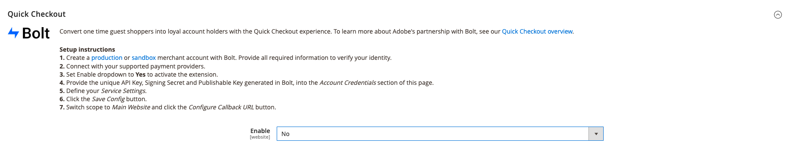

# [!DNL Quick Checkout] Intégration

Pour commencer à utiliser la méthode [!DNL Quick Checkout] pour l’extension Adobe Commerce, vous devez suivre quelques étapes d’intégration afin de connecter votre instance à notre fonctionnalité de passage en caisse.

{width="800" zoomable="yes"}

1. [Get extension](#get-extension).
1. [Création d’un compte commercial de production ou d’environnement de test avec [!DNL Bolt]](#create-account-with-bolt). Fournissez toutes les informations requises pour vérifier votre identité.
1. [Fournissez les [!DNL API Key] et [!DNL Publishable Key]](#obtain-api-credentials) généré dans [!DNL Bolt].
1. [Configurez un fournisseur de paiement dans [!DNL Bolt] account](#configure-payment-providers).
1. [Définir la liste déroulante Activer sur Oui](#enable-extension) pour activer l’extension.
1. [Définition des paramètres du service](#complete-admin-configuration) pour configurer la variable [!DNL Quick Checkout] extension .
1. [Cliquez sur Enregistrer la configuration .](#enable-live-quick-checkout) pour activer l’extension.
1. Basculer l’étendue vers **Site web principal** et [Cliquez sur Configurer l’URL de rappel .](#check-shopper-valid-account) bouton .

Si Gainsight est activé, il déclenche la variable **Visitez** dans votre [!DNL Quick Checkout] Panneau d’administration à propos [!DNL Quick Checkout] pour Adobe Commerce :

1. Sur le _Administration_ barre latérale, accédez à **[!UICONTROL Stores]** > **[!UICONTROL Configuration]** > Avancé :

   {width="500" zoomable="yes"}

Si Gainsight n’est pas activé, passez aux étapes d’intégration.

Voir [[!DNL Quick Checkout] Panneau d’administration](../quick-checkout/admin-panel.md) pour plus d’informations.

>[!NOTE]
>
> Si vous ne configurez pas votre [!DNL Bolt] comptes que vous ne pouvez pas configurer votre environnement de test ou vos environnements de production.

## Conditions préalables

Pour utiliser la variable [!DNL Quick Checkout], les éléments suivants doivent être disponibles pour [!DNL Bolt]:

- Prestataires de paiement pris en charge
- Compte Marchand et Production dans [!DNL Bolt]
- API et [!DNL Publishable key] généré dans [!DNL Bolt]

Voir [conditions préalables](../quick-checkout/prerequisites.md) pour plus d’informations.

Voir [Informations d’identification API](#obtain-api-credentials) pour savoir comment créer ou accéder à votre [!DNL API keys] pour votre instance.

## Get extension

Voir [install](../quick-checkout/install.md) rubrique pour obtenir des informations détaillées sur l’obtention de l’extension.

## Créer un compte avec [!DNL Bolt]

Avant de configurer la variable [!DNL Quick Checkout] dans votre administrateur Adobe Commerce, vous devez créer une [sandbox](https://merchant-sandbox.bolt.com/register?platform=magento2){target="_blank"} and [production](https://merchant.bolt.com/register?platform=magento2){target="_blank"}  comptes de commerce dans [!DNL Bolt]. Indiquez tous les détails requis pour créer un compte dans [!DNL Bolt].

Voir [test et validation](../quick-checkout/testing.md) pour plus d’informations.

## Obtention des informations d’identification de l’API

Pour utiliser la variable [!DNL Quick Checkout] vous avez besoin de [!DNL Bolt] clés uniques et [!DNL signing secret]. Procurez-vous les [!DNL API keys] en accédant à **Développeurs** > **API** > **Clés** dans le **Tableau de bord des commerçants de Bolt**.

- [!DNL API key]: clé privée utilisée par votre serveur principal pour interagir avec [!DNL Bolt] API.
- [!DNL Publishable key]: clé utilisée par votre front-end pour interagir avec [!DNL Bolt] API.
- [!DNL Signing secret]: utilisé pour la vérification des signatures sur les demandes reçues d’ [!DNL Bolt].

  {width="500" zoomable="yes"}

Voir [[!DNL Bolt] détails de l’environnement](https://help.bolt.com/developers/references/environment-details/#about-keys){target="_blank"} pour en savoir plus sur les clés et la signature du secret à partir de [!DNL Bolt] pour le [!DNL Quick Checkout] extension .

>[!CAUTION]
>
> Vous devez créer [!DNL API keys] pour les environnements de test et de production.

## Configurer les fournisseurs de paiement

Pour connecter votre fournisseur de services de paiement, procédez comme décrit dans la section [configuration du processeur](https://help.bolt.com/integrations/adobe-quick-checkout/set-up/){target="_blank"} développeur [!DNL Bolt] page.

## Activer l’extension

1. Sur le _Administration_ barre latérale, accédez à **Magasins** > _Paramètres_ > **Configuration**.
1. Dans le panneau de gauche, développez **Ventes** et sélectionnez **Passage en caisse**.
1. Dans le [!DNL Quick Checkout] vue, définir **Activer** to `Yes`.

{width="500" zoomable="yes"}

>[!CAUTION]
>
> Les champs de paiement rapide ne sont visibles que lorsque **Activer** est défini sur `Yes`.

1. Sélectionnez la méthode (sandbox ou production) à utiliser.

   - Environnement de test pour les tests et le développement
   - Production pour traiter les transactions avec le responsable du paiement en direct

1. Validation des informations d’identification après avoir fourni votre API unique et [!DNL Publishable keys].

{width="500" zoomable="yes"}

Voir [Paramètres](../quick-checkout/settings-quick-checkout.md) rubrique pour plus d’informations sur les options de configuration de la variable [!DNL Quick Checkout] pour l’extension Adobe Commerce.

>[!CAUTION]
>
> Vous devez fournir une API unique. [!DNL Publishable] clés avant d’activer l’extension sinon les clients verront un formulaire de paiement et ne pourront pas passer de commande.

## Configuration complète de l’administrateur

1. Sur le _Administration_ barre latérale, accédez à **Magasins** > **Configuration** > **Passage en caisse** pour accéder à la page de configuration générale de l’administrateur de passage en caisse .
1. Dans le _Paramètres du service_ , fournissez tous les détails requis pour activer l’extension.
1. Définir _Action de paiement_ à l’une des options suivantes :

   - `Authorize`: ne pas capturer les transactions automatiquement lors de l’autorisation.
   - `Authorize and Capture`: capturer automatiquement la transaction lors de l’autorisation.

Pour plus d’informations sur les options de paiement standard d’Adobe Commerce, reportez-vous à la section [passage en caisse](https://docs.magento.com/user-guide/configuration/sales/checkout.html) rubrique.

## Activation de l’extraction rapide en direct

Pour activer la variable [!DNL Quick Checkout] pour l’extension Adobe Commerce :

1. Vérifiez que la variable [!UICONTROL Enable] La liste déroulante est définie sur **Oui** pour activer l’extension.
1. Cliquez sur **Enregistrer la configuration**.

## Vérifier le compte valide du nouvel acheteur

Pour vérifier si l’acheteur a une [!DNL Bolt] compte :

1. Basculez la portée sur **Site web principal**.
1. Cliquez sur le bouton **Configuration de l’URL de rappel** bouton . Cette option active [!DNL Bolt] pour déterminer si l’acheteur dispose d’un compte. Si tel est le cas, la fenêtre contextuelle OTP s’affiche.

   >[!CAUTION]
   >
   > Basculer le périmètre vers le **Site web principal** s’assure que l’URL appropriée est définie. Chaque site web peut comporter plusieurs domaines.

Voir [Site, magasin et portée de l’affichage](https://experienceleague.adobe.com/docs/commerce-admin/start/setup/websites-stores-views.html#scope-settings){target="_blank"} pour plus d’informations sur les portées dans Adobe Commerce.

## Configuration des paramètres du service

{width="500" zoomable="yes"}

1. Définir **Activation du suivi du passage en caisse** to `Yes`.

   >[!CAUTION]
   >
   > La désactivation de cette option aura une incidence sur la création de rapports, car Adobe Commerce n’est pas autorisé à partager les informations de suivi de passage en caisse avec Bolt.

1. Sélectionnez la variable **Étape suivante après la connexion** pour modifier le flux de navigation une fois le client connecté. Par défaut, il est défini sur la valeur **Paiements** page.
1. Définissez si [!DNL Quick Checkout] permet d’afficher la variable **connexion automatique** pendant le passage en caisse. Par défaut, il est activé pour se connecter automatiquement au [!DNL Bolt] réseau.

   >[!NOTE]
   >
   > Voir [Documentation Activer la connexion automatique de Bolt](https://help.bolt.com/products/embedded/direct-api/auto-login/) pour plus d’informations.

## Obtenir de l’aide

Le processus d’intégration est conçu pour vous guider tout au long des étapes requises pour configurer et activer la variable [!DNL Express Checkout] .

Contactez l’assistance d’Adobe Commerce via le [Centre d’aide Adobe Commerce](https://experienceleague.adobe.com/docs/commerce-knowledge-base/kb/help-center-guide/magento-help-center-user-guide.html) pour toute assistance.

Voir [test et validation](../quick-checkout/testing.md) pour plus d’informations.
