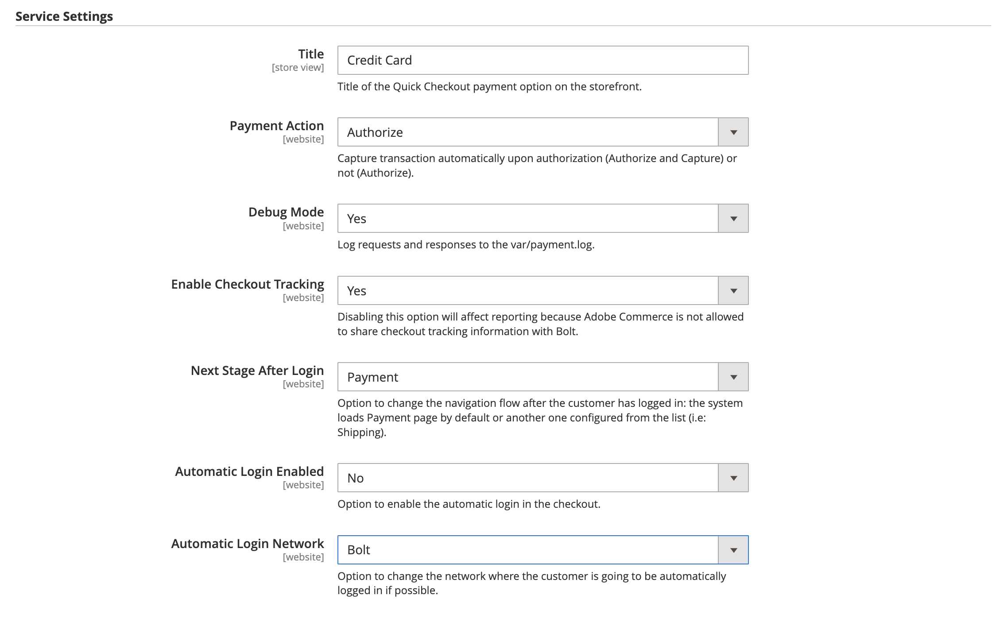

# [!DNL Quick Checkout] Paramètres

[!DNL Quick Checkout] pour Adobe Commerce et Magento Open Source, fournit une vue de configuration avec toutes les informations nécessaires pour configurer l’extension.

Pour accéder à ces paramètres de configuration :

1. Sur le _Administration_ barre latérale, accédez à **Magasins** > _Paramètres_ > **Configuration**.
1. Dans le panneau de gauche, développez **Ventes** et sélectionnez **Passage en caisse**.

   

Reportez-vous à la section [Intégration](../quick-checkout/onboarding.md) rubrique pour plus d’informations sur la configuration de la variable [!DNL Quick Checkout] pour Adobe Commerce.

## Activer l’extension

| Champ | Portée | Description |
|---|---|---|
| [!UICONTROL Enable] | site web | Activer ou désactiver [!DNL Quick Checkout] pour votre site web. Options : [!UICONTROL Yes] / [!UICONTROL No] |
| [!UICONTROL Method] | site web | Définissez la méthode ou l’environnement correspondant à votre [!DNL Quick Checkout]. Options : [!UICONTROL Sandbox] / [!UICONTROL Production] |

{style="table-layout:auto"}

## Identifiants de compte

| Champ | Portée | Description |
|---|---|---|
| [!UICONTROL API key] | site web | Clé privée utilisée par votre serveur principal pour interagir avec [!DNL Bolt] API. |
| [!UICONTROL Publishable key] | site web | Clé utilisée par votre front-end pour interagir avec [!DNL Bolt] API. |
| [!UICONTROL Signing secret] | site web | Utilisé pour la vérification des signatures sur les demandes reçues d’ [!DNL Bolt]. |

{style="table-layout:auto"}

## Paramètres du service

| Champ | Portée | Description |
|---|---|---|
| [!UICONTROL Title] | vue de magasin | Ajoutez le texte à afficher comme titre de cette option de paiement dans la vue Mode de paiement lors de l’extraction. Options : [!UICONTROL text field] |
| [!UICONTROL Payment Action] | site web | Le [action de paiement](https://docs.magento.com/user-guide/configuration/sales/payment-methods.html#payment-actions){target="_blank"} pour le mode de paiement spécifié. Options : [!UICONTROL Authorize] / [!UICONTROL Authorize and Capture] |
| [!UICONTROL Debug Mode] | site web | Activez ou désactivez le mode de débogage. Options : [!UICONTROL Yes] / [!UICONTROL No] |
| [!UICONTROL Enable checkout tracking] | site web | Définissez si Adobe Commerce permet le partage des informations de suivi de passage en caisse avec Bolt. Activé par défaut. Si cette option est désactivée, la création de rapports est affectée. Options : [!UICONTROL Yes] / [!UICONTROL No] |
| [!UICONTROL Next Stage After Login Mode] | site web | Modifiez le flux de navigation une fois le client connecté. Options : [!UICONTROL Payment] / [!UICONTROL Shipping] |
| [!UICONTROL Automatic Login Enabled] | site web | Définissez si [!DNL Quick Checkout] permet la connexion automatique lors de l’extraction. Activé par défaut. Options : [!UICONTROL Yes] / [!UICONTROL No] |
| [!UICONTROL Automatic Login Network] | site web | Sélectionnez le réseau sur lequel le client se connecte automatiquement. Activation de la loupe par défaut. Options : [!UICONTROL Bolt + Merchant] / [!UICONTROL Bolt] |

{style="table-layout:auto"}
